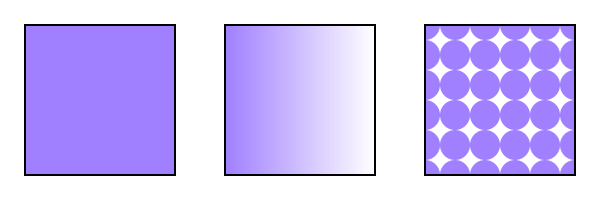

<h2>Paint Servers: Gradients and Patterns</h2>

<h3 id="Introduction">Introduction</h3>

  This section covers <strong>Paint Servers</strong>, a method which
  allows the {{fill}} or {{stroke}} of an object to be defined
  by a resource found elsewhere. It allows resources to be reused
  throughout a document. See the section
  <a href="painting.html">Painting: Filling and Stroking</a> for a
  general discussion of filling and stroking objects.

<!-- Fill and stroke are already defined in painting.html. No need to
redefine them here. -->

  SVG defines several types of paint servers:

<ul>
  <li><a href="#Gradients">Gradients</a>,</li>
  <li><a href="#Patterns">Patterns</a>.</li>
</ul>

  <table>
    <tr>
      <th>SVG 2 Requirement:</th>
      <td>Arbitrary fills for shapes.</td>
    </tr>
    <tr>
      <th>Resolution:</th>
      <td><a href="http://www.w3.org/2011/10/28-svg-irc#T18-32-32">SVG 2 shall support filling and stroking from arbitrary elements.</a></td>
    </tr>
    <tr>
      <th>Purpose:</th>
      <td>To allow for example videos or images to be used as a fill source.</td>
    </tr>
    <tr>
      <th>Owner:</th>
      <td>Alex? (no action)</td>
    </tr>
  </table>

  
  
Two types of paint servers. From left to right:
    A linear gradient.
    A pattern.
  

  Paint servers are used by including a [=URL reference=] in
  a {{fill}} or {{stroke}} property (i.e. fill="url(#MyLightPurple)").

  [=Properties=] inherit
  into a paint-server element from its ancestors;
  properties do <em>not</em> inherit from the element referencing
  the paint server element.

  Paint-server elements are never rendered directly; their only usage is
  as something that can be referenced using
  the {{fill}} and {{stroke}} properties.
  The 'display' value for these elements
  must always be set to none
  by the [=user agent style sheet=],
  and this declaration must have importance over any other CSS rule or presentation attribute.
  <!--The
  'display' property does not apply to a paint-server element;
  thus, paint-server elements are not directly rendered even if
  the 'display' property is set to a value other
  than none, and -->
  Paint-server elements
  are available for referencing even when the 'display'
  property on the paint-server element or any of its ancestors is set
  to none.

<h4 id="PaintServerTemplates">Using paint servers as templates</h4>

  Most paint server elements accept an ‘href’ attribute,
  which can be used to define a compatible paint server element as a template.
  Attributes defined for the template element
  are used instead of the initial value
  if corresponding attributes are not specified
  on the current element.
  Furthermore, if the current element does not have any
  child content other than [=descriptive elements=],
  than the child content of the template element is cloned to replace it.

  

  The exclusion of descriptive content is new in SVG 2 for {{pattern}},
  consistent with the behavior of gradients,
  and with changes to make descriptive content valid for any SVG element.
  
  

  Also new: template cross-references may be to external file resources
  (different chapters in SVG 1.1 had inconsistent guidance on this point),
  and the "inheritance" of child elements is represented through a shadow tree.
  

Templating can be indirect to an arbitrary level
(subject to security limits on external file resources,
which can make a reference invalid).
Thus, if the referenced template element does not have relevant child content
or does not define the specified attribute,
then the attribute value or cloned content is derived
from another element referenced by the template's own ‘href’ attribute.

The description of each ‘href’ attribute in this chapter defines
the limits of the templating process, as follows:

<ul>
  <li>What type of element is a valid target for the reference</li>
  <li>Which attributes are duplicated from the template</li>
</ul>

  If any of the specified attributes are not
  defined on the current element,
  or if the current element has no child elements other than [=descriptive elements=],
  the user agent must <a href="linking.html#processingURL">process the URL</a>
  to identify the referenced resource.
  If the URL reference is not [=invalid=],
  then the URL's target element is used as the template element, as follows:

<ul>
  <li>
    

      For any of the specified attributes not defined on the current element,
      the user agent must determine the value of the attribute
      for the template element
      and use it as the value for the current element.
      The template value is derived
      from recursive cross-references if required.
      The initial value for the attribute is only substituted
      after all valid URL references are exhausted.
    
  </li>
  <li>
    

      If the current element has no child elements other than [=descriptive elements=],
      the user agent must generate a [=shadow tree=] for this element,
      which must behave equivalently to a [=use-element shadow tree=],
      except that the host is the current paint server element.
      The [=corresponding elements=] for the [=element instances=]
      cloned into the shadow tree are:
    
    <ul>
      <li>
      the child content of the template element,
      if it has child elements other than [=descriptive elements=],
      </li>
      <li>
      the [=corresponding elements=] that are used, or would be used, to generate
      the template element's own shadow tree, otherwise.
      </li>
    </ul>
  </li>
</ul>

When a paint-server element has a shadow tree,
the [=element instances=] in that tree
must be used in rendering the paint server effect,
as if they were the paint server element's own children.

Note: 
  The [=use-element shadow tree=] model for templating
  allows cloned content to inherit different styles than the original.
  This behavior is newly defined in SVG 2;
  SVG 1.1 did not define how styles applied to inherited paint server content.

<h3 id="Gradients">Gradients</h3>

Gradients consist of smooth color transitions between points on a
drawing surface. SVG provides for two types of gradients:

<ul>
  <li><a href="#LinearGradients">linear gradients</a>,</li>
  <li><a href="#RadialGradients">radial gradients</a>.</li>
</ul>

Once a gradient is defined, a [=graphics element=] can be
filled or stroked with the gradient by setting the {{fill}}
or {{stroke}} properties to reference the gradient.

  Color transitions for linear and radial gradients are defined by a
  series of color <a href="#GradientStops">stops</a> along a gradient
  vector. A gradient normal defines how the colors in a vector are
  painted to the surface. For a linear gradient, a normal is a line
  perpendicular to the vector. For a radial gradient, a normal is a
  circle intersecting the vector at a right angle. Each gradient
  normal is painted with one color determined by the vector.

  

  

    Linear and radial gradients with the gradient vector
    indicated. The vector consists of three stops shown by small
    circles. One gradient normal is shown for each gradient.
  

  For linear and radial gradients, the color value between two stops along the
  gradient vector is the linear interpolation, per channel, of the color for
  each stop, weighted by the distance from each stop.

  <math xmlns="http://www.w3.org/1998/Math/MathML" display="block">
    <mi>V</mi>
    <mo>=</mo>
    <msub>
      <mi>C</mi><mn>0</mn>
    </msub>
    <mo>+</mo>
    <mo>(</mo>
      <msub>
        <mi>C</mi><mn>1</mn>
      </msub>
      <mo>-</mo>
      <msub><mi>C</mi><mn>0</mn></msub>
    <mo>)</mo>
    <mo>(</mo>
    <mfrac>
      <mrow>
          <mi>D</mi>
          <mo>-</mo>
          <msub><mi>O</mi><mn>0</mn></msub>
      </mrow>
      <mrow>
          <msub><mi>O</mi><mn>1</mn></msub>
          <mo>-</mo>
          <msub><mi>O</mi><mn>0</mn></msub>
      </mrow>
    </mfrac>
    <mo>)</mo>
  </math>
  <pre id="math-gradient-linear-interpolation">
    $V = C0.rgba + (C1.rgba - C0.rgba) * ((D - C0.offset) / (C1.offset - C0.offset));
  </pre>

Where, for each channel:

<ul class='ready-for-wider-review'>
<li>V is the interpolated result for that channel</li>
<li>C0 is the stop color for the stop with the lowest offset</li>
<li>O0 is the offset of C0</li>
<li>C1 is the other stop color</li>
<li>O1 is the offset of C1</li>
<li>D is the distance along the gradient vector</li>
</ul>

  When a [=graphics element=] references a gradient, conceptually the
  [=graphics element=] should take a copy of the gradient vector
  with gradient normals and treat it as part of its own geometry. Any
  transformations applied to the [=graphics element=] geometry also
  apply to the copied gradient vector and gradient normals. Any
  gradient transforms that are specified on the reference gradient are
  applied before any [=graphics element=] transformations are
  applied to the gradient.

<h4 id="pserverDefinitions">Definitions</h4>

<dl class="definitions">
  <dt><dfn id="TermGradientElement" data-dfn-type="dfn" data-export="">gradient element</dfn></dt>
  <dd>A gradient element is one that defines a gradient paint server.
    This specification defines the following gradient elements:
    @@elementcategory gradient@@.
  </dd>
</dl>

<h4 id="LinearGradients">Linear gradients</h4>

Linear gradients are defined by a
{{linearGradient}} element.

@@elementsummary linearGradient@@

<h5 id="LinearGradientAttributes">Attributes</h5>

  Note: 
    Note that the {{x1}},{{y1}}, {{x2}} and {{y2}} attributes
    on a {{linearGradient}} are not presentation attributes;
    the used value is not affected by CSS styles.
    The {{gradientTransform}} attribute is a presentation attribute
    for the [[#TransformProperty|transform]] property.
  

  <dl class="attrdef-list-svg2">

    <dt id="LinearGradientElementGradientUnitsAttribute">gradientUnits</dt>
    <dd>

      

	Defines the coordinate system for attributes {{x1}},
        {{y1}}, {{x2}} and {{y2}}.
      

      <dl class="attrdef-svg2">

	<dt>Value</dt>                <dd>userSpaceOnUse | objectBoundingBox</dd>
	<dt>[=Initial value=]</dt>  <dd>objectBoundingBox</dd>
	<dt>[=Animatable=]</dt>    <dd>yes</dd>

      </dl>

      <dl class="attrdef-values">

	<dt>userSpaceOnUse</dt>
        <dd>
	  

            If gradientUnits="userSpaceOnUse",

            {{x1}}, {{y1}}, {{x2}}, and {{y2}}

            represent values in the coordinate system that results
            from taking the current user coordinate system in place at
            the time when the gradient element is referenced (i.e.,
            the user coordinate system for the element referencing the
            gradient element via a {{fill}} or {{stroke}}
            property) and then applying the transform specified by
            attribute {{gradientTransform}}. Percentages
            represent values relative to the current SVG viewport.
	  
	</dd>

	<dt>objectBoundingBox</dt>
	<dd>
	  

            If gradientUnits="objectBoundingBox",
            the user coordinate system for attributes

            {{x1}}, {{y1}}, {{x2}} and {{y2}}

	    is established using the bounding box of the element to
            which the gradient is applied
            (see [[#ObjectBoundingBoxUnits|Object
            bounding box units]]) and then applying the transform
            specified by attribute {{gradientTransform}}.
            Percentages represent values relative to the bounding box
            for the object.
	  
	  

            When gradientUnits="objectBoundingBox"
            and {{gradientTransform}} is the identity matrix, the
            normal of the linear gradient is perpendicular to the
            gradient vector in object bounding box space (i.e., the
            abstract coordinate system where (0,0) is at the top/left
            of the object bounding box and (1,1) is at the
            bottom/right of the object bounding box). When the
            object's bounding box is not square, the gradient normal
            which is initially perpendicular to the gradient vector
            within object bounding box space may render
            non-perpendicular relative to the gradient vector in user
            space. If the gradient vector is parallel to one of the
            axes of the bounding box, the gradient normal will remain
            perpendicular. This transformation is due to application
            of the non-uniform scaling transformation from bounding
            box space to user coordinate system.
	  
	</dd>

      </dl><!-- Attribute values -->

    </dd>

    <dt id="LinearGradientElementGradientTransformAttribute">
      gradientTransform
    </dt>
    <dd>

      

	Contains the definition of an optional additional
        transformation from the gradient coordinate system onto the
        target coordinate system

        (i.e., <code>userSpaceOnUse</code> or
        <code class='attr-value'>objectBoundingBox</code>).

	This allows for things such as skewing the gradient.

	This additional transformation matrix is post-multiplied to
        (i.e., inserted to the right of) any previously defined
        transformations, including the implicit transformation
        necessary to convert
        from [[#ObjectBoundingBoxUnits|object bounding
        box units]] to user coordinate system.
      

      <dl class="attrdef-svg2">
	<dt>Value</dt>                <dd><a>&lt;transform-list&gt;</a></dd>
	<dt>[=Initial value=]</dt>  <dd>identity transform</dd>
	<dt>[=Animatable=]</dt>    <dd>yes</dd>
      </dl>

    </dd>

    <dt id="LinearGradientElementX1Attribute">x1</dt>
    <dd>

      

	{{x1}}, {{y1}}, {{x2}} and {{y2}} define
        a <em>gradient vector</em> for the linear
        gradient. This <em>gradient vector</em> provides starting and
        ending points onto which the <a href="#GradientStops">gradient
        stops</a> are mapped. The values
        of {{x1}}, {{y1}}, {{x2}} and {{y2}} can
        be either numbers or percentages.
      

      <dl class="attrdef-svg2">
	<dt>Value</dt>                <dd><<length>></dd>
	<dt>[=Initial value=]</dt>  <dd>0%</dd>
	<dt>[=Animatable=]</dt>    <dd>yes</dd>
      </dl>

    </dd>

    <dt id="LinearGradientElementY1Attribute">y1</dt>
    <dd>

      

	See {{x1}}.
      

      <dl class="attrdef-svg2">
	<dt>Value</dt>                <dd><<length>></dd>
	<dt>[=Initial value=]</dt>  <dd>0%</dd>
	<dt>[=Animatable=]</dt>    <dd>yes</dd>
      </dl>

    </dd>

    <dt id="LinearGradientElementX2Attribute">x2</dt>
    <dd>

      

	See {{x1}}.
      

      <dl class="attrdef-svg2">
	<dt>Value</dt>                <dd><<length>></dd>
	<dt>[=Initial value=]</dt>  <dd>100%</dd>
	<dt>[=Animatable=]</dt>    <dd>yes</dd>
      </dl>
    </dd>

    <dt id="LinearGradientElementY2Attribute">y2</dt>
    <dd>

      

	See {{x1}}.
      

      <dl class="attrdef-svg2">
	<dt>Value</dt>                <dd><<length>></dd>
	<dt>[=Initial value=]</dt>  <dd>0%</dd>
	<dt>[=Animatable=]</dt>    <dd>yes</dd>
      </dl>
    </dd>

    <dt id="LinearGradientElementSpreadMethodAttribute">
      spreadMethod
    </dt>
    <dd>
      

	Indicates what happens if the gradient starts or ends
        inside the bounds of the <em>target rectangle</em>.
      

      <dl class="attrdef-svg2">
	<dt>Value</dt>                <dd>pad | reflect | repeat</dd>
	<dt>[=Initial value=]</dt>  <dd>pad</dd>
	<dt>[=Animatable=]</dt>    <dd>yes</dd>
      </dl>

      <dl class="attrdef-values">

	<dt>pad</dt>
        <dd>
	  Use the terminal colors of the gradient to fill the
          remainder of the target region.
	</dd>

	<dt>reflect</dt>
	<dd>
	  Reflect the gradient pattern start-to-end, end-to-start,
          start-to-end, etc. continuously until the <em>target
          rectangle</em> is filled.
	</dd>

	<dt>repeat</dt>
	<dd>
          Repeat the gradient pattern start-to-end, start-to-end,
          start-to-end, etc. continuously until the target region is
          filled.
	</dd>

      </dl>

      

	
	

	  Illustration of the three possible values for
	  spreadMethod, from left to
	  right: pad, reflect, repeat. The gradient vector spans
	  from 40% to 60% of the bounding box width.
	
      

    </dd>

    <dt id="LinearGradientElementHrefAttribute">
      href
    </dt>
    <dd>
      

        A [=URL reference=] to a template gradient element;
        to be valid, the reference must be to a
        different {{linearGradient}} or
        a {{radialGradient}} element.
      
      

        Refer to the process for <a href="#PaintServerTemplates">using paint servers as templates</a>,
        and to the common handling defined for <a
        href="linking.html#linkRefAttrs">URL reference attributes</a> and
        <a href="linking.html#XLinkRefAttrs">deprecated XLink attributes</a>.
      
      

        The specified attributes that will be copied from the template are:
      
      <ul>
        <li>{{x1}}</li>
        <li>{{y1}}</li>
        <li>{{x2}}</li>
        <li>{{y2}}</li>
        <li>{{gradientTransform}}</li>
        <li>{{gradientUnits}}</li>
        <li>{{spreadMethod}}</li>
      </ul>

      <dl class="attrdef-svg2">
	<dt>Value</dt>                <dd>URL <a href="types.html#attribute-url" class="syntax">&bs[;URL]</a></dd>
	<dt>[=Initial value=]</dt>  <dd>empty</dd>
	<dt>[=Animatable=]</dt>    <dd>yes</dd>
      </dl>

    </dd>
  </dl>

<h5 id="LinearGradientNotes">Notes on linear gradients</h5>

If {{x1}} = {{x2}} and {{y1}} =
{{y2}}, then the area to be painted will be painted as a
single color using the color and opacity of the last
<a href="pservers.html#GradientStops">gradient stop</a>.

Example lingrad01
shows how to fill a rectangle by referencing a linear gradient paint server.

<pre class=include-raw>
path: images/pservers/lingrad01.svg
</pre>
<!--
@@fix
<pre class=include>
path: images/pservers/lingrad01.svg
</pre>
-->

<h4 id="RadialGradients">Radial gradients</h4>

Radial gradients are defined by a
{{radialGradient}} element.

@@elementsummary radialGradient@@

<h5 id="RadialGradientAttributes">Attributes</h5>

  Note: 
    Note that the {{cx}},{{cy}}, and {{r}} attributes
    on a {{radialGradient}} are not presentation attributes;
    the used value is not affected by CSS styles.
    The {{gradientTransform}} attribute is a presentation attribute
    for the [[#TransformProperty|transform]] property.
  

  <dl class="attrdef-list-svg2">

    <dt id="RadialGradientElementGradientUnitsAttribute">
      gradientUnits =
      "userSpaceOnUse | objectBoundingBox"
    </dt>
    <dd>

      

	Defines the coordinate system for attributes
        {{cx}}, {{cy}}, {{r}}, {{fx}}, {{fy}}, and {{fr}}.
      

      <dl class="attrdef-svg2">

	<!--
	<dt>Value</dt>                <dd>userSpaceOnUse | objectBoundingBox</dd>
	-->
	<dt>[=Initial value=]</dt>  <dd>objectBoundingBox</dd>
	<dt>[=Animatable=]</dt>    <dd>yes</dd>

      </dl>

      <dl class="attrdef-values">

	<dt>userSpaceOnUse</dt>
        <dd>
	  

            If gradientUnits="userSpaceOnUse",

            {{cx}}, {{cy}}, {{r}}, {{fx}}, {{fy}},
            and {{fr}}

	    represent values in the coordinate system that results
            from taking the current user coordinate system in place at
            the time when the gradient element is referenced (i.e.,
            the user coordinate system for the element referencing the
            gradient element via a {{fill}} or {{stroke}}
            property) and then applying the transform specified by
            attribute {{gradientTransform}}. Percentages
            represent values relative to the current SVG viewport.
	  
	</dd>

	<dt>objectBoundingBox</dt>
	<dd>
	  

            If gradientUnits="objectBoundingBox",
            the user coordinate system for attributes

            {{cx}}, {{cy}}, {{r}}, {{fx}}, {{fy}},
            and {{fr}}

	    is established using the bounding box of the element to
            which the gradient is applied
            (see [[#ObjectBoundingBoxUnits|Object
            bounding box units]]) and then applying the transform
            specified by attribute {{gradientTransform}}.
            Percentages represent values relative to the bounding box
            for the object.
	  
	  

            When gradientUnits="objectBoundingBox"
            and {{gradientTransform}} is the identity matrix,
            then the rings of the radial gradient are circular with
            respect to the object bounding box space (i.e., the
            abstract coordinate system where (0,0) is at the top/left
            of the object bounding box and (1,1) is at the
            bottom/right of the object bounding box). When the
            object's bounding box is not square, the rings that are
            conceptually circular within object bounding box space
            will render as elliptical due to application of the
            non-uniform scaling transformation from bounding box space
            to user coordinate system.
	  
	</dd>

      </dl><!-- Attribute values -->

    </dd>

    <dt id="RadialGradientElementGradientTransformAttribute">
      gradientTransform =
      "<a>&lt;transform-list&gt;</a>"
    </dt>
    <dd>

      

	Contains the definition of an optional additional
        transformation from the gradient coordinate system onto the
        target coordinate system

        (i.e., <code>userSpaceOnUse</code> or
        <code class='attr-value'>objectBoundingBox</code>).

	This allows for things such as skewing the gradient.

	This additional transformation matrix is post-multiplied to
        (i.e., inserted to the right of) any previously defined
        transformations, including the implicit transformation
        necessary to convert
        from [[#ObjectBoundingBoxUnits|object bounding
        box units]] to user coordinate system.
      

      <dl class="attrdef-svg2">
<!--	<dt>Value</dt>                <dd><a>&lt;transform-list&gt;</a></dd> -->
	<dt>[=Initial value=]</dt>  <dd>identity transform</dd>
	<dt>[=Animatable=]</dt>    <dd>yes</dd>
      </dl>

    </dd>

    <dt id="RadialGradientElementCXAttribute">
      cx =
      "<<length>>"
    </dt>
    <dd>

      

	{{cx}}, {{cy}} and {{r}} define the end circle for the radial gradient. The
        gradient will be drawn such that the
        100% <a href="#GradientStops">gradient stop</a> is mapped
        to the perimeter of this end circle.
      

      <dl class="attrdef-svg2">
<!--	<dt>Value</dt>                <dd><<length>></dd> -->
	<dt>[=Initial value=]</dt>  <dd>50%</dd>
	<dt>[=Animatable=]</dt>    <dd>yes</dd>
      </dl>

    </dd>

    <dt id="RadialGradientElementCYAttribute">
      cy =
      "<<length>>"
    </dt>
    <dd>

      

	See {{cx}}.
      

      <dl class="attrdef-svg2">
<!--	<dt>Value</dt>                <dd><<length>></dd> -->
	<dt>[=Initial value=]</dt>  <dd>50%</dd>
	<dt>[=Animatable=]</dt>    <dd>yes</dd>
      </dl>

    </dd>

    <dt id="RadialGradientElementRAttribute">
      r =
      "<<length>>"
    </dt>
    <dd>

      

	See {{cx}}.
      

      

        A negative value is an error
        (see <a href="conform.html#ErrorProcessing">Error
        processing</a>).
      

      <dl class="attrdef-svg2">
<!--	<dt>Value</dt>                <dd><<length>></dd> -->
	<dt>[=Initial value=]</dt>  <dd>50%</dd>
	<dt>[=Animatable=]</dt>    <dd>yes</dd>
      </dl>

    </dd>

    <dt id="RadialGradientElementFXAttribute">
      fx =
      "<<length>>"
    </dt>
    <dd>

      

	{{fx}}, {{fy}}, and {{fr}} define the start
	circle for the radial gradient. The
        gradient will be drawn such that the
        0% <a href="#GradientStops">gradient stop</a> is mapped
        to the perimeter of this start circle.
      

      <dl class="attrdef-svg2">
<!--	<dt>Value</dt>                <dd><<length>></dd> -->
	<dt>[=Initial value=]</dt>  <dd>see below</dd>
	<dt>[=Animatable=]</dt>    <dd>yes</dd>
      </dl>

      

        If attribute {{fx}} is not specified, {{fx}} will coincide
        with the presentational value of {{cx}} for the element whether the
        value for 'cx' was inherited or not. If the element references an
        element that specifies a value for 'fx', then the value of 'fx' is
        inherited from the referenced element.
      

      

	
	

	  This diagram shows how the geometric attributes are defined
	  for the case where {{fr}} is 50% of {{r}}. The
	  small circle marks the center of the outermost circle
	  ({{cx}},{{cy}}), while the cross marks the center
	  of the innermost circle ({{fx}},{{fy}}). The
	  dashed lines show two gradient vectors. Vectors connect
	  corresponding points on the inner and outer most circles.
	  The region outside the outer circle is painted with the
	  last {{stop-color}} while the region inside the inner
	  circle is painted with the first {{stop-color}}.
	
      

    </dd>

    <dt id="RadialGradientElementFYAttribute">
      fy =
      "<<length>>"
    </dt>
    <dd>

      

	See {{fx}}.
      

      <dl class="attrdef-svg2">
<!--	<dt>Value</dt>                <dd><<length>></dd> -->
	<dt>[=Initial value=]</dt>  <dd>see below</dd>
	<dt>[=Animatable=]</dt>    <dd>yes</dd>
      </dl>

      

        If attribute {{fy}} is not specified, {{fy}}
        will coincide with the presentational value of {{cy}}
        for the element whether the value for 'cy' was inherited
        or not. If the element references an element that
        specifies a value for 'fy', then the value of 'fy' is
        inherited from the referenced element.
      
    </dd>

    <dt id="RadialGradientElementFRAttribute">
      fr =
      "<<length>>"
    </dt>
    <dd>

      Note: New in SVG 2. Added to align with Canvas.

      

	{{fr}} is the radius of the focal circle. See {{fx}}.
      

      

        A negative value is an error
        (see <a href="conform.html#ErrorProcessing">Error
        processing</a>).
      

      <dl class="attrdef-svg2">
<!--	<dt>Value</dt>                <dd><<length>></dd> -->
	<dt>[=Initial value=]</dt>  <dd>0%, see below</dd>
	<dt>[=Animatable=]</dt>    <dd>yes</dd>
      </dl>

      

        If the attribute is not specified, the effect is as if a
	value of <code class='attr-value'>0%</code> were
	specified.  If the element references an element that
	specifies a value for 'fr', then the value of 'fr' is
	inherited from the referenced element.
      

      

        <table>
          <tr>
            <th>SVG 2 Requirement:</th>
            <td>Allow specifying focal circle radius in radial gradients.</td>
          </tr>
          <tr>
            <th>Resolution:</th>
            <td><a href="http://www.w3.org/2011/07/29-svg-minutes.html#item06">Add an fr attribute to radialGradient> for SVG 2.</a></td>
          </tr>
          <tr>
            <th>Purpose:</th>
            <td>To align with Canvas.  The zero-offset stop would be along the circle
            defined by the fx, fy
            and fr attributes.</td>
          </tr>
          <tr>
            <th>Owner:</th>
            <td>Erik (<a href="http://www.w3.org/Graphics/SVG/WG/track/actions/3098">ACTION-3098</a>)</td>
          </tr>
        </table>
      

    </dd>

    <dt id="RadialGradientElementSpreadMethodAttribute">
      spreadMethod = "pad | reflect | repeat"
    </dt>
    <dd>

      

	Indicates what happens if the gradient starts or ends inside
        the bounds of the object(s) being painted by the gradient. Has
        the same values and meanings as the <{linearGradient/spreadMethod}>
        attribute on {{linearGradient}} element.
      

      <dl class="attrdef-svg2">
<!--	<dt>Value</dt>                <dd>pad | reflect | repeat</dd> -->
	<dt>[=Initial value=]</dt>  <dd>pad</dd>
	<dt>[=Animatable=]</dt>    <dd>yes</dd>
      </dl>
    </dd>

    <dt id="RadialGradientElementHrefAttribute">
      href =
      <a href="types.html#attribute-url" class="syntax">&bs[;URL]</a>
    </dt>
    <dd>
      

        A [=URL reference=] to a template gradient element;
        to be valid, the reference must be to a
        {{linearGradient}} element or
        a different {{radialGradient}} element.
      
      

        Refer to the process for <a href="#PaintServerTemplates">using paint servers as templates</a>,
        and to the common handling defined for <a
        href="linking.html#linkRefAttrs">URL reference attributes</a> and
        <a href="linking.html#XLinkRefAttrs">deprecated XLink attributes</a>.
      
      

        The specified attributes that will be copied from the template are:
      
      <ul>
        <li>{{cx}}</li>
        <li>{{cy}}</li>
        <li>{{r}}</li>
        <li>{{fx}}</li>
        <li>{{fy}}</li>
        <li>{{fr}}</li>
        <li>{{gradientTransform}}</li>
        <li>{{gradientUnits}}</li>
        <li>{{spreadMethod}}</li>
      </ul>
      

        Refer to the common handling defined for <a
        href="linking.html#linkRefAttrs">URL reference attributes</a> and
        <a href="linking.html#XLinkRefAttrs">deprecated XLink attributes</a>.
      

      <dl class="attrdef-svg2">
<!--	<dt>Value</dt>                <dd><a>&lt;url&gt;</a></dd> -->
	<dt>[=Initial value=]</dt>  <dd>empty</dd>
	<dt>[=Animatable=]</dt>    <dd>yes</dd>
      </dl>

    </dd>
  </dl>

  <table>
    <tr>
      <th>SVG 2 Requirement:</th>
      <td>Clarify radial gradients with focal point on the circle.</td>
    </tr>
    <tr>
      <th>Resolution:</th>
      <td><a href="http://www.w3.org/2011/07/29-svg-minutes.html#item05">When the focal point is on the circle edge, with repeat, then the distance between the first and last stop for the repeating colors is 0 and the paint should generate a color that is the average of all the gradient stops.</a></td>
    </tr>
    <tr>
      <th>Purpose:</th>
      <td>To improve interoperability of radial gradients.</td>
    </tr>
    <tr>
      <th>Owner:</th>
      <td>Erik (<a href="http://www.w3.org/Graphics/SVG/WG/track/actions/3097">ACTION-3097</a>)</td>
    </tr>
    <tr>
      <th>Note:</th>
      <td>SVG 1.1 does not define what to do when the focal point
      is on the circle edge, with 'repeat'. The distance between the
      first and last stop for the repeating colors is 0. It was
      resolved that the paint should generate a color that is the
      weighted average (by offset) of all the gradient stops.</td>
    </tr>
  </table>

<h5 id="RadialGradientNotes">Notes on radial gradients</h5>

Note: Changed in SVG 2. SVG 1.1 required that the focal
point, if outside the end circle, be moved to be on the end
circle. The change was made to align with Canvas.

Allowing the focal point to lie outside the end
circle was resolved at the
<a href="http://www.w3.org/2012/09/19-svg-minutes.html#item01">Rigi
Kaltbad working group meeting</a>.

If the start circle defined by {{fx}}, {{fy}} and {{fr}} lies
outside the end circle defined by {{cx}}, {{cy}}, and {{r}}, effectively
a cone is created, touched by the two circles. Areas outside the cone stay untouched by
the gradient (transparent black).

If the start circle fully overlaps with the end circle, no
gradient is drawn. The area stays untouched (transparent black).

  

  
A radial gradient with the focal (start) circle
    outside the end circle. The focal circle is the
    smaller circle on the right. The gradient has
    spreadMethod="reflect".
  

  

  
Two radial gradients with
  spreadMethod="repeat". On the
  left, the focal point is just inside the right side of the circle
  defined by {{cx}}, {{cy}}, and {{r}}. On the
  right, the focal point is on the circle. In this case, the area
  painted to the right of the circumference has a fill equal to
  the weighted average of the colors in the gradient vector.

Note: The treatment of the area to the right of the gradient
in the right-hand side of the above figure is different from that of
Canvas where the area would be transparent black. The difference is to
maintain compatibility with SVG 1.1.

The color space for the weighted average is the
same as in which the gradient is interpolated. See
<a href="http://www.w3.org/2012/09/19-svg-minutes.html#item01">Rigi
Kaltbad working group meeting</a>.

Example radgrad01
shows how to fill a rectangle by referencing a radial gradient paint
server.

<pre class=include-raw>
path: images/pservers/radgrad01.svg
</pre>
<!--
@@fix
<pre class=include>
path: images/pservers/radgrad01.svg
</pre>
-->

<h4 id="GradientStops">Gradient stops</h4>

The vector of colors to use in a gradient is
defined by the {{stop}} elements that are child elements to a
{{linearGradient}}, or {{radialGradient}}
element.

In SVG 1.1, the above read: "The ramp of
colors..." but "ramp" is used nowhere else in this section.

@@elementsummary stop@@

<h5 id="GradientStopAttributes">Attributes</h5>

  <dl class="attrdef-list-svg2">

    <dt id="StopElementOffsetAttribute">
      offset
    </dt>
    <dd>

      

	Indicates were the gradient stop is placed.  For linear
	gradients, the {{offset}} attribute represents a location
	along the <em>gradient vector</em>. For radial gradients, it
	represents a fractional distance from the edge of the
	innermost/smallest circle to the edge of the outermost/largest
	circle.
      

      <dl class="attrdef-svg2">

	<dt>Value</dt>                <dd><<number>> | <a>&lt;percentage&gt;</a></dd>
	<dt>[=Initial value=]</dt>  <dd>0</dd>
	<dt>[=Animatable=]</dt>    <dd>yes</dd>

      </dl>

      <dl class="attrdef-values">

	<dt><<number>></dt>
        <dd>A number usually ranging from 0 to 1.</dd>

	<dt><a>&lt;percentage&gt;</a></dt>
        <dd>A percentage usually ranging from 0% to 100%.</dd>

      </dl>

    </dd>
  </dl>

<h5 id="StopColorProperties">Properties</h5>

  <dl class="propdef-list-svg2">
    <dt id="StopColorProperty">'stop-color'</dt>
    <dd>
      

      The {{stop-color}} property indicates what color to use
      at that gradient stop. The keyword
      currentColor and other color syntaxes
      can be specified in the same manner as within a
      <a href="painting.html#SpecifyingPaint">&lt;paint&gt;</a>
      specification for the {{fill}} and {{stroke}}
      properties.
      
      Note: 
      With respect to gradients, SVG treats the 'transparent' keyword
      differently than CSS. SVG does not calculate gradients in pre-multiplied
      space, so 'transparent' really means transparent black. Specifying
      a {{stop-color}} with the value 'transparent' is equivalent to
      specifying a {{stop-color}} with the value 'black' and a
      'stop-opacity' with the value '0'.
      
      <dl class="propdef-svg2">
        <dt>Value</dt>              <dd>&lt;‘{{color}}’&gt;</dd>
        <dt>Initial</dt>            <dd>black</dd>
        <dt>Applies to</dt>         <dd>{{stop}} elements</dd>
        <dt>Inherited</dt>          <dd>no</dd>
        <dt>Percentages</dt>        <dd>N/A</dd>
        <dt>Media</dt>              <dd>visual</dd>
        <dt>[=Animatable=]</dt>  <dd>yes</dd>
      </dl>
    </dd>
    <dt id="StopOpacityProperty">'stop-opacity'</dt>
    <dd>
      

      The 'stop-opacity' property defines the opacity of
      a given gradient stop.
      
      The opacity value used for the gradient calculation is the product
      of the value of 'stop-opacity' and the opacity of the value of
      {{stop-color}}. For {{stop-color}} value types of that
      don't include explicit opacity information, the opacity of that
      component must be treated as 1.
      
      <dl class="propdef-svg2">
        <dt>Value</dt>              <dd>&lt;‘{{opacity}}’&gt;</dd>
        <dt>Initial</dt>            <dd>1</dd>
        <dt>Applies to</dt>         <dd>{{stop}} elements</dd>
        <dt>Inherited</dt>          <dd>no</dd>
        <dt>Percentages</dt>        <dd>N/A</dd>
        <dt>Media</dt>              <dd>visual</dd>
        <dt>Computed value</dt>     <dd>the specified value converted to a number, clamped to the range [0,1]</dd>
        <dt>[=Animatable=]</dt>  <dd>yes</dd>
      </dl>
      <dl class="propdef-values">
        <dt>&lt;number&gt;</dt>
        <dd>
          The opacity of the {{stop-color}}. Any values outside the
          range 0.0 (fully transparent) to 1.0 (fully opaque) must be
          clamped to this range.
        </dd>
        <dt>&lt;percentage&gt;</dt>
        <dd>
          The opacity of the {{stop-color}} expressed as a percentage
          of the range 0 to 1.
        </dd>
      </dl>
    </dd>
  </dl><!-- propdef-list -->

<h5 id="StopNotes">Notes on gradient stops</h5>

<ul>
  <li>Gradient offset values less than 0 (or less than 0%) are
  rounded up to 0%. Gradient offset values greater than 1 (or
  greater than 100%) are rounded down to 100%.</li>

  <li>It is necessary that at least two stops defined to have a
  gradient effect. If no stops are defined, then painting shall
  occur as if 'none' were specified as the paint style. If one
  stop is defined, then paint with the solid color fill using
  the color defined for that gradient stop.</li>

  <li>Each gradient offset value is required to be equal to or
  greater than the previous gradient stop's offset value. If a
  given gradient stop's offset value is not equal to or greater
  than all previous offset values, then the offset value is
  adjusted to be equal to the largest of all previous offset
  values.</li>

  <li>
    
If two gradient stops have the same offset value, then the
    latter gradient stop controls the color value at the
    overlap point. In particular:

    <xmp>
<stop offset="0" stop-color="white"/>
<stop offset=".2" stop-color="red"/>
<stop offset=".2" stop-color="blue"/>
<stop offset="1" stop-color="black"/>
</xmp>

    
will have approximately the same effect as:

    <xmp>
<stop offset="0" stop-color="white"/>
<stop offset=".1999999999" stop-color="red"/>
<stop offset=".2" stop-color="blue"/>
<stop offset="1" stop-color="black"/>
</xmp>

    
which is a gradient that goes smoothly from white to red,
    then abruptly shifts from red to blue, and then goes
    smoothly from blue to black.
  </li>
</ul>

<h3 id="Patterns">Patterns</h3>

A pattern is used to {{fill}} or {{stroke}}
an object using a pre-defined graphic object which can be replicated
("tiled") at fixed intervals in <em>x</em> and <em>y</em> to cover the
areas to be painted. Patterns are defined using a {{pattern}}
element and then referenced by properties {{fill}} and
{{stroke}} on a given [=graphics element=] to indicate that the
given element shall be filled or stroked with the pattern.

Attributes {{x}}, {{y}}, {{width}}, {{height}}
and {{patternUnits}} define a reference rectangle somewhere
on the infinite canvas. The reference rectangle has its top/left
at (<var>x</var>,&nbsp;<var>y</var>) and its bottom/right at
(<var>x</var>&nbsp;+&nbsp;<var>width</var>,&nbsp;<var>y</var>&nbsp;+&nbsp;<var>height</var>).
The tiling theoretically extends a series of such rectangles to infinity in X
and Y (positive and negative), with rectangles starting at
(<var>x</var>&nbsp;+&nbsp;m*<var>width</var>,&nbsp;<var>y</var>&nbsp;+&nbsp;n*
<var>height</var>) for each possible integer value for <em>m</em>
and <em>n</em>.

@@elementsummary pattern@@

<h4 id="PatternElementAttributes">Attributes</h4>

  Note: 
    Note that the {{x}},{{y}}, {{width}} and {{height}} attributes
    on a {{pattern}} are not presentation attributes;
    the used value is not affected by CSS styles.
    The {{patternTransform}} attribute is a presentation attribute for the [[#TransformProperty|transform]] property.
  

  <dl class="attrdef-list-svg2">

    <dt id="PatternElementPatternUnitsAttribute">patternUnits</dt>
    <dd>

      

	Defines the coordinate system for attributes
	{{x}}, {{y}}, {{width}} and {{height}}.
      

      <dl class="attrdef-svg2">

	<dt>Value</dt>                <dd>userSpaceOnUse | objectBoundingBox</dd>
	<dt>[=Initial value=]</dt>  <dd>objectBoundingBox</dd>
	<dt>[=Animatable=]</dt>    <dd>yes</dd>

      </dl>

      <dl class="attrdef-values">

	<dt>userSpaceOnUse</dt>
        <dd>
	  

            If patternUnits="userSpaceOnUse",

            {{x}}, {{y}}, {{width}} and {{height}}

            represent values in the coordinate system that results
            from taking the current user coordinate system in place at
            the time when the {{pattern}} element is referenced
            (i.e., the user coordinate system for the element
            referencing the {{pattern}} element via a
            {{fill}} or {{stroke}} property) and then
            applying the transform specified by attribute
            {{patternTransform}}. Percentages
            represent values relative to the current SVG viewport.
	  
	</dd>

	<dt>objectBoundingBox</dt>
	<dd>
	  

            If patternUnits="objectBoundingBox",
            the user coordinate system for attributes

            {{x}}, {{y}}, {{width}} and {{height}}

            is established using the bounding box of the element to
            which the pattern is applied
            (see [[#ObjectBoundingBoxUnits|Object
            bounding box units]]) and then applying the transform
            specified by attribute {{patternTransform}}.
            Percentages represent values relative to the bounding box
            for the object.
	  
	</dd>

      </dl><!-- Attribute values -->

    </dd>

    <dt id="PatternElementPatternContentUnitsAttribute">
      patternContentUnits
    </dt>
    <dd>

      

	Defines the coordinate system for the contents of the
	{{pattern}}. Note that this attribute has no effect if
	attribute [[#ViewBoxAttribute|viewBox]] is specified.
      

      <dl class="attrdef-svg2">

	<dt>Value</dt>                <dd>userSpaceOnUse | objectBoundingBox</dd>
	<dt>[=Initial value=]</dt>  <dd>userSpaceOnUse</dd>
	<dt>[=Animatable=]</dt>    <dd>yes</dd>

      </dl>

      <dl class="attrdef-values">

	<dt>userSpaceOnUse</dt>
        <dd>
	  

	    If patternContentUnits="userSpaceOnUse",
	    the user coordinate system for the contents of the {{pattern}}
	    element is the coordinate system that results from taking
	    the current user coordinate system in place at the time
	    when the {{pattern}} element is referenced (i.e., the
	    user coordinate system for the element referencing the
	    {{pattern}} element via a {{fill}} or {{stroke}}
	    property) and then applying the transform specified by attribute
	    {{patternTransform}}.
	  
	</dd>

	<dt>objectBoundingBox</dt>
	<dd>
	  

            If patternContentUnits="objectBoundingBox",
            the user coordinate system for the contents of
            the {{pattern}} element is established using the
            bounding box of the element to which the pattern is
            applied
            (see [[#ObjectBoundingBoxUnits|Object
            bounding box units]]) and then applying the transform
            specified by attribute {{patternTransform}}.
	  
	</dd>

      </dl><!-- Attribute values -->

    </dd>

    <dt id="PatternElementPatternTransformAttribute">
      patternTransform
    </dt>
    <dd>

      

	Contains the definition of an optional additional
        transformation from the pattern coordinate system onto the
        target coordinate system

        (i.e., <code>userSpaceOnUse</code> or
        <code class='attr-value'>objectBoundingBox</code>).

	This allows for things such as skewing the pattern tiles.

	This additional transformation matrix is post-multiplied to
        (i.e., inserted to the right of) any previously defined
        transformations, including the implicit transformation
        necessary to convert
        from [[#ObjectBoundingBoxUnits|object bounding
        box units]] to user coordinate system.
      

      <dl class="attrdef-svg2">
	<dt>Value</dt>                <dd><a>&lt;transform-list&gt;</a></dd>
	<dt>[=Initial value=]</dt>  <dd>identity transform</dd>
	<dt>[=Animatable=]</dt>    <dd>yes</dd>
      </dl>

    </dd>

    <dt id="PatternElementXAttribute">x</dt>
    <dd>
      

	{{x}}, {{y}}, {{width}} and {{height}}
        indicate how the pattern tiles are placed and spaced. These
        attributes represent coordinates and values in the coordinate
        space specified by the combination of
        attributes {{patternUnits}}
        and {{patternTransform}}.
      

      <dl class="attrdef-svg2">
	<dt>Value</dt>                <dd><<length>></dd>
	<dt>[=Initial value=]</dt>  <dd>0</dd>
	<dt>[=Animatable=]</dt>    <dd>yes</dd>
      </dl>

    </dd>

    <dt id="PatternElementYAttribute">y</dt>
    <dd>

      

	See {{x}}.
      

      <dl class="attrdef-svg2">
	<dt>Value</dt>                <dd><<length>></dd>
	<dt>[=Initial value=]</dt>  <dd>0</dd>
	<dt>[=Animatable=]</dt>    <dd>yes</dd>
      </dl>

    </dd>

    <dt id="PatternElementWidthAttribute">width</dt>
    <dd>

      

	See {{x}}.
      

      <dl class="attrdef-svg2">
	<dt>Value</dt>                <dd><<length>></dd>
	<dt>[=Initial value=]</dt>  <dd>0</dd>
	<dt>[=Animatable=]</dt>    <dd>yes</dd>
      </dl>

      

        A negative value is an error
        (see <a href="conform.html#ErrorProcessing">Error
        processing</a>).  A value of zero disables rendering of the
        element (i.e., no paint is applied).
      

    </dd>

    <dt id="PatternElementHeightAttribute">height</dt>
    <dd>

      

	See {{x}}.
      

      <dl class="attrdef-svg2">
	<dt>Value</dt>                <dd><<length>></dd>
	<dt>[=Initial value=]</dt>  <dd>0</dd>
	<dt>[=Animatable=]</dt>    <dd>yes</dd>
      </dl>

      

        A negative value is an error (see <a href="conform.html#ErrorProcessing">Error processing</a>).
        A value of zero disables rendering of the element (i.e., no
        paint is applied).
      

    </dd>

    <dt id="PatternElementHrefAttribute">href</dt>
    <dd>
      

        A [=URL reference=] to a template element,
        which must be a different {{pattern}} element to be valid.
      
      

        Refer to the process for <a href="#PaintServerTemplates">using paint servers as templates</a>,
        and to the common handling defined for <a
        href="linking.html#linkRefAttrs">URL reference attributes</a> and
        <a href="linking.html#XLinkRefAttrs">deprecated XLink attributes</a>.
      
      

        The specified attributes that will be copied from the template are:
      
      <ul class='ready-for-wider-review'>
        <li>{{x}}</li>
        <li>{{y}}</li>
        <li>{{width}}</li>
        <li>{{height}}</li>
        <li>[[#ViewBoxAttribute|viewBox]]</li>
        <li>[[#PreserveAspectRatioAttribute|preserveAspectRatio]]</li>
        <li>{{patternTransform}}</li>
        <li>{{patternUnits}}</li>
        <li>{{patternContentUnits}}</li>
      </ul>

      <dl class="attrdef-svg2">
	<dt>Value</dt>                <dd>URL <a href="types.html#attribute-url" class="syntax">&bs[;URL]</a></dd>
	<dt>[=Initial value=]</dt>  <dd>empty</dd>
	<dt>[=Animatable=]</dt>    <dd>yes</dd>
      </dl>

    </dd>
  </dl>

<h4 id="PatternNotes">Notes on patterns</h4>

SVG's <a href="styling.html#UAStyleSheet">user agent style sheet</a> sets
the [[#OverflowAndClipProperties|overflow]] property for {{pattern}} elements to
hidden, which causes a rectangular clipping
path to be created at the bounds of the pattern tile.  Unless the
[[#OverflowAndClipProperties|overflow]] property is overridden, any graphics within the pattern
which goes outside of the pattern rectangle will be clipped.
<a href="pservers.html#ExamplePattern01">Example pattern01</a> below shows the
effect of clipping to the pattern tile.

Note: 
  Note that if the [[#OverflowAndClipProperties|overflow]] property is set to
  visible the rendering behavior
  for the pattern outside the bounds of the pattern is currently
  undefined. A future version of SVG may require the overflow to be
  shown. SVG implementers are encouraged to render the overflow as
  this is the behavior expected by authors. If overflow is rendered,
  the pattern tiles should be rendered left to right in rows and the
  rows from top to bottom.

  See <a href="https://github.com/w3c/svgwg/issues/129">GitHub Issue 129</a>

The contents of the {{pattern}} are relative to a new coordinate
system. If there is a [[#ViewBoxAttribute|viewBox]] attribute, then the new coordinate
system is fitted into the region defined by the {{x}}, {{y}},
{{width}}, {{height}} and {{patternUnits}} attributes on the
{{pattern}} element using the standard rules for [[#ViewBoxAttribute|viewBox]] and
[[#PreserveAspectRatioAttribute|preserveAspectRatio]]. If there is no [[#ViewBoxAttribute|viewBox]] attribute, then
the new coordinate system has its origin at (<var>x</var>,&nbsp;<var>y</var>),
where <var>x</var> is established by the {{x}} attribute on the
{{pattern}} element, and <var>y</var> is established by the {{y}}
attribute on the {{pattern}} element. Thus, in the following example:

<xmp>
<pattern x="10" y="10" width="20" height="20">
  <rect x="5" y="5" width="10" height="10"/>
</pattern>
</xmp>

the rectangle has its top/left located 5 units to the right and 5
units down from the origin of the pattern tile.

The [[#ViewBoxAttribute|viewBox]] attribute introduces a supplemental transformation
which is applied on top of any transformations necessary to create a new
pattern coordinate system due to attributes {{x}}, {{y}},
{{width}}, {{height}} and {{patternUnits}}.

<a href="interact.html#EventAttributes">Event attributes and event listeners</a> attached
to the contents of a {{pattern}} element are not processed;
only the rendering aspects of {{pattern}} elements are
processed.

Example pattern01
shows how to fill a rectangle by referencing a pattern paint
server. Note how the blue stroke of each triangle has been
slightly clipped at the top and the left. This is due to SVG's
<a href="styling.html#UAStyleSheet">user agent style sheet</a> setting
the [[#OverflowAndClipProperties|overflow]] property for {{pattern}} elements to
hidden, which causes the pattern to be clipped
to the bounds of the pattern tile.

<pre class=include-raw>
path: images/pservers/pattern01.svg
</pre>
<!--
@@fix
<pre class=include>
path: images/pservers/pattern01.svg
</pre>
-->

<h3 id="DOMInterfaces">DOM interfaces</h3>

<h4 id="InterfaceSVGGradientElement">Interface SVGGradientElement</h4>

The [[#InterfaceSVGGradientElement|SVGGradientElement]] interface is used as a base interface
for gradient paint server element interfaces.

<pre class="idl">
[<a>Exposed</a>=Window]
interface <b>SVGGradientElement</b> : <a>SVGElement</a> {

  // Spread Method Types
  const unsigned short <a href="pservers.html#__svg__SVGGradientElement__SVG_SPREADMETHOD_UNKNOWN">SVG_SPREADMETHOD_UNKNOWN</a> = 0;
  const unsigned short <a href="pservers.html#__svg__SVGGradientElement__SVG_SPREADMETHOD_PAD">SVG_SPREADMETHOD_PAD</a> = 1;
  const unsigned short <a href="pservers.html#__svg__SVGGradientElement__SVG_SPREADMETHOD_REFLECT">SVG_SPREADMETHOD_REFLECT</a> = 2;
  const unsigned short <a href="pservers.html#__svg__SVGGradientElement__SVG_SPREADMETHOD_REPEAT">SVG_SPREADMETHOD_REPEAT</a> = 3;

  [<a>SameObject</a>] readonly attribute <a>SVGAnimatedEnumeration</a> <a href="pservers.html#__svg__SVGGradientElement__gradientUnits">gradientUnits</a>;
  [<a>SameObject</a>] readonly attribute <a>SVGAnimatedTransformList</a> <a href="pservers.html#__svg__SVGGradientElement__gradientTransform">gradientTransform</a>;
  [<a>SameObject</a>] readonly attribute <a>SVGAnimatedEnumeration</a> <a href="pservers.html#__svg__SVGGradientElement__spreadMethod">spreadMethod</a>;
};

<a>SVGGradientElement</a> includes <a>SVGURIReference</a>;
</pre>

The numeric spread method type constants defined on [[#InterfaceSVGGradientElement|SVGGradientElement]]
are used to represent the keyword values that the spreadMethod
attribute can take.  Their meanings are as follows:

<table class='vert'>
  <tr><th>Constant</th><th>Meaning</th></tr>
  <tr><td><b id="__svg__SVGGradientElement__SVG_SPREADMETHOD_PAD">SVG_SPREADMETHOD_PAD</b></td><td>The pad keyword.</td></tr>
  <tr><td><b id="__svg__SVGGradientElement__SVG_SPREADMETHOD_REFLECT">SVG_SPREADMETHOD_REFLECT</b></td><td>The reflect keyword.</td></tr>
  <tr><td><b id="__svg__SVGGradientElement__SVG_SPREADMETHOD_REPEAT">SVG_SPREADMETHOD_REPEAT</b></td><td>The repeat keyword.</td></tr>
  <tr><td><b id="__svg__SVGGradientElement__SVG_SPREADMETHOD_UNKNOWN">SVG_SPREADMETHOD_UNKNOWN</b></td><td>Some other value.</td></tr>
</table>

The <b id="__svg__SVGGradientElement__gradientUnits">gradientUnits</b> IDL attribute
[=reflects=] the gradientUnits content attribute.
The [=numeric type values=] for gradientUnits
attributes on gradient elements are as follows:

<table class="vert">
  <tr><th>Value</th><th>Numeric type value</th></tr>
  <tr>
    <td>userSpaceOnUse</td>
    <td><a href='types.html#__svg__SVGUnitTypes__SVG_UNIT_TYPE_USERSPACEONUSE'>SVG_UNIT_TYPE_USERSPACEONUSE</a></td>
  </tr>
  <tr>
    <td>objectBoundingBox</td>
    <td><a href='types.html#__svg__SVGUnitTypes__SVG_UNIT_TYPE_OBJECTBOUNDINGBOX'>SVG_UNIT_TYPE_OBJECTBOUNDINGBOX</a></td>
  </tr>
</table>

The <b id="__svg__SVGGradientElement__gradientTransform">gradientTransform</b> IDL
attribute [=reflects=] the computed value of the [[#TransformProperty|transform]] property
and  the 'gradientTransform' presentation attribute
for {{linearGradient}} and {{radialGradient}} elements.

The <b id="__svg__SVGGradientElement__spreadMethod">spreadMethod</b> IDL attribute
[=reflects=] the spreadMethod content attribute.
The [=numeric type values=] for spreadMethod
attributes on gradient elements are as described above in the
numeric spread type constant table.

<h4 id="InterfaceSVGLinearGradientElement">Interface SVGLinearGradientElement</h4>

An [[#InterfaceSVGLinearGradientElement|SVGLinearGradientElement]] object represents an {{linearGradient}}
in the DOM.

<pre class="idl">
[<a>Exposed</a>=Window]
interface <b>SVGLinearGradientElement</b> : <a>SVGGradientElement</a> {
  [<a>SameObject</a>] readonly attribute <a>SVGAnimatedLength</a> <a href="pservers.html#__svg__SVGLinearGradientElement__x1">x1</a>;
  [<a>SameObject</a>] readonly attribute <a>SVGAnimatedLength</a> <a href="pservers.html#__svg__SVGLinearGradientElement__y1">y1</a>;
  [<a>SameObject</a>] readonly attribute <a>SVGAnimatedLength</a> <a href="pservers.html#__svg__SVGLinearGradientElement__x2">x2</a>;
  [<a>SameObject</a>] readonly attribute <a>SVGAnimatedLength</a> <a href="pservers.html#__svg__SVGLinearGradientElement__y2">y2</a>;
};
</pre>

The
<b id="__svg__SVGLinearGradientElement__x1">x1</b>,
<b id="__svg__SVGLinearGradientElement__y1">y1</b>,
<b id="__svg__SVGLinearGradientElement__x2">x2</b> and
<b id="__svg__SVGLinearGradientElement__y2">y2</b> IDL attributes
[=reflect=] the {{x1}}, {{y1}}, {{x2}} and {{y2}}
content attributes, respectively

<h4 id="InterfaceSVGRadialGradientElement">Interface SVGRadialGradientElement</h4>

An [[#InterfaceSVGRadialGradientElement|SVGRadialGradientElement]] object represents an {{radialGradient}}
in the DOM.

<pre class="idl">
[<a>Exposed</a>=Window]
interface <b>SVGRadialGradientElement</b> : <a>SVGGradientElement</a> {
  [<a>SameObject</a>] readonly attribute <a>SVGAnimatedLength</a> <a href="pservers.html#__svg__SVGRadialGradientElement__cx">cx</a>;
  [<a>SameObject</a>] readonly attribute <a>SVGAnimatedLength</a> <a href="pservers.html#__svg__SVGRadialGradientElement__cy">cy</a>;
  [<a>SameObject</a>] readonly attribute <a>SVGAnimatedLength</a> <a href="pservers.html#__svg__SVGRadialGradientElement__r">r</a>;
  [<a>SameObject</a>] readonly attribute <a>SVGAnimatedLength</a> <a href="pservers.html#__svg__SVGRadialGradientElement__fx">fx</a>;
  [<a>SameObject</a>] readonly attribute <a>SVGAnimatedLength</a> <a href="pservers.html#__svg__SVGRadialGradientElement__fy">fy</a>;
  [<a>SameObject</a>] readonly attribute <a>SVGAnimatedLength</a> <a href="pservers.html#__svg__SVGRadialGradientElement__fr">fr</a>;
};
</pre>

The
<b id="__svg__SVGRadialGradientElement__cx">cx</b>,
<b id="__svg__SVGRadialGradientElement__cy">cy</b>,
<b id="__svg__SVGRadialGradientElement__r">r</b>,
<b id="__svg__SVGRadialGradientElement__fx">fx</b>,
<b id="__svg__SVGRadialGradientElement__fy">fy</b> and
<b id="__svg__SVGRadialGradientElement__fr">fr</b> IDL attributes
[=reflect=] the {{cx}}, {{cy}}, {{r}}, {{fx}},
{{fy}} and {{fr}} content attributes, respectively

<h4 id="InterfaceSVGStopElement">Interface SVGStopElement</h4>

An [[#InterfaceSVGStopElement|SVGStopElement]] object represents a {{stop}} element
in the DOM.

<pre class="idl">
[<a>Exposed</a>=Window]
interface <b>SVGStopElement</b> : <a>SVGElement</a> {
  [<a>SameObject</a>] readonly attribute <a>SVGAnimatedNumber</a> <a href="pservers.html#__svg__SVGStopElement__offset">offset</a>;
};
</pre>

The <b id="__svg__SVGStopElement__offset">offset</b> IDL attribute
[=reflects=] the {{offset}} content attribute.

Note: Note that [[#InterfaceSVGStopElement|SVGStopElement]] does not have a
[=reflecting=] IDL attribute for its {{path}} attribute.

<h4 id="InterfaceSVGPatternElement">Interface SVGPatternElement</h4>

An [[#InterfaceSVGPatternElement|SVGPatternElement]] object represents a {{pattern}} element
in the DOM.

<pre class="idl">
[<a>Exposed</a>=Window]
interface <b>SVGPatternElement</b> : <a>SVGElement</a> {
  [<a>SameObject</a>] readonly attribute <a>SVGAnimatedEnumeration</a> <a href="pservers.html#__svg__SVGPatternElement__patternUnits">patternUnits</a>;
  [<a>SameObject</a>] readonly attribute <a>SVGAnimatedEnumeration</a> <a href="pservers.html#__svg__SVGPatternElement__patternContentUnits">patternContentUnits</a>;
  [<a>SameObject</a>] readonly attribute <a>SVGAnimatedTransformList</a> <a href="pservers.html#__svg__SVGPatternElement__patternTransform">patternTransform</a>;
  [<a>SameObject</a>] readonly attribute <a>SVGAnimatedLength</a> <a href="pservers.html#__svg__SVGPatternElement__x">x</a>;
  [<a>SameObject</a>] readonly attribute <a>SVGAnimatedLength</a> <a href="pservers.html#__svg__SVGPatternElement__y">y</a>;
  [<a>SameObject</a>] readonly attribute <a>SVGAnimatedLength</a> <a href="pservers.html#__svg__SVGPatternElement__width">width</a>;
  [<a>SameObject</a>] readonly attribute <a>SVGAnimatedLength</a> <a href="pservers.html#__svg__SVGPatternElement__height">height</a>;
};

<a>SVGPatternElement</a> includes <a>SVGFitToViewBox</a>;
<a>SVGPatternElement</a> includes <a>SVGURIReference</a>;
</pre>

The <b id="__svg__SVGPatternElement__patternUnits">patternUnits</b>
and <b id="__svg__SVGPatternElement__patternContentUnits">patternContentUnits</b>
IDL attributes [=reflect=] the {{patternUnits}} and
{{patternContentUnits}} content attributes, respectively.
The [=numeric type values=] for {{patternUnits}} and
{{patternContentUnits}} are as follows:

<table class="vert">
  <tr><th>Value</th><th>Numeric type value</th></tr>
  <tr>
    <td>userSpaceOnUse</td>
    <td><a href='types.html#__svg__SVGUnitTypes__SVG_UNIT_TYPE_USERSPACEONUSE'>SVG_UNIT_TYPE_USERSPACEONUSE</a></td>
  </tr>
  <tr>
    <td>objectBoundingBox</td>
    <td><a href='types.html#__svg__SVGUnitTypes__SVG_UNIT_TYPE_OBJECTBOUNDINGBOX'>SVG_UNIT_TYPE_OBJECTBOUNDINGBOX</a></td>
  </tr>
</table>

The <b id="__svg__SVGPatternElement__patternTransform">patternTransform</b> IDL
attribute [=reflects=] the computed value of the [[#TransformProperty|transform]] property
and the patternTransform presentation attribute.

The
<b id="__svg__SVGPatternElement__x">x</b>,
<b id="__svg__SVGPatternElement__y">y</b>,
<b id="__svg__SVGPatternElement__width">width</b> and
<b id="__svg__SVGPatternElement__height">height</b>
IDL attributes [=reflect=] the {{x}}, {{y}},
{{width}} and {{height}} content attributes, respectively.