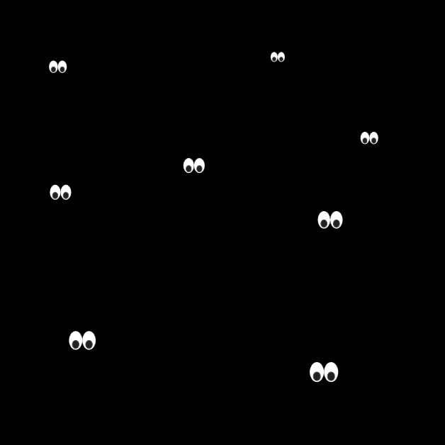
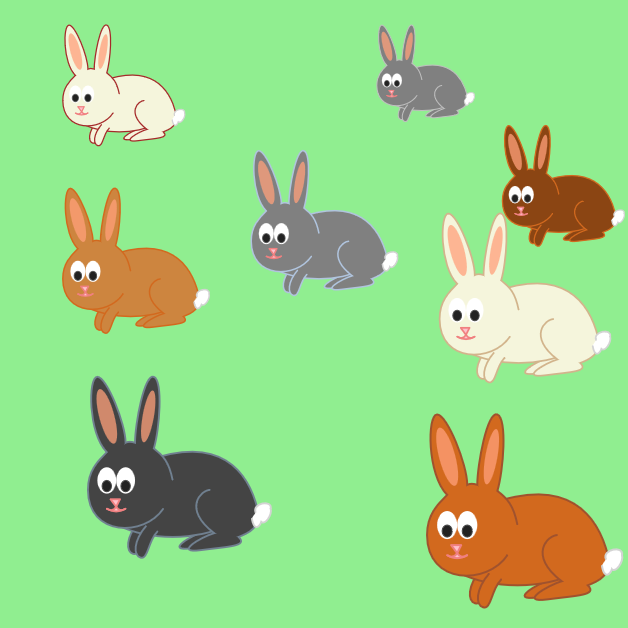

<h2 id="chap-struct">Document Structure</h2>

<h3 id="NewDocument">Defining an SVG document fragment: the svg element</h3>

<h4 id="NewDocumentOverview">Overview</h4>

An [=SVG document fragment=] consists of any number of SVG elements
contained within an <{svg}> element.

An SVG document fragment can range from an empty fragment (i.e.,
no content inside of the <{svg}> element), to a very simple SVG
document fragment containing a single SVG [=graphics element=]
such as a <{rect}>, to a complex, deeply nested collection of
[=container elements=] and [=graphics elements=].

An SVG document fragment can stand by itself as a self-contained
file or resource, in which case the SVG document fragment is an <a>SVG
document</a>, or it can be embedded inline as a fragment within a parent
HTML or XML document.

The following example shows simple SVG
content embedded inline as a fragment within a parent XML document.
Note the use of XML namespaces to indicate that the <{svg}> and
<{ellipse}> elements belong to the [=SVG namespace=]:

<pre class=include-code>
path: images/struct/parent-xml-doc.xml
highlight: xml
</pre>

This example shows a slightly more complex (i.e., it contains
multiple rectangles) stand-alone, self-contained SVG document:

<pre class=include-code>
path: images/struct/StandAlone01.svg
highlight: xml
</pre>

<{svg}> elements can appear in the middle of SVG content. This
is the mechanism by which SVG document fragments can be embedded within
other SVG document fragments.

Another use for <{svg}> elements within the middle
of SVG content is to establish a new SVG viewport. (See
<a href="coords.html#EstablishingANewSVGViewport">Establishing a new
SVG viewport</a>.)

<h4 id="Namespace"><dfn dfn export>SVG Namespace</dfn></h4>

When SVG is parsed as a XML, for compliance with the
[[xml-names|<cite>Namespaces in XML</cite>]] Recommendation
[[!xml-names]], an SVG namespace
declaration must be provided so that all SVG elements are identified
as belonging to the SVG namespace.

When using the HTML syntax, the namespace is provided automatically by the HTML parser.

<pre class=include-code>
path: images/struct/html-doc-with-svg.html
highlight: html
</pre>

As the example shows there's no need to have an xmlns
  attribute declaring that the element is in the SVG namespace when using the HTML parser.
  The HTML parser will automatically create the SVG elements in the proper namespace.

This section should talk about how a document's behavior
is defined in terms of the DOM, and also explain how the HTML parser can
create SVG fragments.

The SVG 2 namespace is <code>http://www.w3.org/2000/svg</code>,
which is the same as for earlier versions of SVG.

The following are possible ways to
provide a namespace declaration when SVG is parsed as XML. An xmlns
attribute without a namespace prefix could be specified on an
<{svg}> element, which means that SVG is the default namespace
for all elements within the scope of the element with the xmlns attribute:

<pre class=include-code>
path: images/struct/svg-namespace-example.svg
highlight: xml
</pre>

If a namespace prefix is specified on the xmlns
attribute (e.g., <code class='xml'>xmlns:svg="http://www.w3.org/2000/svg"</code>),
then the corresponding namespace is not the default namespace, so an
explicit namespace prefix must be assigned to the elements:

<pre class=include-code>
path: images/struct/svg-namespace-example-02.svg
highlight: xml
</pre>

Namespace prefixes can be specified on ancestor elements (illustrated
in the <a href="#EmbeddedSVGExample">above example</a>). For more
information, refer to the [[xml-names|<cite>Namespaces in XML</cite>]] Recommendation
[[!xml-names]].

<h4 id="structure-Definitions">Definitions</h4>

<dl class="definitions">
  <dt><dfn id="TermStructuralElement" data-dfn-type="dfn" data-export="">structural element</dfn></dt>
  <dd>The structural elements are those which define the primary
  structure of an SVG document.  Specifically, the following
  elements are structural elements:
  <{defs}>, <{g}>, <{svg}>, <{symbol}> and <{use}>.</dd>

  <dt><dfn id="TermStructurallyExternalElement" data-dfn-type="dfn" data-export="">structurally external element</dfn></dt>
  <dd>Elements that define its structure by reference to an external resource.
  Specifically, the following elements are structurally external elements when
  they have an href attribute:
  <{foreignObject}>, <{image}>, <{script}> and <{use}>.</dd>

  <dt><dfn id="TermCurrentSVGDocumentFragment" data-dfn-type="dfn" data-export="">current SVG document fragment</dfn></dt>
  <dd>The document sub-tree which starts with the outermost
  ancestor <{svg}> element of a given SVG
  element, with the requirement that all container elements
  between the outermost <{svg}> and the given element are
  all elements in the SVG namespace.</dd>

  <dt><dfn id="TermOutermostSVGElement" data-dfn-type="dfn" data-export="">outermost svg element</dfn></dt>
  <dd>The furthest <{svg}> ancestor element that remains in the
  [=current SVG document fragment=].</dd>

  <dt><dfn id="TermSVGDocumentFragment" data-dfn-type="dfn" data-export="" data-lt="SVG document">SVG document fragment</dfn></dt>
  <dd>A document sub-tree which starts with an <{svg}>
  element which is either the root element of the document or whose parent
  element is not in the SVG namespace.
  An SVG document fragment can consist of a stand-alone SVG document,
  or a fragment of a parent document enclosed by an <{svg}>
  element.
  However, an <{svg}> element that is a direct child of another SVG-namespaced element
  is not the root of an SVG document fragment.
  </dd>

  <dt><dfn id="TermSVGElements" data-dfn-type="dfn" data-export="">SVG elements</dfn></dt>
  <dd>Any element in the [=SVG namespace=].</dd>

  <dt id="TermGraphicsElement"><dfn id="graphics-element" data-dfn-type="dfn" data-export="">graphics element</dfn></dt>
  <dd>One of the element types that can cause graphics to be
  drawn onto the target canvas. Specifically:
  <{circle}>, <{ellipse}>, <{foreignObject}>, <{image}>, <{line}>, <{path}>, <{polygon}>, <{polyline}>, <{rect}>, <{text}>, <{textPath}> and <{tspan}>.</dd>

  <dt id="TermGraphicsReferencingElement"><dfn id="graphics-referencing-element" data-dfn-type="dfn" data-export="">graphics referencing element</dfn></dt>
  <dd>A graphics element which uses a reference to a different
  document or element as the source of its graphical content.
  Specifically: <{image}> and <{use}>.</dd>

</dl>

<h4 id="SVGElement">The svg element</h4>

  <table>
    <tr>
      <th>SVG 2 Requirement:</th>
      <td>Support transforming <{svg}> elements.</td>
    </tr>
    <tr>
      <th>Resolution:</th>
      <td><a href="http://www.w3.org/2011/10/28-svg-irc#T00-23-44">We will allow transform on svg in SVG 2.</a></td>
    </tr>
    <tr>
      <th>Purpose:</th>
      <td>To allow transforms on nested <{svg}> elements, in line with author expectations.</td>
    </tr>
    <tr>
      <th>Owner:</th>
      <td>Dirk (no action)</td>
    </tr>
    <tr>
      <th>Status:</th>
      <td>Done</td>
    </tr>
  </table>

    

      
‘<dfn data-dfn-type="element"
               data-export=""
               id="struct-elementdef-svg">svg</dfn>’

      <dl>
        <dt>Categories:</dt>
        <dd>[=container element=], [=renderable element=], [=structural element=]</dd>
        <dt>Content model:</dt>
        <dd>Any number of the following elements, in any order:<ul class="no-bullets">
            <li><a href="https://svgwg.org/specs/animations/#TermAnimationElement">animation elements</a> — ‘<a
                     href="https://svgwg.org/specs/animations/#AnimateElement">animate</a>’, ‘<a
                     href="https://svgwg.org/specs/animations/#AnimateMotionElement">animateMotion</a>’,
                ‘<a
                     href="https://svgwg.org/specs/animations/#AnimateTransformElement">animateTransform</a>’,
                ‘<a
                     href="https://svgwg.org/specs/animations/#SetElement">set</a>’</li>
            <li>[=descriptive element|descriptive elements=] — ‘<{desc}>’, ‘<{title}>’, ‘<{metadata}>’
            </li>
            <li>[=paint server element|paint server elements=] — ‘<{linearGradient}>’, ‘<{radialGradient}>’, ‘<{pattern}>’
            </li>
            <li>[=shape elements=] — ‘<{circle}>’, ‘<{ellipse}>’, ‘<{line}>’, ‘<{path}>’, ‘<{polygon}>’, ‘<{polyline}>’, ‘<{rect}>’</li>
            <li>[=structural element|structural elements=] — ‘<{defs}>’, ‘<{g}>’, ‘<a href="#SVGElement">svg</a>’, ‘<{symbol}>’, ‘<{use}>’</li>
          </ul><{a}>, <a
               href="https://drafts.fxtf.org/css-masking-1/#ClipPathElement">clipPath</a>, <a
               href="https://drafts.fxtf.org/filter-effects/#FilterElement">filter</a>, <a href="#ForeignObjectElement">foreignObject</a>,
          <{image}>, <{marker}>, <a
               href="https://drafts.fxtf.org/css-masking-1/#MaskElement">mask</a>, <{script}>, <{style}>, <a href="#SwitchElement">switch</a>, <a href="#TextElement">text</a>, <a href="#ViewElement">view</a></dd>
        <dt>Attributes:</dt>
        <dd>
          <ul class="no-bullets">
            <li>[=aria attributes=] — ‘<a
                     href="https://www.w3.org/TR/wai-aria-1.1/#aria-activedescendant">aria-activedescendant</a>’,
                ‘<a
                     href="https://www.w3.org/TR/wai-aria-1.1/#aria-atomic">aria-atomic</a>’, ‘<a
                     href="https://www.w3.org/TR/wai-aria-1.1/#aria-autocomplete">aria-autocomplete</a>’,
                ‘<a
                     href="https://www.w3.org/TR/wai-aria-1.1/#aria-busy">aria-busy</a>’, ‘<a
                     href="https://www.w3.org/TR/wai-aria-1.1/#aria-checked">aria-checked</a>’,
                ‘<a
                     href="https://www.w3.org/TR/wai-aria-1.1/#aria-colcount">aria-colcount</a>’,
                ‘<a
                     href="https://www.w3.org/TR/wai-aria-1.1/#aria-colindex">aria-colindex</a>’,
                ‘<a
                     href="https://www.w3.org/TR/wai-aria-1.1/#aria-colspan">aria-colspan</a>’,
                ‘<a
                     href="https://www.w3.org/TR/wai-aria-1.1/#aria-controls">aria-controls</a>’,
                ‘<a
                     href="https://www.w3.org/TR/wai-aria-1.1/#aria-current">aria-current</a>’,
                ‘<a
                     href="https://www.w3.org/TR/wai-aria-1.1/#aria-describedby">aria-describedby</a>’,
                ‘<a
                     href="https://www.w3.org/TR/wai-aria-1.1/#aria-details">aria-details</a>’,
                ‘<a
                     href="https://www.w3.org/TR/wai-aria-1.1/#aria-disabled">aria-disabled</a>’,
                ‘<a
                     href="https://www.w3.org/TR/wai-aria-1.1/#aria-dropeffect">aria-dropeffect</a>’,
                ‘<a
                     href="https://www.w3.org/TR/wai-aria-1.1/#aria-errormessage">aria-errormessage</a>’,
                ‘<a
                     href="https://www.w3.org/TR/wai-aria-1.1/#aria-expanded">aria-expanded</a>’,
                ‘<a
                     href="https://www.w3.org/TR/wai-aria-1.1/#aria-flowto">aria-flowto</a>’, ‘<a
                     href="https://www.w3.org/TR/wai-aria-1.1/#aria-grabbed">aria-grabbed</a>’,
                ‘<a
                     href="https://www.w3.org/TR/wai-aria-1.1/#aria-haspopup">aria-haspopup</a>’,
                ‘<a
                     href="https://www.w3.org/TR/wai-aria-1.1/#aria-hidden">aria-hidden</a>’, ‘<a
                     href="https://www.w3.org/TR/wai-aria-1.1/#aria-invalid">aria-invalid</a>’,
                ‘<a
                     href="https://www.w3.org/TR/wai-aria-1.1/#aria-keyshortcuts">aria-keyshortcuts</a>’,
                ‘<a
                     href="https://www.w3.org/TR/wai-aria-1.1/#aria-label">aria-label</a>’, ‘<a
                     href="https://www.w3.org/TR/wai-aria-1.1/#aria-labelledby">aria-labelledby</a>’,
                ‘<a
                     href="https://www.w3.org/TR/wai-aria-1.1/#aria-level">aria-level</a>’, ‘<a
                     href="https://www.w3.org/TR/wai-aria-1.1/#aria-live">aria-live</a>’, ‘<a
                     href="https://www.w3.org/TR/wai-aria-1.1/#aria-modal">aria-modal</a>’, ‘<a
                     href="https://www.w3.org/TR/wai-aria-1.1/#aria-multiline">aria-multiline</a>’,
                ‘<a
                     href="https://www.w3.org/TR/wai-aria-1.1/#aria-multiselectable">aria-multiselectable</a>’,
                ‘<a
                     href="https://www.w3.org/TR/wai-aria-1.1/#aria-orientation">aria-orientation</a>’,
                ‘<a
                     href="https://www.w3.org/TR/wai-aria-1.1/#aria-owns">aria-owns</a>’, ‘<a
                     href="https://www.w3.org/TR/wai-aria-1.1/#aria-placeholder">aria-placeholder</a>’,
                ‘<a
                     href="https://www.w3.org/TR/wai-aria-1.1/#aria-posinset">aria-posinset</a>’,
                ‘<a
                     href="https://www.w3.org/TR/wai-aria-1.1/#aria-pressed">aria-pressed</a>’,
                ‘<a
                     href="https://www.w3.org/TR/wai-aria-1.1/#aria-readonly">aria-readonly</a>’,
                ‘<a
                     href="https://www.w3.org/TR/wai-aria-1.1/#aria-relevant">aria-relevant</a>’,
                ‘<a
                     href="https://www.w3.org/TR/wai-aria-1.1/#aria-required">aria-required</a>’,
                ‘<a
                     href="https://www.w3.org/TR/wai-aria-1.1/#aria-roledescription">aria-roledescription</a>’,
                ‘<a
                     href="https://www.w3.org/TR/wai-aria-1.1/#aria-rowcount">aria-rowcount</a>’,
                ‘<a
                     href="https://www.w3.org/TR/wai-aria-1.1/#aria-rowindex">aria-rowindex</a>’,
                ‘<a
                     href="https://www.w3.org/TR/wai-aria-1.1/#aria-rowspan">aria-rowspan</a>’,
                ‘<a
                     href="https://www.w3.org/TR/wai-aria-1.1/#aria-selected">aria-selected</a>’,
                ‘<a
                     href="https://www.w3.org/TR/wai-aria-1.1/#aria-setsize">aria-setsize</a>’,
                ‘<a
                     href="https://www.w3.org/TR/wai-aria-1.1/#aria-sort">aria-sort</a>’, ‘<a
                     href="https://www.w3.org/TR/wai-aria-1.1/#aria-valuemax">aria-valuemax</a>’,
                ‘<a
                     href="https://www.w3.org/TR/wai-aria-1.1/#aria-valuemin">aria-valuemin</a>’,
                ‘<a
                     href="https://www.w3.org/TR/wai-aria-1.1/#aria-valuenow">aria-valuenow</a>’,
                ‘<a
                     href="https://www.w3.org/TR/wai-aria-1.1/#aria-valuetext">aria-valuetext</a>’,
                ‘<a href="#RoleAttribute">role</a>’</li>
            <li>[=conditional processing attributes=] — ‘<a
                     href="#RequiredExtensionsAttribute">requiredExtensions</a>’, ‘<a
                     href="#SystemLanguageAttribute">systemLanguage</a>’</li>
            <li>[=core attributes=] — ‘id’, ‘tabindex’, ‘autofocus’, ‘lang’, ‘xml:space’, ‘class’, ‘style’</li>
            <li><a href="#EventAttributes">document event attributes</a> — ‘onunload’, ‘onabort’, ‘onerror’, ‘onresize’, ‘onscroll’
            </li>
            <li><a href="https://html.spec.whatwg.org/multipage/webappapis.html#globaleventhandlers">global event
                attributes</a> — ‘oncancel’, ‘oncanplay’, ‘oncanplaythrough’, ‘onchange’, ‘onclick’, ‘onclose’, ‘oncopy’, ‘oncuechange’, ‘oncut’, ‘ondblclick’, ‘ondrag’, ‘ondragend’, ‘ondragenter’, ‘ondragexit’, ‘ondragleave’, ‘ondragover’, ‘ondragstart’, ‘ondrop’, ‘ondurationchange’,
                ‘onemptied’, ‘onended’, ‘onerror’, ‘onfocus’, ‘oninput’, ‘oninvalid’, ‘onkeydown’, ‘onkeypress’, ‘onkeyup’, ‘onload’, ‘onloadeddata’,
                ‘onloadedmetadata’,
                ‘onloadstart’, ‘onmousedown’, ‘onmouseenter’,
                ‘onmouseleave’,
                ‘onmousemove’, ‘onmouseout’, ‘onmouseover’, ‘onmouseup’, ‘onpaste’, ‘onpause’, ‘onplay’, ‘onplaying’, ‘onprogress’, ‘onratechange’,
                ‘onreset’, ‘onresize’, ‘onscroll’, ‘onseeked’, ‘onseeking’, ‘onselect’, ‘onshow’, ‘onstalled’, ‘onsubmit’, ‘onsuspend’, ‘ontimeupdate’,
                ‘ontoggle’, ‘onvolumechange’,
                ‘onwaiting’, ‘onwheel’
            </li>
            <li>[=presentation attributes=] —
              </li>
            <li>‘<a href="#ViewBoxAttribute">viewBox</a>’</li>
            <li>‘<a
                   href="#PreserveAspectRatioAttribute">preserveAspectRatio</a>’</li>
            <li>‘<a href="#TransformProperty">transform</a>’</li>
          </ul>
        </dd>
        <dt>Geometry properties:</dt>
        <dd>
          <ul class="no-bullets">
            <li><a property>x</a></li>
            <li><a property>y</a></li>
            <li><a href="#Sizing">width</a></li>
            <li><a href="#Sizing">height</a></li>
          </ul>
        </dd>
        <dt>DOM Interfaces:</dt>
        <dd>
          <ul class="no-bullets">
            <li>{{SVGSVGElement}}</li>
          </ul>
        </dd>
      </dl>
    

    

  The 'x' and 'y' attributes specify the
  top-left corner of the rectangular region into which an
  embedded <{svg}> element is placed.  On an [=outermost svg element=],
  these attributes have no effect.

  For [=outermost svg elements=],
  the <a href="#Sizing">width</a> and <a href="#Sizing">height</a> attributes specify
  the intrinsic size of the SVG document fragment.
  For embedded <{svg}> elements, they specify the size
  of the rectangular region into which the <{svg}> element
  is placed.
  In either case, a computed style of auto
  is treated equivalent to 100%.

If an SVG document is likely to be referenced as a component
of another document, the author will often want to include a
[[#ViewBoxAttribute|viewBox]] attribute on the [=outermost svg element=] of the
referenced document. This attribute provides a convenient way to design
SVG documents to scale-to-fit into an arbitrary SVG viewport.

The <{svg}> element exposes as [=event handler content attributes=] a number of the [=event handlers=] of the [=Window=] object. It also mirrors their [=event handler IDL attributes=].

The <a href="interact.html">onblur</a>, {{onerror}}, <a href="interact.html">onfocus</a>, {{onload}}, and {{onscroll}} [=event handlers=] of the [=Window=] object, exposed on the <{svg}> element,
replace the generic [=event handlers=] with the same names normally supported by [=SVG elements=].

<h3 id="Groups">Grouping: the g element</h3>

<h4 id="GroupsOverview">Overview</h4>

<dl class="definitions">
  <dt id="TermContainerElement"><dfn id="container-element" data-dfn-type="dfn" data-export="">container element</dfn></dt>
  <dd>An element which can have [=graphics elements=] and other
  container elements as child elements. Specifically:
  <{a}>, <{clipPath}>, <{defs}>, <{g}>, <{marker}>, <{mask}>, <{pattern}>, <{svg}>, <{switch}> and <{symbol}>.</dd>
</dl>

The <{g}> element is a [=container element=] for grouping together
related [=graphics elements=].

A group of elements, as well as individual objects, can be given
a name using the <a element-attr for="core-attributes" spec="svg2">id</a> attribute. Named groups are needed for
several purposes such as animation and re-usable objects.

An example:

<pre class=include-code>
path: images/struct/grouping01.svg
highlight: xml
</pre>

A <{g}> element can contain other <{g}> elements nested
within it, to an arbitrary depth.

<h4 id="GElement">The g element</h4>

    

      
‘<dfn data-dfn-type="element"
               data-export=""
               id="struct-elementdef-g">g</dfn>’

      <dl>
        <dt>Categories:</dt>
        <dd>[=container element=], [=renderable element=], [=structural element=]</dd>
        <dt>Content model:</dt>
        <dd>Any number of the following elements, in any order:<ul class="no-bullets">
            <li><a href="https://svgwg.org/specs/animations/#TermAnimationElement">animation elements</a> — ‘<a
                     href="https://svgwg.org/specs/animations/#AnimateElement">animate</a>’, ‘<a
                     href="https://svgwg.org/specs/animations/#AnimateMotionElement">animateMotion</a>’,
                ‘<a
                     href="https://svgwg.org/specs/animations/#AnimateTransformElement">animateTransform</a>’,
                ‘<a
                     href="https://svgwg.org/specs/animations/#SetElement">set</a>’</li>
            <li>[=descriptive element|descriptive elements=] — ‘<{desc}>’, ‘<{title}>’, ‘<{metadata}>’
            </li>
            <li>[=paint server element|paint server elements=] — ‘<{linearGradient}>’, ‘<{radialGradient}>’, ‘<{pattern}>’
            </li>
            <li>[=shape elements=] — ‘<{circle}>’, ‘<{ellipse}>’, ‘<{line}>’, ‘<{path}>’, ‘<{polygon}>’, ‘<{polyline}>’, ‘<{rect}>’</li>
            <li>[=structural element|structural elements=] — ‘<{defs}>’, ‘<{g}>’, ‘<a href="#SVGElement">svg</a>’, ‘<{symbol}>’, ‘<{use}>’</li>
          </ul><{a}>, <a
               href="https://drafts.fxtf.org/css-masking-1/#ClipPathElement">clipPath</a>, <a
               href="https://drafts.fxtf.org/filter-effects/#FilterElement">filter</a>, <a href="#ForeignObjectElement">foreignObject</a>,
          <{image}>, <{marker}>, <a
               href="https://drafts.fxtf.org/css-masking-1/#MaskElement">mask</a>, <{script}>, <{style}>, <a href="#SwitchElement">switch</a>, <a href="#TextElement">text</a>, <a href="#ViewElement">view</a></dd>
        <dt>Attributes:</dt>
        <dd>
          <ul class="no-bullets">
            <li>[=aria attributes=] — ‘<a
                     href="https://www.w3.org/TR/wai-aria-1.1/#aria-activedescendant">aria-activedescendant</a>’,
                ‘<a
                     href="https://www.w3.org/TR/wai-aria-1.1/#aria-atomic">aria-atomic</a>’, ‘<a
                     href="https://www.w3.org/TR/wai-aria-1.1/#aria-autocomplete">aria-autocomplete</a>’,
                ‘<a
                     href="https://www.w3.org/TR/wai-aria-1.1/#aria-busy">aria-busy</a>’, ‘<a
                     href="https://www.w3.org/TR/wai-aria-1.1/#aria-checked">aria-checked</a>’,
                ‘<a
                     href="https://www.w3.org/TR/wai-aria-1.1/#aria-colcount">aria-colcount</a>’,
                ‘<a
                     href="https://www.w3.org/TR/wai-aria-1.1/#aria-colindex">aria-colindex</a>’,
                ‘<a
                     href="https://www.w3.org/TR/wai-aria-1.1/#aria-colspan">aria-colspan</a>’,
                ‘<a
                     href="https://www.w3.org/TR/wai-aria-1.1/#aria-controls">aria-controls</a>’,
                ‘<a
                     href="https://www.w3.org/TR/wai-aria-1.1/#aria-current">aria-current</a>’,
                ‘<a
                     href="https://www.w3.org/TR/wai-aria-1.1/#aria-describedby">aria-describedby</a>’,
                ‘<a
                     href="https://www.w3.org/TR/wai-aria-1.1/#aria-details">aria-details</a>’,
                ‘<a
                     href="https://www.w3.org/TR/wai-aria-1.1/#aria-disabled">aria-disabled</a>’,
                ‘<a
                     href="https://www.w3.org/TR/wai-aria-1.1/#aria-dropeffect">aria-dropeffect</a>’,
                ‘<a
                     href="https://www.w3.org/TR/wai-aria-1.1/#aria-errormessage">aria-errormessage</a>’,
                ‘<a
                     href="https://www.w3.org/TR/wai-aria-1.1/#aria-expanded">aria-expanded</a>’,
                ‘<a
                     href="https://www.w3.org/TR/wai-aria-1.1/#aria-flowto">aria-flowto</a>’, ‘<a
                     href="https://www.w3.org/TR/wai-aria-1.1/#aria-grabbed">aria-grabbed</a>’,
                ‘<a
                     href="https://www.w3.org/TR/wai-aria-1.1/#aria-haspopup">aria-haspopup</a>’,
                ‘<a
                     href="https://www.w3.org/TR/wai-aria-1.1/#aria-hidden">aria-hidden</a>’, ‘<a
                     href="https://www.w3.org/TR/wai-aria-1.1/#aria-invalid">aria-invalid</a>’,
                ‘<a
                     href="https://www.w3.org/TR/wai-aria-1.1/#aria-keyshortcuts">aria-keyshortcuts</a>’,
                ‘<a
                     href="https://www.w3.org/TR/wai-aria-1.1/#aria-label">aria-label</a>’, ‘<a
                     href="https://www.w3.org/TR/wai-aria-1.1/#aria-labelledby">aria-labelledby</a>’,
                ‘<a
                     href="https://www.w3.org/TR/wai-aria-1.1/#aria-level">aria-level</a>’, ‘<a
                     href="https://www.w3.org/TR/wai-aria-1.1/#aria-live">aria-live</a>’, ‘<a
                     href="https://www.w3.org/TR/wai-aria-1.1/#aria-modal">aria-modal</a>’, ‘<a
                     href="https://www.w3.org/TR/wai-aria-1.1/#aria-multiline">aria-multiline</a>’,
                ‘<a
                     href="https://www.w3.org/TR/wai-aria-1.1/#aria-multiselectable">aria-multiselectable</a>’,
                ‘<a
                     href="https://www.w3.org/TR/wai-aria-1.1/#aria-orientation">aria-orientation</a>’,
                ‘<a
                     href="https://www.w3.org/TR/wai-aria-1.1/#aria-owns">aria-owns</a>’, ‘<a
                     href="https://www.w3.org/TR/wai-aria-1.1/#aria-placeholder">aria-placeholder</a>’,
                ‘<a
                     href="https://www.w3.org/TR/wai-aria-1.1/#aria-posinset">aria-posinset</a>’,
                ‘<a
                     href="https://www.w3.org/TR/wai-aria-1.1/#aria-pressed">aria-pressed</a>’,
                ‘<a
                     href="https://www.w3.org/TR/wai-aria-1.1/#aria-readonly">aria-readonly</a>’,
                ‘<a
                     href="https://www.w3.org/TR/wai-aria-1.1/#aria-relevant">aria-relevant</a>’,
                ‘<a
                     href="https://www.w3.org/TR/wai-aria-1.1/#aria-required">aria-required</a>’,
                ‘<a
                     href="https://www.w3.org/TR/wai-aria-1.1/#aria-roledescription">aria-roledescription</a>’,
                ‘<a
                     href="https://www.w3.org/TR/wai-aria-1.1/#aria-rowcount">aria-rowcount</a>’,
                ‘<a
                     href="https://www.w3.org/TR/wai-aria-1.1/#aria-rowindex">aria-rowindex</a>’,
                ‘<a
                     href="https://www.w3.org/TR/wai-aria-1.1/#aria-rowspan">aria-rowspan</a>’,
                ‘<a
                     href="https://www.w3.org/TR/wai-aria-1.1/#aria-selected">aria-selected</a>’,
                ‘<a
                     href="https://www.w3.org/TR/wai-aria-1.1/#aria-setsize">aria-setsize</a>’,
                ‘<a
                     href="https://www.w3.org/TR/wai-aria-1.1/#aria-sort">aria-sort</a>’, ‘<a
                     href="https://www.w3.org/TR/wai-aria-1.1/#aria-valuemax">aria-valuemax</a>’,
                ‘<a
                     href="https://www.w3.org/TR/wai-aria-1.1/#aria-valuemin">aria-valuemin</a>’,
                ‘<a
                     href="https://www.w3.org/TR/wai-aria-1.1/#aria-valuenow">aria-valuenow</a>’,
                ‘<a
                     href="https://www.w3.org/TR/wai-aria-1.1/#aria-valuetext">aria-valuetext</a>’,
                ‘<a href="#RoleAttribute">role</a>’</li>
            <li>[=conditional processing attributes=] — ‘<a
                     href="#RequiredExtensionsAttribute">requiredExtensions</a>’, ‘<a
                     href="#SystemLanguageAttribute">systemLanguage</a>’</li>
            <li>[=core attributes=] — ‘id’, ‘tabindex’, ‘autofocus’, ‘lang’, ‘xml:space’, ‘class’, ‘style’</li>
            <li><a href="https://html.spec.whatwg.org/multipage/webappapis.html#globaleventhandlers">global event
                attributes</a> — ‘oncancel’, ‘oncanplay’, ‘oncanplaythrough’, ‘onchange’, ‘onclick’, ‘onclose’, ‘oncopy’, ‘oncuechange’, ‘oncut’, ‘ondblclick’, ‘ondrag’, ‘ondragend’, ‘ondragenter’, ‘ondragexit’, ‘ondragleave’, ‘ondragover’, ‘ondragstart’, ‘ondrop’, ‘ondurationchange’,
                ‘onemptied’, ‘onended’, ‘onerror’, ‘onfocus’, ‘oninput’, ‘oninvalid’, ‘onkeydown’, ‘onkeypress’, ‘onkeyup’, ‘onload’, ‘onloadeddata’,
                ‘onloadedmetadata’,
                ‘onloadstart’, ‘onmousedown’, ‘onmouseenter’,
                ‘onmouseleave’,
                ‘onmousemove’, ‘onmouseout’, ‘onmouseover’, ‘onmouseup’, ‘onpaste’, ‘onpause’, ‘onplay’, ‘onplaying’, ‘onprogress’, ‘onratechange’,
                ‘onreset’, ‘onresize’, ‘onscroll’, ‘onseeked’, ‘onseeking’, ‘onselect’, ‘onshow’, ‘onstalled’, ‘onsubmit’, ‘onsuspend’, ‘ontimeupdate’,
                ‘ontoggle’, ‘onvolumechange’,
                ‘onwaiting’, ‘onwheel’
            </li>
            <li>[=presentation attributes=] —
              </li>
          </ul>
        </dd>
        <dt>DOM Interfaces:</dt>
        <dd>
          <ul class="no-bullets">
            <li>{{SVGGElement}}</li>
          </ul>
        </dd>
      </dl>
    

<h3 id="Head">Defining content for reuse, and the defs element</h3>

<h4 id="struct-overview">Overview</h4>

SVG allows a graphical object to be defined for later reuse.
To do this, SVG makes extensive use of the [=URL reference=]
construct [<a href="refs.html#ref-rfc3987">rfc3987</a>].
For example, to fill a rectangle with a linear gradient, a
<{linearGradient}> element may be defined with an
<a element-attr for="core-attributes" spec="svg2">id</a> property that may be referenced in the value for
the rectangle's 'fill' property, as in the following:

<xmp>
<linearGradient id="example-gradient">...</linearGradient>
<rect style="fill:url(#example-gradient)"/>
</xmp>

Some types of element, such as gradients, will not by themselves produce a graphical result. They can therefore be placed anywhere convenient. However, sometimes it is desired to define a graphical object and prevent it from being directly rendered. it is only there to be referenced elsewhere. To do this, and to allow convenient grouping defined content, SVG provides the defs element.

It is recommended that, where possible, referenced elements be defined
prior to the elements that use them, in document order.
Collecting all referenced elements
inside of a single <{defs}> element
near the top of the file
can make the markup easier to read and understand.

<h4 id="DefsElement">The defs element</h4>

    

      
‘<dfn data-dfn-type="element"
               data-export=""
               id="struct-elementdef-defs">defs</dfn>’

      <dl>
        <dt>Categories:</dt>
        <dd>[=container element=], [=never-rendered element=], [=structural element=]</dd>
        <dt>Content model:</dt>
        <dd>Any number of the following elements, in any order:<ul class="no-bullets">
            <li><a href="https://svgwg.org/specs/animations/#TermAnimationElement">animation elements</a> — ‘<a
                     href="https://svgwg.org/specs/animations/#AnimateElement">animate</a>’, ‘<a
                     href="https://svgwg.org/specs/animations/#AnimateMotionElement">animateMotion</a>’,
                ‘<a
                     href="https://svgwg.org/specs/animations/#AnimateTransformElement">animateTransform</a>’,
                ‘<a
                     href="https://svgwg.org/specs/animations/#SetElement">set</a>’</li>
            <li>[=descriptive element|descriptive elements=] — ‘<{desc}>’, ‘<{title}>’, ‘<{metadata}>’
            </li>
            <li>[=paint server element|paint server elements=] — ‘<{linearGradient}>’, ‘<{radialGradient}>’, ‘<{pattern}>’
            </li>
            <li>[=shape elements=] — ‘<{circle}>’, ‘<{ellipse}>’, ‘<{line}>’, ‘<{path}>’, ‘<{polygon}>’, ‘<{polyline}>’, ‘<{rect}>’</li>
            <li>[=structural element|structural elements=] — ‘<{defs}>’, ‘<{g}>’, ‘<a href="#SVGElement">svg</a>’, ‘<{symbol}>’, ‘<{use}>’</li>
          </ul><{a}>, <a
               href="https://drafts.fxtf.org/css-masking-1/#ClipPathElement">clipPath</a>, <a
               href="https://drafts.fxtf.org/filter-effects/#FilterElement">filter</a>, <a href="#ForeignObjectElement">foreignObject</a>,
          <{image}>, <{marker}>, <a
               href="https://drafts.fxtf.org/css-masking-1/#MaskElement">mask</a>, <{script}>, <{style}>, <a href="#SwitchElement">switch</a>, <a href="#TextElement">text</a>, <a href="#ViewElement">view</a></dd>
        <dt>Attributes:</dt>
        <dd>
          <ul class="no-bullets">
            <li>[=core attributes=] — ‘id’, ‘tabindex’, ‘autofocus’, ‘lang’, ‘xml:space’, ‘class’, ‘style’</li>
            <li><a href="https://html.spec.whatwg.org/multipage/webappapis.html#globaleventhandlers">global event
                attributes</a> — ‘oncancel’, ‘oncanplay’, ‘oncanplaythrough’, ‘onchange’, ‘onclick’, ‘onclose’, ‘oncopy’, ‘oncuechange’, ‘oncut’, ‘ondblclick’, ‘ondrag’, ‘ondragend’, ‘ondragenter’, ‘ondragexit’, ‘ondragleave’, ‘ondragover’, ‘ondragstart’, ‘ondrop’, ‘ondurationchange’,
                ‘onemptied’, ‘onended’, ‘onerror’, ‘onfocus’, ‘oninput’, ‘oninvalid’, ‘onkeydown’, ‘onkeypress’, ‘onkeyup’, ‘onload’, ‘onloadeddata’,
                ‘onloadedmetadata’,
                ‘onloadstart’, ‘onmousedown’, ‘onmouseenter’,
                ‘onmouseleave’,
                ‘onmousemove’, ‘onmouseout’, ‘onmouseover’, ‘onmouseup’, ‘onpaste’, ‘onpause’, ‘onplay’, ‘onplaying’, ‘onprogress’, ‘onratechange’,
                ‘onreset’, ‘onresize’, ‘onscroll’, ‘onseeked’, ‘onseeking’, ‘onselect’, ‘onshow’, ‘onstalled’, ‘onsubmit’, ‘onsuspend’, ‘ontimeupdate’,
                ‘ontoggle’, ‘onvolumechange’,
                ‘onwaiting’, ‘onwheel’
            </li>
            <li>[=presentation attributes=] —
              </li>
          </ul>
        </dd>
        <dt>DOM Interfaces:</dt>
        <dd>
          <ul class="no-bullets">
            <li>{{SVGDefsElement}}</li>
          </ul>
        </dd>
      </dl>
    

The <{defs}> element is a container element for
<a href="struct.html#Head">referenced elements</a>. For understandability and
<a href="access.html">accessibility</a> reasons, it is recommended
that, whenever possible, referenced elements be defined inside
of a <{defs}>.

The content model for <{defs}> is the same as for the
<{g}> element; thus, any element that can be a child of a
<{g}> can also be a child of a <{defs}>, and vice versa.

Elements that are descendants of a <{defs}> are not rendered directly;
the 'display' value for the <{defs}> element
must always be set to none
by the [=user agent style sheet=],
and this declaration must have importance over any other CSS rule or presentation attribute.
Note, however, that the descendants of a <{defs}> are
always present in the source tree and thus can always be
referenced by other elements; thus, the value of the 'display'
property on the <{defs}> element does not
prevent those elements from being referenced by other elements.

<h3 id="SymbolElement">The symbol element</h3>

The <{symbol}> element is used to define graphical templates
which can be instantiated by a <{use}> element but which are not rendered
directly.

A <{symbol}> establishes a nested coordinate system
  for the graphics it contains.
  When a symbol is instantiated
  as the [=referenced element=] of a <{use}> element,
  it is therefore rendered very similarly to a nested <{svg}> element.

      

        
‘<dfn data-dfn-type="element"
                 data-export=""
                 id="struct-elementdef-symbol">symbol</dfn>’

        <dl>
          <dt>Categories:</dt>
          <dd>[=container element=], [=structural element=]</dd>
          <dt>Content model:</dt>
          <dd>Any number of the following elements, in any order:<ul class="no-bullets">
              <li><a href="https://svgwg.org/specs/animations/#TermAnimationElement">animation elements</a> — ‘<a
                       href="https://svgwg.org/specs/animations/#AnimateElement">animate</a>’, ‘<a
                       href="https://svgwg.org/specs/animations/#AnimateMotionElement">animateMotion</a>’,
                  ‘<a
                       href="https://svgwg.org/specs/animations/#AnimateTransformElement">animateTransform</a>’,
                  ‘<a
                       href="https://svgwg.org/specs/animations/#SetElement">set</a>’</li>
              <li>[=descriptive element|descriptive elements=] — ‘<{desc}>’, ‘<{title}>’, ‘<{metadata}>’
              </li>
              <li>[=paint server element|paint server elements=] — ‘<{linearGradient}>’, ‘<{radialGradient}>’, ‘<{pattern}>’
              </li>
              <li>[=shape elements=] — ‘<{circle}>’, ‘<{ellipse}>’, ‘<{line}>’, ‘<{path}>’, ‘<{polygon}>’, ‘<{polyline}>’, ‘<{rect}>’</li>
              <li>[=structural element|structural elements=] — ‘<{defs}>’, ‘<{g}>’, ‘<a href="#SVGElement">svg</a>’, ‘<{symbol}>’, ‘<{use}>’</li>
            </ul><{a}>, <a
                 href="https://drafts.fxtf.org/css-masking-1/#ClipPathElement">clipPath</a>, <a
                 href="https://drafts.fxtf.org/filter-effects/#FilterElement">filter</a>, <a href="#ForeignObjectElement">foreignObject</a>,
            <{image}>, <{marker}>, <a
                 href="https://drafts.fxtf.org/css-masking-1/#MaskElement">mask</a>, <{script}>, <{style}>, <a href="#SwitchElement">switch</a>, <a href="#TextElement">text</a>, <a href="#ViewElement">view</a></dd>
          <dt>Attributes:</dt>
          <dd>
            <ul class="no-bullets">
              <li>[=aria attributes=] — ‘<a
                       href="https://www.w3.org/TR/wai-aria-1.1/#aria-activedescendant">aria-activedescendant</a>’,
                  ‘<a
                       href="https://www.w3.org/TR/wai-aria-1.1/#aria-atomic">aria-atomic</a>’,
                  ‘<a
                       href="https://www.w3.org/TR/wai-aria-1.1/#aria-autocomplete">aria-autocomplete</a>’,
                  ‘<a
                       href="https://www.w3.org/TR/wai-aria-1.1/#aria-busy">aria-busy</a>’, ‘<a
                       href="https://www.w3.org/TR/wai-aria-1.1/#aria-checked">aria-checked</a>’,
                  ‘<a
                       href="https://www.w3.org/TR/wai-aria-1.1/#aria-colcount">aria-colcount</a>’,
                  ‘<a
                       href="https://www.w3.org/TR/wai-aria-1.1/#aria-colindex">aria-colindex</a>’,
                  ‘<a
                       href="https://www.w3.org/TR/wai-aria-1.1/#aria-colspan">aria-colspan</a>’,
                  ‘<a
                       href="https://www.w3.org/TR/wai-aria-1.1/#aria-controls">aria-controls</a>’,
                  ‘<a
                       href="https://www.w3.org/TR/wai-aria-1.1/#aria-current">aria-current</a>’,
                  ‘<a
                       href="https://www.w3.org/TR/wai-aria-1.1/#aria-describedby">aria-describedby</a>’,
                  ‘<a
                       href="https://www.w3.org/TR/wai-aria-1.1/#aria-details">aria-details</a>’,
                  ‘<a
                       href="https://www.w3.org/TR/wai-aria-1.1/#aria-disabled">aria-disabled</a>’,
                  ‘<a
                       href="https://www.w3.org/TR/wai-aria-1.1/#aria-dropeffect">aria-dropeffect</a>’,
                  ‘<a
                       href="https://www.w3.org/TR/wai-aria-1.1/#aria-errormessage">aria-errormessage</a>’,
                  ‘<a
                       href="https://www.w3.org/TR/wai-aria-1.1/#aria-expanded">aria-expanded</a>’,
                  ‘<a
                       href="https://www.w3.org/TR/wai-aria-1.1/#aria-flowto">aria-flowto</a>’,
                  ‘<a
                       href="https://www.w3.org/TR/wai-aria-1.1/#aria-grabbed">aria-grabbed</a>’,
                  ‘<a
                       href="https://www.w3.org/TR/wai-aria-1.1/#aria-haspopup">aria-haspopup</a>’,
                  ‘<a
                       href="https://www.w3.org/TR/wai-aria-1.1/#aria-hidden">aria-hidden</a>’,
                  ‘<a
                       href="https://www.w3.org/TR/wai-aria-1.1/#aria-invalid">aria-invalid</a>’,
                  ‘<a
                       href="https://www.w3.org/TR/wai-aria-1.1/#aria-keyshortcuts">aria-keyshortcuts</a>’,
                  ‘<a
                       href="https://www.w3.org/TR/wai-aria-1.1/#aria-label">aria-label</a>’, ‘<a
                       href="https://www.w3.org/TR/wai-aria-1.1/#aria-labelledby">aria-labelledby</a>’,
                  ‘<a
                       href="https://www.w3.org/TR/wai-aria-1.1/#aria-level">aria-level</a>’, ‘<a
                       href="https://www.w3.org/TR/wai-aria-1.1/#aria-live">aria-live</a>’, ‘<a
                       href="https://www.w3.org/TR/wai-aria-1.1/#aria-modal">aria-modal</a>’, ‘<a
                       href="https://www.w3.org/TR/wai-aria-1.1/#aria-multiline">aria-multiline</a>’,
                  ‘<a
                       href="https://www.w3.org/TR/wai-aria-1.1/#aria-multiselectable">aria-multiselectable</a>’,
                  ‘<a
                       href="https://www.w3.org/TR/wai-aria-1.1/#aria-orientation">aria-orientation</a>’,
                  ‘<a
                       href="https://www.w3.org/TR/wai-aria-1.1/#aria-owns">aria-owns</a>’, ‘<a
                       href="https://www.w3.org/TR/wai-aria-1.1/#aria-placeholder">aria-placeholder</a>’,
                  ‘<a
                       href="https://www.w3.org/TR/wai-aria-1.1/#aria-posinset">aria-posinset</a>’,
                  ‘<a
                       href="https://www.w3.org/TR/wai-aria-1.1/#aria-pressed">aria-pressed</a>’,
                  ‘<a
                       href="https://www.w3.org/TR/wai-aria-1.1/#aria-readonly">aria-readonly</a>’,
                  ‘<a
                       href="https://www.w3.org/TR/wai-aria-1.1/#aria-relevant">aria-relevant</a>’,
                  ‘<a
                       href="https://www.w3.org/TR/wai-aria-1.1/#aria-required">aria-required</a>’,
                  ‘<a
                       href="https://www.w3.org/TR/wai-aria-1.1/#aria-roledescription">aria-roledescription</a>’,
                  ‘<a
                       href="https://www.w3.org/TR/wai-aria-1.1/#aria-rowcount">aria-rowcount</a>’,
                  ‘<a
                       href="https://www.w3.org/TR/wai-aria-1.1/#aria-rowindex">aria-rowindex</a>’,
                  ‘<a
                       href="https://www.w3.org/TR/wai-aria-1.1/#aria-rowspan">aria-rowspan</a>’,
                  ‘<a
                       href="https://www.w3.org/TR/wai-aria-1.1/#aria-selected">aria-selected</a>’,
                  ‘<a
                       href="https://www.w3.org/TR/wai-aria-1.1/#aria-setsize">aria-setsize</a>’,
                  ‘<a
                       href="https://www.w3.org/TR/wai-aria-1.1/#aria-sort">aria-sort</a>’, ‘<a
                       href="https://www.w3.org/TR/wai-aria-1.1/#aria-valuemax">aria-valuemax</a>’,
                  ‘<a
                       href="https://www.w3.org/TR/wai-aria-1.1/#aria-valuemin">aria-valuemin</a>’,
                  ‘<a
                       href="https://www.w3.org/TR/wai-aria-1.1/#aria-valuenow">aria-valuenow</a>’,
                  ‘<a
                       href="https://www.w3.org/TR/wai-aria-1.1/#aria-valuetext">aria-valuetext</a>’,
                  ‘<a href="#RoleAttribute">role</a>’</li>
              <li>[=core attributes=] — ‘id’, ‘tabindex’, ‘autofocus’, ‘lang’, ‘xml:space’, ‘class’, ‘style’</li>
              <li><a href="https://html.spec.whatwg.org/multipage/webappapis.html#globaleventhandlers">global event
                  attributes</a> — ‘oncancel’, ‘oncanplay’, ‘oncanplaythrough’, ‘onchange’, ‘onclick’, ‘onclose’, ‘oncopy’, ‘oncuechange’,
                  ‘oncut’, ‘ondblclick’,
                  ‘ondrag’, ‘ondragend’, ‘ondragenter’,
                  ‘ondragexit’,
                  ‘ondragleave’,
                  ‘ondragover’,
                  ‘ondragstart’,
                  ‘ondrop’, ‘ondurationchange’, ‘onemptied’, ‘onended’, ‘onerror’, ‘onfocus’, ‘oninput’, ‘oninvalid’, ‘onkeydown’, ‘onkeypress’,
                  ‘onkeyup’, ‘onload’, ‘onloadeddata’,
                  ‘onloadedmetadata’, ‘onloadstart’,
                  ‘onmousedown’,
                  ‘onmouseenter’,
                  ‘onmouseleave’,
                  ‘onmousemove’,
                  ‘onmouseout’,
                  ‘onmouseover’,
                  ‘onmouseup’, ‘onpaste’, ‘onpause’, ‘onplay’, ‘onplaying’, ‘onprogress’,
                  ‘onratechange’,
                  ‘onreset’, ‘onresize’, ‘onscroll’, ‘onseeked’, ‘onseeking’, ‘onselect’, ‘onshow’, ‘onstalled’, ‘onsubmit’, ‘onsuspend’, ‘ontimeupdate’,
                  ‘ontoggle’, ‘onvolumechange’,
                  ‘onwaiting’, ‘onwheel’
              </li>
              <li>[=presentation attributes=] —
                </li>
              <li>‘<a
                     href="#PreserveAspectRatioAttribute">preserveAspectRatio</a>’</li>
              <li>‘<a href="#ViewBoxAttribute">viewBox</a>’</li>
              <li>‘<{symbol/refX}>’
              </li>
              <li>‘<{symbol/refY}>’
              </li>
            </ul>
          </dd>
          <dt>Geometry properties:</dt>
          <dd>
            <ul class="no-bullets">
              <li><a property>x</a></li>
              <li><a property>y</a></li>
              <li><a href="#Sizing">width</a></li>
              <li><a href="#Sizing">height</a></li>
            </ul>
          </dd>
          <dt>DOM Interfaces:</dt>
          <dd>
            <ul class="no-bullets">
              <li>{{SVGSymbolElement}}</li>
            </ul>
          </dd>
        </dl>
      

The 'x', 'y', <a href="#Sizing">width</a>, and <a href="#Sizing">height</a> geometry properties
  have the same effect as on an <{svg}> element,
  when the <{symbol}> is instantiated by a <{use}> element.
  In particular, if <a href="#Sizing">width</a> and <a href="#Sizing">height</a>
  compute to auto
  (and are not over-ridden by values on the instantiating <{use}> element),
  then they will be treated as a value of 100%.

Note: 
  New in SVG 2.
  Allowing geometry properties to be specified on a symbol
  provides a more consistent rendering model,
  and allows authors to set a default size for each symbol
  (which may still be over-ridden by attributes on the <{use}> element).

<h4 id="SymbolAttributes">Attributes</h4>

<dl class="attrdef-list">
  <dt>
    <table class="attrdef def">
      <tr>
        <th>Name</th>
        <th>Value</th>
        <th>Initial value</th>
        <th>Animatable</th>
      </tr>
      <tr>
        <td><dfn data-dfn-type="element-attr" data-dfn-for="symbol" id="SymbolElementRefXAttribute">refX</dfn></td>
        <td><<length>> | left | center | right</td>
        <td>(none)</td>
        <td>yes</td>
      </tr>
      <tr>
        <td><dfn data-dfn-type="element-attr" data-dfn-for="symbol" id="SymbolElementRefYAttribute">refY</dfn></td>
        <td><<length>> | top | center | bottom</td>
        <td>(none)</td>
        <td>yes</td>
      </tr>
    </table>
  </dt>
  <dd>

    Note: 
      New in SVG 2. Added to make it easier to align symbols to a
      particular point, as is often done in maps. Similar to the
      matching attributes on <{marker}> element.
    

    

      Add refX/refY to symbol element. Resolved at
      <a href="http://www.w3.org/2014/04/08-svg-minutes.html#item12">Leipzig F2F</a>.
      Status: Done.
    
    

      We will add top/center/bottom, left/center/right keywords to
      refX/refY on marker/symbol. Resolved at
      <a href="http://www.w3.org/2014/08/26-svg-minutes.html#item07">London
      F2F</a>. Values inspired by
      <a href="https://www.w3.org/TR/css3-background/#the-background-position">background-position</a>.
      Status: Done.
    

    

      The {{refX}} and {{refY}} attributes define the
      reference point of the symbol which is to be placed exactly at
      the symbol's x,y positioning coordinate,
      as defined by the cumulative effect of the 'x' and 'y'
      properties and any transformations on the <{symbol}>
      and its [=host=] <{use}> element.
    
    

      Keyword values have the same meaning as for the
      <{marker/refX}> and <{marker/refY}> attributes on the <{marker}> element element,
      resolving to 0%, 50%, or 100% in the applicable direction.
    
    

      Unlike other positioning attributes,
      {{refX}} and {{refY}}
      are interpreted as being in the coordinate system of the
      symbol contents, after application of the [[#ViewBoxAttribute|viewBox]]
      and [[#PreserveAspectRatioAttribute|preserveAspectRatio]] attributes.
      If one or both of the attributes is not specified,
      no adjustment is made in the corresponding dimension,
      and the top or left side of the symbol's rectangular viewport region
      (regardless of the [[#ViewBoxAttribute|viewBox]] coordinates)
      is positioned at the x,y point.
    

    Note: 
      For backwards compatibility,
      the behavior when {{refX}} and {{refY}}
      are not specified on a <{symbol}>
      is different from when they are specified with a value of 0,
      and therefore different from the behavior
      when equivalent attributes are not specified on a <{marker}> element.
    

  </dd>
</dl>

<h4 id="SymbolNotes">Notes on symbols</h4>

The use of <{symbol}> elements for graphics that are used multiple
times in the same document adds structure and semantics.
Closely related to the <{symbol}> element are the
<{marker}> element and <{pattern}> elements;
all three define a container of graphical content
that can be rendered repeatedly at various positions and scales in the SVG.
However, while [=re-used graphics=] in a pattern and marker
provide a graphical effect on another element,
the content in a <{symbol}> will be embedded
as fully interactive content, within a [=use-element shadow tree=].

The <a href="styling.html#UAStyleSheet">user agent style sheet</a> sets
the [[#OverflowAndClipProperties|overflow]] property for <{symbol}> element elements to
hidden, which causes a rectangular clipping
path to be created at the bounds of symbol's SVG viewport.  Unless the
[[#OverflowAndClipProperties|overflow]] property is overridden, any graphics within the symbol which
goes outside of the symbol's SVG viewport will be clipped.

<{symbol}> elements must never be rendered directly;
their only usage is as something that can be referenced
using the <{use}> element.
<!--
The 'display' property does not apply
to the <{symbol}> element; thus, <{symbol}> elements are
not directly rendered even if the 'display' property is set to a
value other than none, and <{symbol}>
elements are available for referencing even when the
'display' property on the <{symbol}> element or any of its
ancestors is set to none.
-->
The user agent must set the
'display' property on the <{symbol}> element
to none,
as part of the [=user agent style sheet=],
and this declaration must have importance over any other CSS rule or presentation attribute.

The generated [=instance=] of a <{symbol}>
that is the direct [=referenced element=] of a <{use}> element
must always have a computed value of inline
for the 'display' property.
In other words, it must be rendered whenever the host <{use}> element is rendered.
The [=user agent style sheet=] again defines this
declaration to have importance over any other CSS rule or presentation attribute.
Any other <{symbol}> that is cloned
to create an [=element instance=]
within the [=use-element shadow tree=]
behaves as a symbol definition, and must not be rendered.

<h3 id="UseElement">The use element</h3>

  <table>
    <tr>
      <th>SVG 2 Requirement:</th>
      <td>Allow <{use}> to reference an external document's root element by omitting the fragment.</td>
    </tr>
    <tr>
      <th>Resolution:</th>
      <td><a href="http://www.w3.org/2011/10/28-svg-irc#T00-33-43">We will relax referencing requirements to particular elements to allow dropping fragments to mean referencing root element, where it makes sense, such as with use, in SVG 2.</a></td>
    </tr>
    <tr>
      <th>Purpose:</th>
      <td>To avoid requiring authors to modify the referenced document to add an ID to the root element.</td>
    </tr>
    <tr>
      <th>Owner:</th>
      <td>Cameron (<a href="http://www.w3.org/Graphics/SVG/WG/track/actions/3417">ACTION-3417</a>)</td>
    </tr>
    <tr>
      <th>Status:</th>
      <td>Done</td>
    </tr>
  </table>

      

        
‘<dfn data-dfn-type="element"
                 data-export=""
                 id="struct-elementdef-use">use</dfn>’

        <dl>
          <dt>Categories:</dt>
          <dd>[=graphics referencing element|Graphics referencing element=], [=renderable element=], [=structural element=], [=structurally external element=]</dd>
          <dt>Content model:</dt>
          <dd>Any number of the following elements, in any order:<ul class="no-bullets">
              <li><a href="https://svgwg.org/specs/animations/#TermAnimationElement">animation elements</a> — ‘<a
                       href="https://svgwg.org/specs/animations/#AnimateElement">animate</a>’, ‘<a
                       href="https://svgwg.org/specs/animations/#AnimateMotionElement">animateMotion</a>’,
                  ‘<a
                       href="https://svgwg.org/specs/animations/#AnimateTransformElement">animateTransform</a>’,
                  ‘<a
                       href="https://svgwg.org/specs/animations/#SetElement">set</a>’</li>
              <li>[=descriptive element|descriptive elements=] — ‘<{desc}>’, ‘<{title}>’, ‘<{metadata}>’
              </li>
            </ul><a
                 href="https://drafts.fxtf.org/css-masking-1/#ClipPathElement">clipPath</a>, <a
                 href="https://drafts.fxtf.org/css-masking-1/#MaskElement">mask</a>, <{script}>, <{style}></dd>
          <dt>Attributes:</dt>
          <dd>
            <ul class="no-bullets">
              <li>[=aria attributes=] — ‘<a
                       href="https://www.w3.org/TR/wai-aria-1.1/#aria-activedescendant">aria-activedescendant</a>’,
                  ‘<a
                       href="https://www.w3.org/TR/wai-aria-1.1/#aria-atomic">aria-atomic</a>’,
                  ‘<a
                       href="https://www.w3.org/TR/wai-aria-1.1/#aria-autocomplete">aria-autocomplete</a>’,
                  ‘<a
                       href="https://www.w3.org/TR/wai-aria-1.1/#aria-busy">aria-busy</a>’, ‘<a
                       href="https://www.w3.org/TR/wai-aria-1.1/#aria-checked">aria-checked</a>’,
                  ‘<a
                       href="https://www.w3.org/TR/wai-aria-1.1/#aria-colcount">aria-colcount</a>’,
                  ‘<a
                       href="https://www.w3.org/TR/wai-aria-1.1/#aria-colindex">aria-colindex</a>’,
                  ‘<a
                       href="https://www.w3.org/TR/wai-aria-1.1/#aria-colspan">aria-colspan</a>’,
                  ‘<a
                       href="https://www.w3.org/TR/wai-aria-1.1/#aria-controls">aria-controls</a>’,
                  ‘<a
                       href="https://www.w3.org/TR/wai-aria-1.1/#aria-current">aria-current</a>’,
                  ‘<a
                       href="https://www.w3.org/TR/wai-aria-1.1/#aria-describedby">aria-describedby</a>’,
                  ‘<a
                       href="https://www.w3.org/TR/wai-aria-1.1/#aria-details">aria-details</a>’,
                  ‘<a
                       href="https://www.w3.org/TR/wai-aria-1.1/#aria-disabled">aria-disabled</a>’,
                  ‘<a
                       href="https://www.w3.org/TR/wai-aria-1.1/#aria-dropeffect">aria-dropeffect</a>’,
                  ‘<a
                       href="https://www.w3.org/TR/wai-aria-1.1/#aria-errormessage">aria-errormessage</a>’,
                  ‘<a
                       href="https://www.w3.org/TR/wai-aria-1.1/#aria-expanded">aria-expanded</a>’,
                  ‘<a
                       href="https://www.w3.org/TR/wai-aria-1.1/#aria-flowto">aria-flowto</a>’,
                  ‘<a
                       href="https://www.w3.org/TR/wai-aria-1.1/#aria-grabbed">aria-grabbed</a>’,
                  ‘<a
                       href="https://www.w3.org/TR/wai-aria-1.1/#aria-haspopup">aria-haspopup</a>’,
                  ‘<a
                       href="https://www.w3.org/TR/wai-aria-1.1/#aria-hidden">aria-hidden</a>’,
                  ‘<a
                       href="https://www.w3.org/TR/wai-aria-1.1/#aria-invalid">aria-invalid</a>’,
                  ‘<a
                       href="https://www.w3.org/TR/wai-aria-1.1/#aria-keyshortcuts">aria-keyshortcuts</a>’,
                  ‘<a
                       href="https://www.w3.org/TR/wai-aria-1.1/#aria-label">aria-label</a>’, ‘<a
                       href="https://www.w3.org/TR/wai-aria-1.1/#aria-labelledby">aria-labelledby</a>’,
                  ‘<a
                       href="https://www.w3.org/TR/wai-aria-1.1/#aria-level">aria-level</a>’, ‘<a
                       href="https://www.w3.org/TR/wai-aria-1.1/#aria-live">aria-live</a>’, ‘<a
                       href="https://www.w3.org/TR/wai-aria-1.1/#aria-modal">aria-modal</a>’, ‘<a
                       href="https://www.w3.org/TR/wai-aria-1.1/#aria-multiline">aria-multiline</a>’,
                  ‘<a
                       href="https://www.w3.org/TR/wai-aria-1.1/#aria-multiselectable">aria-multiselectable</a>’,
                  ‘<a
                       href="https://www.w3.org/TR/wai-aria-1.1/#aria-orientation">aria-orientation</a>’,
                  ‘<a
                       href="https://www.w3.org/TR/wai-aria-1.1/#aria-owns">aria-owns</a>’, ‘<a
                       href="https://www.w3.org/TR/wai-aria-1.1/#aria-placeholder">aria-placeholder</a>’,
                  ‘<a
                       href="https://www.w3.org/TR/wai-aria-1.1/#aria-posinset">aria-posinset</a>’,
                  ‘<a
                       href="https://www.w3.org/TR/wai-aria-1.1/#aria-pressed">aria-pressed</a>’,
                  ‘<a
                       href="https://www.w3.org/TR/wai-aria-1.1/#aria-readonly">aria-readonly</a>’,
                  ‘<a
                       href="https://www.w3.org/TR/wai-aria-1.1/#aria-relevant">aria-relevant</a>’,
                  ‘<a
                       href="https://www.w3.org/TR/wai-aria-1.1/#aria-required">aria-required</a>’,
                  ‘<a
                       href="https://www.w3.org/TR/wai-aria-1.1/#aria-roledescription">aria-roledescription</a>’,
                  ‘<a
                       href="https://www.w3.org/TR/wai-aria-1.1/#aria-rowcount">aria-rowcount</a>’,
                  ‘<a
                       href="https://www.w3.org/TR/wai-aria-1.1/#aria-rowindex">aria-rowindex</a>’,
                  ‘<a
                       href="https://www.w3.org/TR/wai-aria-1.1/#aria-rowspan">aria-rowspan</a>’,
                  ‘<a
                       href="https://www.w3.org/TR/wai-aria-1.1/#aria-selected">aria-selected</a>’,
                  ‘<a
                       href="https://www.w3.org/TR/wai-aria-1.1/#aria-setsize">aria-setsize</a>’,
                  ‘<a
                       href="https://www.w3.org/TR/wai-aria-1.1/#aria-sort">aria-sort</a>’, ‘<a
                       href="https://www.w3.org/TR/wai-aria-1.1/#aria-valuemax">aria-valuemax</a>’,
                  ‘<a
                       href="https://www.w3.org/TR/wai-aria-1.1/#aria-valuemin">aria-valuemin</a>’,
                  ‘<a
                       href="https://www.w3.org/TR/wai-aria-1.1/#aria-valuenow">aria-valuenow</a>’,
                  ‘<a
                       href="https://www.w3.org/TR/wai-aria-1.1/#aria-valuetext">aria-valuetext</a>’,
                  ‘<a href="#RoleAttribute">role</a>’</li>
              <li>[=core attributes=] — ‘id’, ‘tabindex’, ‘autofocus’, ‘lang’, ‘xml:space’, ‘class’, ‘style’</li>
              <li>[=conditional processing attributes=] — ‘<a
                       href="#RequiredExtensionsAttribute">requiredExtensions</a>’, ‘<a
                       href="#SystemLanguageAttribute">systemLanguage</a>’</li>
              <li><a href="https://html.spec.whatwg.org/multipage/webappapis.html#globaleventhandlers">global event
                  attributes</a> — ‘oncancel’, ‘oncanplay’, ‘oncanplaythrough’, ‘onchange’, ‘onclick’, ‘onclose’, ‘oncopy’, ‘oncuechange’,
                  ‘oncut’, ‘ondblclick’,
                  ‘ondrag’, ‘ondragend’, ‘ondragenter’,
                  ‘ondragexit’,
                  ‘ondragleave’,
                  ‘ondragover’,
                  ‘ondragstart’,
                  ‘ondrop’, ‘ondurationchange’, ‘onemptied’, ‘onended’, ‘onerror’, ‘onfocus’, ‘oninput’, ‘oninvalid’, ‘onkeydown’, ‘onkeypress’,
                  ‘onkeyup’, ‘onload’, ‘onloadeddata’,
                  ‘onloadedmetadata’, ‘onloadstart’,
                  ‘onmousedown’,
                  ‘onmouseenter’,
                  ‘onmouseleave’,
                  ‘onmousemove’,
                  ‘onmouseout’,
                  ‘onmouseover’,
                  ‘onmouseup’, ‘onpaste’, ‘onpause’, ‘onplay’, ‘onplaying’, ‘onprogress’,
                  ‘onratechange’,
                  ‘onreset’, ‘onresize’, ‘onscroll’, ‘onseeked’, ‘onseeking’, ‘onselect’, ‘onshow’, ‘onstalled’, ‘onsubmit’, ‘onsuspend’, ‘ontimeupdate’,
                  ‘ontoggle’, ‘onvolumechange’,
                  ‘onwaiting’, ‘onwheel’
              </li>
              <li>[=presentation attributes=] —
                </li>
              <li><a href="#XLinkRefAttrs">deprecated xlink attributes</a> — ‘<a href="#XLinkHrefAttribute">xlink:href</a>’,
                  ‘<a
                       href="#XLinkTitleAttribute">xlink:title</a>’</li>
              <li>'<{use/href}>'</li>
            </ul>
          </dd>
          <dt>Geometry properties:</dt>
          <dd>
            <ul class="no-bullets">
              <li><a property>x</a></li>
              <li><a property>y</a></li>
              <li><a href="#Sizing">width</a></li>
              <li><a href="#Sizing">height</a></li>
            </ul>
          </dd>
          <dt>DOM Interfaces:</dt>
          <dd>
            <ul class="no-bullets">
              <li>{{SVGUseElement}}</li>
            </ul>
          </dd>
        </dl>
      

The <{use}> element
references another element, a copy of which
is rendered in place of the <{use}> in the document.
The [=referenced element=] may be a [=container element=],
in which case a copy of
the complete SVG document subtree rooted at that element is used.

The cloned content inherits styles from the <{use}> element
and can be the target of user events.
However, these cloned [=element instances=] remain linked to the referenced source
and reflect DOM mutations in the original.
In addition, all style rules that apply in the scope of the referenced element
also apply in the scope of the cloned [=shadow tree=].

    
The 'x', 'y', <a href="#Sizing">width</a> and <a href="#Sizing">height</a>
    geometric properties specify the positioning of the referenced element.
    The <a href="#Sizing">width</a> and <a href="#Sizing">height</a> attributes
    only have an effect if the [=referenced element=]
    defines a viewport (i.e., if it is a <{svg}> or <{symbol}>);
    if so, a value other than auto
    for the <{use}> element overrides the value
    of the corresponding geometric property on that element.
    
    
A negative value for <a href="#Sizing">width</a> or <a href="#Sizing">height</a>
    is [=invalid=] and must be [=ignored=].
    If <a href="#Sizing">width</a> or <a href="#Sizing">height</a> is zero,
    and the properties have an effect on the [=referenced element=],
    then rendering of that element will be disabled.

    Note: 
    The 'x' and 'y' properties
    affect the user coordinate system for the element.
    See the <a href="#UseLayout">Layout</a> section for implementation details.
    

<dl class="attrdef-list">
  <dt>
    <table class="attrdef def">
      <tr>
        <th>Name</th>
        <th>Value</th>
        <th>Initial value</th>
        <th>Animatable</th>
      </tr>
      <tr>
        <td><dfn id="UseElementHrefAttribute" data-dfn-type="element-attr" data-dfn-for="use" data-export="">href</dfn></td>
        <td>URL <a href="types.html#attribute-url" class="syntax">&bs[;URL]</a></td>
        <td>(none)</td>
        <td>yes</td>
      </tr>
    </table>
  </dt>
  <dd>
    
An [=URL Reference=] to the
    element/fragment within an SVG document to be cloned for
    rendering.
    
The <{use}> element can reference an entire SVG document
    by specifying an {{href}} value without a fragment.
    Such references are taken to be referring to the root element
    of the referenced document.
    Refer to the common handling defined for <a
    href="linking.html#linkRefAttrs">URL reference attributes</a> and
    <a href="linking.html#XLinkRefAttrs">deprecated XLink attributes</a>.
  </dd>
</dl>

Note: New in SVG 2.
An {{href}} without a fragment allows an entire SVG document to be referenced
without having to ensure that it has an ID on its root element.

User agents may restrict external resource documents for security
reasons. In particular, this specification does not allow cross-origin and <a href="linking.html#TermDataURL">data URL</a> resource requests in <{use}>.

When the {{href}} attribute is set
(or, in the absence of an {{href}} attribute, an <a href="linking-XLinkHrefAttribute">xlink:href</a> attribute),
the user agent must <a href="linking.html#processingURL">process the URL</a>.
The target element that results from URL processing is the [=referenced element=] of the <{use}>.

If the [=referenced element=] that results from resolving the URL
  is not an SVG element,
  then the reference is [=invalid=] and the <{use}> element is in error.

  If the referenced element is a (shadow-including) ancestor
  of the <{use}> element,
  then this is an [=invalid circular reference=]
  and the <{use}> element is in error.

  Otherwise, the user agent must generate a [=shadow tree=]
  of [=re-used graphics=] to render as the contents of the <{use}> element,
  as described in the next section, <a href="#UseShadowTree">The use-element shadow tree</a>.

A <{use}> that has an [=unresolved=] or [=invalid=] URL reference
  is not rendered.
  For the purpose of bounding box calculations,
  it is equivalent to an empty container element.

<h4 id="UseShadowTree">The use-element shadow tree</h4>

The [=re-used graphics=] generated by a <{use}> element
are defined in terms of a [=shadow tree=].
In terms of interactivity and style inheritance,
they are therefore quite different from other types of [=re-used graphics=] in SVG,
such as <{pattern}> and <{marker}> element content.

Elements in the shadow tree are rendered as if
the <{use}> element was a container and they were its children.
However, the SVG Document Object Model (DOM) only contains
the <{use}> element and its attributes.
The SVG DOM does not include the
element instances as children of the <{use}> element.

User agents that support scripting and the document object model
must implement the [=use-element shadow tree=] as described in this section
and in conformance with the <a href="refs.html#ref-dom">dom</a> specification <a href="refs.html#ref-dom">[dom]</a>,
or its future replacement.
In contrast, user agents that do <em>not</em> support
the dynamic interactive processing mode
may not need to implement all the details of the shadow DOM.
However, all user agents must ensure that the <a href="#UseLayout">layout</a>
and <a href="#UseStyleInheritance">style inheritance</a> for the re-used graphics
and <a href="#UseAnimations">declarative animations</a> if applicable,
are rendered in the same way as if the shadow DOM was implemented.

The following definitions apply when discussing <{use}> elements
  and their shadow trees:

<dl>
  <dt><dfn id="TermReferencedElement">referenced element</dfn></dt>
  <dd>The element specified by the {{href}} (or <a href="#XLinkHrefAttribute">xlink:href</a>) attribute on the <{use}> element, or the root element of a document referenced by that attribute if the URL provided does not include a target fragment that links to a specific element <a element-attr for="core-attributes" spec="svg2">id</a>.</dd>

  <dt><dfn id="TermReferencedDocumentSubtree" data-dfn-type="dfn" data-export="" data-lt="referenced document subtree|referenced graphics">referenced document subtree</dfn></dt>
  <dd>The referenced element, and all of its descendent nodes.</dd>

  <dt><dfn id="TermShadowRoot">shadow root</dfn></dt>
  <dd>A {{ShadowRoot}} object,
  a type of {{DocumentFragment}} node which is associated with a host [=Attr/element|Element=],
  and which contains the content that will be used to render that host.
  A shadow root should be implemented in conformance with the <a href="refs.html#ref-dom">dom</a> specification <a href="refs.html#ref-dom">[dom]</a>,
  or its future replacement.
  </dd>

  <dt><dfn id="TermShadowHost" data-export="">shadow host</dfn></dt>
  <dt>host</dt>
  <dd>An element that has an associated shadow root;
    usage is consistent the definition of <a href="https://dom.spec.whatwg.org/#concept-documentfragment-host">host</a> in the DOM standard.
  </dd>

  <dt><dfn id="TermShadowTree">shadow tree</dfn></dt>
  <dd>A node tree whose root is a shadow root;
    usage is consistent the definition of <a href="https://dom.spec.whatwg.org/#shadow-trees">shadow tree</a> in the DOM standard.
  </dd>

  <dt><dfn id="TermUseElementShadowTree">use-element shadow tree</dfn></dt>
  <dd>A shadow tree whose host is a <{use}> element,
  which contains element instances generated by cloning the referenced graphics.
  </dd>

  <dt><dfn id="TermElementInstance" data-dfn-type="dfn" data-export="" data-lt="element instance|instance">element instance</dfn></dt>
  <dd>An element in the [=use-element shadow tree=],
    which is generated by cloning a corresponding element in the referenced document subtree.
  </dd>

  <dt><dfn id="TermInstanceRoot">instance root</dfn></dt>
  <dd>The [=element instance=] for the referenced element;
    it is always a direct child of the <{use}> element's shadow root.
  </dd>

  <dt><dfn id="TermCorrespondingElement">corresponding element</dfn></dt>
  <dd>For each element instance,
    the element in the referenced document subtree from which it is cloned.</dd>

  <dt><dfn id="TermCorrespondingUseElement">corresponding use element</dfn></dt>
  <dd>For each element instance,
    the <{use}> element which causes it to be rendered in the document.
    This is the instance's shadow root's host <{use}> element
    <em>if</em> that element is not itself an element instance within a <{use}> element shadow tree,
    or is that element's corresponding use element otherwise,
    recursively exiting shadow trees as many times as necessary
    to reach a <{use}> element that was not itself generated
    as part of the shadow tree of another <{use}> element.
  </dd>
</dl>

When the user agent successfully resolves a <{use}> element
to identify a [=referenced element=],
the user agent must create a
[=use-element shadow tree=] whose host is the <{use}> element itself.
The shadow tree must be created even if
the <{use}> element is not rendered
because it is a descendent of a [=never-rendered element=],
because of conditional processing,
or because of the 'display' property being set to none
on it or an ancestor element.

Each node in the shadow tree is an [=instance=] of a corresponding node
from the [=referenced document subtree=].
The shadow nodes all descend from the [=instance root=],
which is the instance of the [=referenced element=],
and which itself is a direct child of the [=shadow root=] node.

The shadow tree is open (inspectable by script), but read-only.
Any attempt to directly modify the elements, attributes, and other nodes in the shadow tree
must throw a <code>NoModificationAllowedError</code>.

Within a [=use-element shadow tree=],
<{script}> elements are inert (do not execute).

Note: 
  Previous versions of SVG restricted the contents
  of the shadow tree to SVG graphics elements.
  This specification allows any valid SVG document subtree
  to be cloned.
  Cloning non-graphical content, however,
  will not usually have any visible effect.

If the [=referenced element=] is in an external file,
then all [=URL references=] in attributes and style properties
must be made absolute as described in <a href="linking.html#processingURL-absolute">Generating the absolute URL</a>,
before copying the value to the [=element instances=].
The shadow tree itself uses the same document base URL
as the document that includes it.

The user agent must ensure that
all mutations to the [=referenced document subtree=] are reflected in the shadow tree.
This includes changes to elements, attributes, and text and other nodes.
In addition, changes to the stylesheets in effect for the referenced graphics
must be reflected in changes to the stylesheets in the shadow tree's scope,
as described further in the section on <a href="#UseStyleInheritance">style inheritance</a>.

If either the <{use}> element or the [=referenced element=] is altered
in a way that causes the <{use}> element's URL reference to become [=unresolved=] again,
then the entire shadow tree for that use element is discarded.

When a <{use}> references
another element which is another <{use}> or whose content contains a
<{use}> element, then the shadow DOM
cloning approach described above is recursive. However, a set
of references that directly or indirectly reference a element
to create a circular dependency is an [=invalid circular reference=].
The <{use}> element or element instance
whose shadow tree would create the circular reference
is in error and must not be rendered by the user agent.

<h4 id="UseLayout">Layout of re-used graphics</h4>

The value of the 'x', 'y', <a href="#Sizing">width</a> and <a href="#Sizing">height</a> properties
on a <{use}> element
are used to position the re-used graphics
and to set the viewport size
if the [=referenced element=] defines a nested viewport.
The effect of these properties on a <{use}> element
is notably different from their effect on a [=graphics element=],
or from their effect in CSS box layout.

  The 'x' and 'y' properties define
  an additional transformation
  (translate(x,y),
  where x
  and y represent the computed value of the corresponding property)
  to be applied to the <{use}> element,
  after any transformations specified with other properties
  (i.e., appended to the right-side of the transformation list).

  

  For historical reasons,
  the supplemental transformation is applied to the <{use}> element itself,
  rather than solely to the re-used content in the shadow tree.
  This affects the coordinate system used for
  any masks, clipping paths, or filters
  applied to the <{use}> element
  and calculated in userSpaceOnUse units.
  
  

  To apply userSpaceOnUse graphical effects in an un-transformed coordinate space,
  while also using the 'x' and 'y' to position the graphics,
  authors can nest the <{use}> element inside a <{g}>,
  and apply the graphical effects to the <{g}> element.
  

  The <a href="#Sizing">width</a> and <a href="#Sizing">height</a> properties
  on the <{use}> element
  override the values for the corresponding properties
  on a referenced <{svg}> or <{symbol}> element
  when determining the used value for that property on the [=instance root=] element.
  However, if the computed value for the property on the <{use}> element is auto,
  then the property is computed as normal for the element instance.

  These properties can therefore be used to scale a graphic
  that defines its own coordinate system,
  each time it is re-used.
  Because auto is the initial value,
  if dimensions are not explicitly set on the <{use}> element,
  the values set on the <{svg}> or <{symbol}> will be used as defaults.

  The <a href="#Sizing">width</a> and <a href="#Sizing">height</a> properties
  on the <{use}> element have no effect
  if the [=referenced element=] does not
  <a href="coords.html#EstablishingANewSVGViewport">establish a new viewport</a>.
  In particular, the <{use}> element does not itself establish a new viewport,
  and therefore does not affect the interpretation of percentages in the re-used graphics.

  In all other ways,
  rendering and layout of elements within the
  [=use-element shadow tree=]
  occurs as if the <{use}> element was a container for its shadow content.
  In particular, unless elements within the shadow tree establish a new viewport,
  they must be drawn in the coordinate system in which the <{use}> element is defined
  (including any cumulative transformations).
  This affects the interpretation of percentage lengths,
  and also graphical effects with userSpaceOnUse units.

<h4 id="UseStyleInheritance">Style Scoping and Inheritance</h4>

The [=use-element shadow tree=], like other shadow trees,
  exhibits style encapsulation,
  as defined in the <a href="https://www.w3.org/TR/css-scoping-1/">CSS Scoping</a> module <a href="refs.html#ref-css-scoping-1">[css-scoping-1]</a>.
  This means that elements in the shadow tree inherit styles
  from its [=host=] <{use}> element,
  but that style rules defined in the outer document
  do not match the elements in the shadow tree.
  Instead, the shadow tree maintains its own list of stylesheets,
  whose CSS rules are matched against elements in the shadow tree.

Note: 
  Presentation attributes and the <a element-attr for="core-attributes">style</a> attribute
  are cloned from the elements in the [=referenced graphics=]
  into the [=element instances=]
  in the same manner as other attributes.

  When the [=referenced element=]
  is from the same document as the <{use}> element,
  the same document stylesheets will apply in
  both the original document and the shadow tree document fragment.
  Any changes to the stylesheets in the main document
  also affect the shadow tree;
  the <code>StyleSheetList</code> object accessed through the
  document and shadow root document fragment's
  <code>styleSheets</code> properties must be identical.
  If a <{style}> element element is duplicated
  as part of the [=referenced document subtree=],
  then the <code>styleSheet</code> property on the [=element instance=]
  points to the same object as for the [=corresponding element=].

  When the [=referenced element=]
  is from an external document,
  the stylesheet objects generated when processing that document
  apply to the shadow tree, and are read-only.
  All [=URL references=] in the stylesheet,
  including fragment-only references,
  must be made absolute, relative to the URL of the document
  that contains the [=referenced element=].
  User agents may re-use the same stylesheet objects for any shadow trees
  that reference that same external document.

  Style rules that are scoped to the shadow tree
  cannot normally affect any elements in the main document.
  Similarly, style rules in the main document can only
  affect the shadow tree elements by changing inherited values.
  However, <a href="https://www.w3.org/TR/css-scoping-1/">CSS Scoping</a>
  defines special selectors for styling the [=host=] element from within the shadow tree,
  or for adjusting styles within the shadow tree
  in response to changes in the host's context
  <a href="refs.html#ref-css-scoping-1">[css-scoping-1]</a>.

  CSS media queries within a shadow tree's scope
  are evaluated using the same device features and dimensions
  as the corresponding "light" document
  (that is, the document that contains the [=corresponding use element=]
  for the shadow tree, after recursively exiting all nested shadow trees).

  

    In most cases,
    the [=element instance=] in the shadow tree will match the same style rules
    as its [=corresponding element=] in the original document.
    However, if a CSS rule uses a <a href="https://drafts.csswg.org/selectors/#complex">complex selector</a>
    to match an element based on its ancestors or siblings,
    and those ancestors or siblings are not cloned as part of the shadow tree,
    then that rule would no longer match the [=element instance=].
    Similarly, child-indexed pseudo-classes
    such as <code>nth-of-type</code> and <code>nth-child</code>
    may apply to one element but not the other.
    This represents a change
    from how style cloning was defined in previous versions of SVG.
  

  

    The following example demonstrates both the consistent and changed style-matching rules.
    The circle on the left is re-used to draw the circle on the right.
    The original circle has styles set in various ways:
  
  <ul>
    <li>'stroke-width' (20) is set in a presentation attribute on the circle itself.</li>
    <li>'stroke-opacity' (0.7) is set via a CSS rule with a simple selector matching the circle tag name.</li>
    <li>'stroke' color (green) is set using a complex CSS selector, matching the circle as a descendent of an element with class <code>special</code>.</li>
    <li>'fill' color is not set directly on the circle, so is inherited from the style set on the containing <{g}> element (blue).</li>
  </ul>
  

    In the SVG 1.1 style-cloning model,
    the <a href="https://www.w3.org/TR/css-cascade-3/#specified">specified style values</a>
    would be cloned from the original element to the element instance.
    The re-used circle would have the same styles as the original,
    except that the 'fill' value would be inherited from the <{use}> (orange)
    instead of from the <{g}> (blue).
  
  

    In the shadow DOM model required by SVG 2,
    the styles for the re-used circle are calculated as follows:
  
  <ul>
    <li>the 'stroke-width' (20) presentation attribute is cloned to the element instance.</li>
    <li>the CSS rule setting 'stroke-opacity' (0.7) is part of the CSS stylesheet cloned into the shadow tree; it matches the circle tag name of the [=element instance=], so is applied.</li>
    <li>the CSS rule with the complex selector is also part of the cloned stylesheet, but it does not match the [=element instance=] of the circle, which is not a descendent of an element with class <code>special</code>; instead, 'stroke' color on the circle is inherited from the host <{use}> element (purple).</li>
    <li>'fill' color is still not set directly, so is once again inherited from the host <{use}> element.</li>
  </ul>
  

    The re-used circle therefore differs from the original in both fill color (because it inherits from a different element) and stroke color (because the complex selector no longer matches).
  

<pre class=include-code>
path: images/struct/Use-changed-styles.svg
highlight: xml
</pre>
<pre class=include>
path: images/struct/Use-changed-styles.svg
</pre>

  

    Previous versions of SVG
    were not clear about how dynamic pseudo-classes
    (such as <code>:hover</code>)
    should apply to element instances.
    The shadow tree model requires that all such pseudo-classes
    are matched independently to the
    [=element instance=] or to its [=corresponding element=],
    depending on which element the user is interacting with.
  

  

  Specifying 'visibility:hidden' on a <{use}> element does not guarantee
  that the referenced content will not be rendered.
  Unlike the 'display' or the 'opacity' properties,
  the 'visibility' property does not apply directly to container elements,
  and therefore does not apply directly to the <{use}> element.
  Because 'visibility' is normally inherited,
  hiding the use element will often hide the child content,
  but not necessarily.
  If any graphics elements in the shadow tree have
  'visibility:visible' specified, then that
  element will be visible even if the <{use}> element specifies 'visibility:hidden'.

  

    In the following example, key style rules are as follows:
  
<pre class="css">
.dark {
  visibility: hidden;
}
.eyes {
  visibility: visible;
}
svg:hover .dark, svg:focus .dark {
  visibility: visible;
}
</pre>
  

    The "dark" class is set on the group containing the <{use}> elements,
    so all parts of the re-used graphics inherit the hidden visibility setting,
    except for the subtrees with class "eyes", where it is reset to visible.
    Upon hovering or focusing the graphic, the hiding effect is removed.
  
  

    
    
Example Use-visibility-hidden, default styles
  

  

    
    
Example Use-visibility-hidden, interactive styles
  

  
<a href="images/struct/Use-visibility-inheritance.svg">View this example as SVG</a>

  

    The example also demonstrates inheritance of other style properties
    ('fill' and 'stroke')
    specified on the <{use}> elements,
    and how these are also not used if any elements within the symbol
    specify explicit values (e.g., the pink noses and ears and the white tails).
  

<h4 id="UseAnimations">Animations in use-element shadow trees</h4>

  The <a href="https://www.w3.org/TR/web-animations-1/">Web Animations API</a>
  [<a href="refs.html#ref-web-animations-1">web-animations-1</a>]
  and the <a href="https://svgwg.org/specs/animations/">SVG Animations</a> specification
  [<a href="refs.html#ref-svg-animation">svg-animation</a>]
  define non-CSS ways to animate attributes and styles
  on targetted elements without directly manipulating DOM properties
  (see the <a href="animate.html">Animation appendix</a> for details).
  User agents that implement those features
  must ensure that all animations
  that apply to an element in a [=referenced document subtree=]
  also apply to instances of that element
  in a [=use-element shadow tree=],
  as described in this section.

  

    Scripted animations created by directly manipulating
    attributes on elements in the [=referenced graphics=]
    (including the <a element-attr for="core-attributes">style</a> attribute or its IDL property)
    will be propagated to the [=element instances=]
    in the shadow tree in the same manner as any other DOM manipulations.
  
  

    Animation effects applied using CSS
    will be duplicated along with other stylesheet rules,
    following the procedure specified in the
    <a href="#UseStyleInheritance">Style Scoping and Inheritance</a> section.
  

  All animations within a [=use-element shadow tree=]
  operate in the same document timeline as for the
  [=corresponding use element=],
  regardless of whether the [=referenced element=]
  is from the same or an external document.

  For animation effects applied
  using a <a href="https://www.w3.org/TR/web-animations-1/">Web Animations API</a> method
  <a href="refs.html#ref-web-animations-1">[web-animations-1]</a>,
  if the target of the animation is a [=corresponding element=]
  to an [=element instance=] in a shadow tree,
  the user agent must construct a {{ShadowAnimation}}
  whose source is that [=Animation=] object
  and whose target is the [=element instance=].
  If there are multiple instances of the element in different trees,
  then there will be multiple shadow animations, one for each.

  The user agent must create such a {{ShadowAnimation}}
  for all Web Animations API animations in effect
  (including pending and frozen animations)
  at the time the shadow tree is generated,
  and for any new animations applied while the shadow tree exists.
  The user agent must not create {{ShadowAnimation}} objects
  for CSS animations or animation elements
  (as these are duplicated separately).

Note:
  As part of the interface definition,
  a {{ShadowAnimation}} is read-only,
  and must reflect any changes to its [=sourceAnimation=].

  Any attempts to directly apply new animations
  to a target that is a read-only [=element instance=] (or pseudo-element)
  within a [=use-element shadow tree=]
  must throw a <code>NoModificationAllowedError</code>.

  For each <a href="https://svgwg.org/specs/animations/#TermAnimationElement">animation elements</a> [<a href="refs.html#ref-svg-animation">svg-animation</a>]
  that targets an element in the
  [=referenced document subtree=],
  the user agent must ensure that an equivalent animation element
  is in effect in the [=use-element shadow tree=].
  If the animation element itself is part of the referenced document subtree,
  then this happens as a matter of course through the creation
  of an [=element instance=] for the animation element.
  Otherwise, the user agent must generate an [=element instance=]
  for the animation element
  that has the same effect as if it was a node in the shadow tree.
  The effective document order for these generated animation elements
  must be the same as the document order for their [=corresponding elements=].

  Each animation element or instance must only affect a target element
  in the same node tree (shadow or light),
  regardless of whether the targetting is implicit (the parent element)
  or explicit (a URL cross-reference to an element <a element-attr for="core-attributes" spec="svg2">id</a>).
  In this way, the one-to-one relationship between animation elements
  and target elements is preserved.

Note: 
  The <a element-attr for="core-attributes" spec="svg2">id</a> attribute is cloned, like any other attribute,
  from the [=corresponding element=] to the [=element instance=];
  This does not conflict with the requirement for <a element-attr for="core-attributes" spec="svg2">id</a> to be unique,
  because the clone and the original are in distinct node trees.

  All animation elements, in the document or in the shadow trees,
  which are timed to begin or end in response to an event
  on another element identified by its <a element-attr for="core-attributes" spec="svg2">id</a> attribute,
  must also begin or end when any [=instance=] of an element with that <a element-attr for="core-attributes" spec="svg2">id</a>
  receives the same event.
  This is consistent with how event listeners on a
  referenced element also listen to events on instances of that element,
  as described in the section on
  <a href="#UseEventHandling">Event handling in use-element shadow trees</a>.
  This behavior does not apply to animation begin or end times
  defined only by an event and not by an <a element-attr for="core-attributes" spec="svg2">id</a>
  (and therefore implicitly listening for the event on the target element);
  in that case, each animation element is only triggered by its own target.

  At the time an [=instance=] of an animation element
  is generated within a shadow tree,
  if there is an active animation associated with the [=corresponding element=]
  (including a frozen animation),
  and the timing event that initiated that animation would also have initiated the instance if it existed,
  then the animation for the [=element instance=] must be initiated,
  with its begin time
  adjusted backwards in the document timeline
  to match the timing of the [=corresponding element=].

  

    In many cases,
    the requirements of this section mean that
    the [=element instance=] and its [=corresponding element=]
    will animate synchronously.
    This will be the case if the animation is purely time-based,
    or if it begins and ends in response to user interaction
    on an element referenced by its <a element-attr for="core-attributes" spec="svg2">id</a>.
    However, if the animation is triggered by a user interaction event
    on the targetted element (implicitly),
    then only the element or element instance that receives the interaction event
    will display the animation.
  
  

    This is a change from previous versions of SVG,
    which required all animations on the [=corresponding element=] to be mirrored,
    regardless of user interaction,
    but which did not offer clear guidance for responding to
    user interactions with the element instances.
    The change ensures that interactive animations declared with animation elements
    behave in the same manner as interactive CSS styles and CSS animations.
  
  

    In order to create animations
    that apply to all instances when any instance or the original element
    receives an event,
    specify the element <a element-attr for="core-attributes" spec="svg2">id</a> explicitly:
  
  <pre><code>
&lt;set href="#target" begin="mouseover" ... />
  &lt;!-- only affects the element that is moused over --&gt;

&lt;set href="#target" begin="target.mouseover" ... />
  &lt;!-- affects all instances of the element with the id 'target',
          in all light and shadow node trees,
          when any of them are moused over --&gt;
  </code></pre>

<h4 id="UseEventHandling">Event handling in use-element shadow trees</h4>

Element in a [=use-element shadow tree=]
  can both listen for and be the target of DOM events.
  Event retargetting provides encapsulation,
  so that the details of the shadow DOM structure
  are masked when an event bubbles out of the shadow tree and into the light.

Note: 
  Event retargeting is new in SVG 2.
  It provides consistency with the Shadow DOM specification,
  with existing implementations,
  and with the expectations of authors who are only concerned with elements in the main DOM.

  Any event listeners defined on an element
  in the [=referenced graphics=]
  must also listen for the same event, at the same capture phase,
  on each [=instance=] of that element in a [=use-element shadow tree=].
  This includes event listeners assigned using [=event attributes=]
  (which would be duplicated as with any other DOM attribute)
  and also event listeners assigned using the <a href="https://www.w3.org/TR/dom/#dom-eventtarget-addeventlistener"><code>addEventListener</code></a> method.
  The user agent must ensure that the list of event listeners
  for each [=element instance=] is synchronized to match
  its [=corresponding element=].
  An event listener cannot be directly assigned
  to a read-only [=element instance=] in a [=use-element shadow tree=].
  Any attempt to add an event listener to such an element
  must throw a <code>NoModificationAllowedError</code>.

Events in the [=use-element shadow tree=]
  are dispatched and bubble according to the shadow tree
  <a href="https://dom.spec.whatwg.org/#events">event path and event retargeting algorithm</a> [[DOM]].

  

    In general, the event path for a [=use-element shadow tree=]
    is constructed from the ancestors of the event target element
    up to the [=shadow root=],
    then the [=host=] <{use}> element
    and its event path through to the document window.
    This means that, in the capture phase,
    an event propagates from the window through the regular document tree
    to the <{use}> element
    and then to the shadow root object
    and down through the shadow tree
    (or recursively through multiple shadow trees)
    to the event target element.
    In the bubbling phase, the event passes in the opposite direction,
    from the shadow tree elements to the shadow root,
    then to the <{use}> element and its ancestors.
  
  

    The event retargeting algorithm ensures that
    from the perspective of event listeners
    on the <{use}> element or its ancestors,
    all events targetted to [=element instances=] in the shadow tree
    instead have a target of the <{use}> element itself.
    If the event has both a <a href="https://www.w3.org/TR/dom/#dom-event-target"><code>target</code></a>
    and a <code>relatedTarget</code>,
    and both of these properties would be retargeted
    to point to the same <{use}> element,
    then the event is not propagated at all outside of the shadow tree.
    This would occur, for example,
    if focus moved from one element inside the shadow tree to another.
    Certain other event types are constrained to
    not propagate outside of the shadow tree in which they were created.
  
  

    In contrast, event listeners that process the event
    while it is propagating through the shadow tree
    (because the listener has been added to a
    [=corresponding element=])
    will receive the event with its <a href="https://www.w3.org/TR/dom/#dom-event-target"><code>target</code></a>
    pointing to a read-only [=element instance=] in the shadow tree.
    The [=correspondingElement=]
    and [=correspondingUseElement=]
    properties of that [=element instance=]
    can be used to connect it to the modifiable elements in the main DOM.
  

<h3 id="ConditionalProcessing">Conditional processing</h3>

<h4 id="ConditionalProcessingOverview">Conditional processing overview</h4>

SVG contains a <{switch}> element along with
attributes {{requiredExtensions}} and {{systemLanguage}} to provide an
ability to specify alternate viewing depending on the
capabilities of a given user agent or the user's language.
This is known as <dfn id="TermConditionalProcessing" data-dfn-type="dfn" data-export="">conditional processing</dfn>.

Attributes {{requiredExtensions}} and {{systemLanguage}} act as tests and
evaluate to either true or false. The <{switch}> renders the first of
its children for which all of these attributes test true. If
the given attribute is not specified, then a true value is
assumed.

When an element is excluded because of conditional processing,
it is treated as if it had a used value of <code>none</code> for the 'display' property.
Similar to the 'display' property, conditional processing
attributes only affect the direct rendering of elements and do
not prevent elements from being successfully referenced by
other elements (such as via a <{use}>).

In consequence:

<ul>
  <li>conditional processing affects the visual display of [=graphics elements=],
  <a element spec="svg2">a</a>, <{foreignObject}>, and [=text content elements=].</li>

  <li>conditional processing prevents <a href="https://svgwg.org/specs/animations/#TermAnimationElement">animation elements</a> from playing.</li>

  <li>conditional processing will
  have no effect on [=never-rendered elements=];
  in particular, conditional processing does not affect the processing of a <{style}> element or <{script}> element.</li>

  <li>conditional processing of child content of a never-rendered container element
  (e.g., a <{pattern}> or a <a element spec="css-masking">mask</a> element)
  will affect whether that child content contributes to the graphical effect.</li>
</ul>

  
Previous versions of SVG included a third conditional processing attribute,
  <code>requiredFeatures</code>.
  This was intended to allow authors to provide fallback behavior for user agents
  that only implemented parts of the SVG specification.
  Unfortunately, poor specification and implementation of this attribute made it unreliable
  as a test of feature support.
  

<h4 id="ConditionalProcessingDefinitions">Definitions</h4>
<dl class="definitions">
  <dt><dfn id="TermConditionalProcessingAttribute" data-dfn-type="dfn" data-export="">conditional processing attribute</dfn></dt>
  <dd>A conditional processing attribute is one that controls whether
  or not the element on which it appears is processed.  Most elements,
  but not all, may have conditional processing attributes specified
  on them.  See <a href="struct.html#ConditionalProcessing">Conditional processing</a>
  for details.  The conditional processing attributes defined in
  SVG 2 are '<a href="#RequiredExtensionsAttribute">requiredExtensions</a>', '<a href="#SystemLanguageAttribute">systemLanguage</a>'.</dd>
</dl>

<h4 id="SwitchElement">The switch element</h4>

    

      
‘<dfn data-dfn-type="element"
               data-export=""
               id="struct-elementdef-switch">switch</dfn>’

      <dl>
        <dt>Categories:</dt>
        <dd>[=container element=], [=renderable element=]</dd>
        <dt>Content model:</dt>
        <dd>Any number of the following elements, in any order:<ul class="no-bullets">
            <li><a href="https://svgwg.org/specs/animations/#TermAnimationElement">animation elements</a> — ‘<a
                     href="https://svgwg.org/specs/animations/#AnimateElement">animate</a>’, ‘<a
                     href="https://svgwg.org/specs/animations/#AnimateMotionElement">animateMotion</a>’,
                ‘<a
                     href="https://svgwg.org/specs/animations/#AnimateTransformElement">animateTransform</a>’,
                ‘<a
                     href="https://svgwg.org/specs/animations/#SetElement">set</a>’</li>
            <li>[=shape elements=] — ‘<{circle}>’, ‘<{ellipse}>’, ‘<{line}>’, ‘<{path}>’, ‘<{polygon}>’, ‘<{polyline}>’, ‘<{rect}>’</li>
          </ul><{a}>, <a href="#ForeignObjectElement">foreignObject</a>,
          <{g}>, <{image}>, <a
               href="#SVGElement">svg</a>, <a
               href="#SwitchElement">switch</a>, <a
               href="#TextElement">text</a>, <{use}></dd>
        <dt>Attributes:</dt>
        <dd>
          <ul class="no-bullets">
            <li>[=aria attributes=] — ‘<a
                     href="https://www.w3.org/TR/wai-aria-1.1/#aria-activedescendant">aria-activedescendant</a>’,
                ‘<a
                     href="https://www.w3.org/TR/wai-aria-1.1/#aria-atomic">aria-atomic</a>’, ‘<a
                     href="https://www.w3.org/TR/wai-aria-1.1/#aria-autocomplete">aria-autocomplete</a>’,
                ‘<a
                     href="https://www.w3.org/TR/wai-aria-1.1/#aria-busy">aria-busy</a>’, ‘<a
                     href="https://www.w3.org/TR/wai-aria-1.1/#aria-checked">aria-checked</a>’,
                ‘<a
                     href="https://www.w3.org/TR/wai-aria-1.1/#aria-colcount">aria-colcount</a>’,
                ‘<a
                     href="https://www.w3.org/TR/wai-aria-1.1/#aria-colindex">aria-colindex</a>’,
                ‘<a
                     href="https://www.w3.org/TR/wai-aria-1.1/#aria-colspan">aria-colspan</a>’,
                ‘<a
                     href="https://www.w3.org/TR/wai-aria-1.1/#aria-controls">aria-controls</a>’,
                ‘<a
                     href="https://www.w3.org/TR/wai-aria-1.1/#aria-current">aria-current</a>’,
                ‘<a
                     href="https://www.w3.org/TR/wai-aria-1.1/#aria-describedby">aria-describedby</a>’,
                ‘<a
                     href="https://www.w3.org/TR/wai-aria-1.1/#aria-details">aria-details</a>’,
                ‘<a
                     href="https://www.w3.org/TR/wai-aria-1.1/#aria-disabled">aria-disabled</a>’,
                ‘<a
                     href="https://www.w3.org/TR/wai-aria-1.1/#aria-dropeffect">aria-dropeffect</a>’,
                ‘<a
                     href="https://www.w3.org/TR/wai-aria-1.1/#aria-errormessage">aria-errormessage</a>’,
                ‘<a
                     href="https://www.w3.org/TR/wai-aria-1.1/#aria-expanded">aria-expanded</a>’,
                ‘<a
                     href="https://www.w3.org/TR/wai-aria-1.1/#aria-flowto">aria-flowto</a>’, ‘<a
                     href="https://www.w3.org/TR/wai-aria-1.1/#aria-grabbed">aria-grabbed</a>’,
                ‘<a
                     href="https://www.w3.org/TR/wai-aria-1.1/#aria-haspopup">aria-haspopup</a>’,
                ‘<a
                     href="https://www.w3.org/TR/wai-aria-1.1/#aria-hidden">aria-hidden</a>’, ‘<a
                     href="https://www.w3.org/TR/wai-aria-1.1/#aria-invalid">aria-invalid</a>’,
                ‘<a
                     href="https://www.w3.org/TR/wai-aria-1.1/#aria-keyshortcuts">aria-keyshortcuts</a>’,
                ‘<a
                     href="https://www.w3.org/TR/wai-aria-1.1/#aria-label">aria-label</a>’, ‘<a
                     href="https://www.w3.org/TR/wai-aria-1.1/#aria-labelledby">aria-labelledby</a>’,
                ‘<a
                     href="https://www.w3.org/TR/wai-aria-1.1/#aria-level">aria-level</a>’, ‘<a
                     href="https://www.w3.org/TR/wai-aria-1.1/#aria-live">aria-live</a>’, ‘<a
                     href="https://www.w3.org/TR/wai-aria-1.1/#aria-modal">aria-modal</a>’, ‘<a
                     href="https://www.w3.org/TR/wai-aria-1.1/#aria-multiline">aria-multiline</a>’,
                ‘<a
                     href="https://www.w3.org/TR/wai-aria-1.1/#aria-multiselectable">aria-multiselectable</a>’,
                ‘<a
                     href="https://www.w3.org/TR/wai-aria-1.1/#aria-orientation">aria-orientation</a>’,
                ‘<a
                     href="https://www.w3.org/TR/wai-aria-1.1/#aria-owns">aria-owns</a>’, ‘<a
                     href="https://www.w3.org/TR/wai-aria-1.1/#aria-placeholder">aria-placeholder</a>’,
                ‘<a
                     href="https://www.w3.org/TR/wai-aria-1.1/#aria-posinset">aria-posinset</a>’,
                ‘<a
                     href="https://www.w3.org/TR/wai-aria-1.1/#aria-pressed">aria-pressed</a>’,
                ‘<a
                     href="https://www.w3.org/TR/wai-aria-1.1/#aria-readonly">aria-readonly</a>’,
                ‘<a
                     href="https://www.w3.org/TR/wai-aria-1.1/#aria-relevant">aria-relevant</a>’,
                ‘<a
                     href="https://www.w3.org/TR/wai-aria-1.1/#aria-required">aria-required</a>’,
                ‘<a
                     href="https://www.w3.org/TR/wai-aria-1.1/#aria-roledescription">aria-roledescription</a>’,
                ‘<a
                     href="https://www.w3.org/TR/wai-aria-1.1/#aria-rowcount">aria-rowcount</a>’,
                ‘<a
                     href="https://www.w3.org/TR/wai-aria-1.1/#aria-rowindex">aria-rowindex</a>’,
                ‘<a
                     href="https://www.w3.org/TR/wai-aria-1.1/#aria-rowspan">aria-rowspan</a>’,
                ‘<a
                     href="https://www.w3.org/TR/wai-aria-1.1/#aria-selected">aria-selected</a>’,
                ‘<a
                     href="https://www.w3.org/TR/wai-aria-1.1/#aria-setsize">aria-setsize</a>’,
                ‘<a
                     href="https://www.w3.org/TR/wai-aria-1.1/#aria-sort">aria-sort</a>’, ‘<a
                     href="https://www.w3.org/TR/wai-aria-1.1/#aria-valuemax">aria-valuemax</a>’,
                ‘<a
                     href="https://www.w3.org/TR/wai-aria-1.1/#aria-valuemin">aria-valuemin</a>’,
                ‘<a
                     href="https://www.w3.org/TR/wai-aria-1.1/#aria-valuenow">aria-valuenow</a>’,
                ‘<a
                     href="https://www.w3.org/TR/wai-aria-1.1/#aria-valuetext">aria-valuetext</a>’,
                ‘<a href="#RoleAttribute">role</a>’</li>
            <li>[=conditional processing attributes=] — ‘<a
                     href="#RequiredExtensionsAttribute">requiredExtensions</a>’, ‘<a
                     href="#SystemLanguageAttribute">systemLanguage</a>’</li>
            <li>[=core attributes=] — ‘id’, ‘tabindex’, ‘autofocus’, ‘lang’, ‘xml:space’, ‘class’, ‘style’</li>
            <li><a href="https://html.spec.whatwg.org/multipage/webappapis.html#globaleventhandlers">global event
                attributes</a> — ‘oncancel’, ‘oncanplay’, ‘oncanplaythrough’, ‘onchange’, ‘onclick’, ‘onclose’, ‘oncopy’, ‘oncuechange’, ‘oncut’, ‘ondblclick’, ‘ondrag’, ‘ondragend’, ‘ondragenter’, ‘ondragexit’, ‘ondragleave’, ‘ondragover’, ‘ondragstart’, ‘ondrop’, ‘ondurationchange’,
                ‘onemptied’, ‘onended’, ‘onerror’, ‘onfocus’, ‘oninput’, ‘oninvalid’, ‘onkeydown’, ‘onkeypress’, ‘onkeyup’, ‘onload’, ‘onloadeddata’,
                ‘onloadedmetadata’,
                ‘onloadstart’, ‘onmousedown’, ‘onmouseenter’,
                ‘onmouseleave’,
                ‘onmousemove’, ‘onmouseout’, ‘onmouseover’, ‘onmouseup’, ‘onpaste’, ‘onpause’, ‘onplay’, ‘onplaying’, ‘onprogress’, ‘onratechange’,
                ‘onreset’, ‘onresize’, ‘onscroll’, ‘onseeked’, ‘onseeking’, ‘onselect’, ‘onshow’, ‘onstalled’, ‘onsubmit’, ‘onsuspend’, ‘ontimeupdate’,
                ‘ontoggle’, ‘onvolumechange’,
                ‘onwaiting’, ‘onwheel’
            </li>
            <li>[=presentation attributes=] —
              </li>
          </ul>
        </dd>
        <dt>DOM Interfaces:</dt>
        <dd>
          <ul class="no-bullets">
            <li>{{SVGSwitchElement}}</li>
          </ul>
        </dd>
      </dl>
    

The <dfn dfn data-export="">switch</dfn> element evaluates
the {{requiredExtensions}} and
{{systemLanguage}} attributes on its direct child elements in
order, and then processes and renders the first child for which these
attributes evaluate to true. All others will be bypassed and therefore
not rendered. If the child element is a container element such as a
<{g}>, then the entire subtree is either processed/rendered or
bypassed/not rendered.

In SVG, when evaluating the {{systemLanguage}} attribute, the order of
evaluation of descendant elements of the <{switch}> element must be as if the
<a href="https://www.w3.org/TR/REC-smil/smil-content.html#adef-allowReorder">allowReorder</a>
attribute, defined in the SMIL specification [<a href="refs.html#ref-SMIL">SMIL</a>]
always has a value of yes.

Note that the values of properties 'display' and
'visibility' have no effect on <{switch}> element
processing. In particular, setting 'display' to
none on a child of a <{switch}> element
has no effect on true/false testing associated with <{switch}>
element processing.

The <{switch}> element does not affect the processing of
<{script}> and <{style}> element elements.

For more information and an example, see
<a href="embedded.html#ForeignObjectElement">Embedding foreign
object types</a>.

<h4 id="RequiredExtensionsAttribute">The {{requiredExtensions}} attribute</h4>

The {{requiredExtensions}}
attribute defines a list of required language extensions.
Language extensions are capabilities within a user agent that
go beyond the feature set defined in this specification. Each
extension is identified by an [=URL Reference=].

<dl class="attrdef-list">
  <dt>
    <table class="attrdef def">
      <tr>
        <th>Name</th>
        <th>Value</th>
        <th>Initial value</th>
        <th>Animatable</th>
      </tr>
      <tr>
        <td>requiredExtensions @@something to fix for the ref@@</td>
        <td>[=set of space-separated tokens=] &bs[;HTML]</td>
        <td>(none)</td>
        <td>no</td>
      </tr>
    </table>
  </dt>
  <dd>
    
The value is a list of [=URL Reference=]s which
    identify the required extensions, with the individual
    values separated by white space. Determines whether all of
    the named <em>extensions</em> are supported by the user
    agent. If all of the given extensions are supported, then
    the attribute evaluates to true; otherwise, the current
    element and its children are skipped and thus will not be
    rendered.
  </dd>
</dl>

If a given [=URL Reference=] contains white space within itself, that white
space must be escaped.

If the attribute is not present, then it implicitly evaluates to "true". If a null string or empty string value is
given to attribute {{requiredExtensions}}, the attribute
evaluates to "false".

{{requiredExtensions}} is often
used in conjunction with the <{switch}> element. If the {{requiredExtensions}} is used in other
situations, then it represents a simple switch on the given
element whether to render the element or not.

The URL names for the extension should include versioning
information, such as "http://example.org/SVGExtensionXYZ/1.0",
so that script writers can distinguish between different
versions of a given extension.

<h4 id="SystemLanguageAttribute">The systemLanguage attribute</h4>

<dl class="attrdef-list">
  <dt>
    <table class="attrdef def">
      <tr>
        <th>Name</th>
        <th>Value</th>
        <th>Initial value</th>
        <th>Animatable</th>
      </tr>
      <tr>
        <td>systemLanguage</td>
        <td>[=set of comma-separated tokens=] &bs[;HTML]</td>
        <td>(none)</td>
        <td>no</td>
      </tr>
    </table>
  </dt>
  <dd>
    
The value is a [=set of comma-separated tokens=], each of which must be a <a href="http://tools.ietf.org/html/bcp47#section-2.1">Language-Tag</a> value, as defined in <a href="http://www.ietf.org/rfc/bcp/bcp47.txt">BCP 47</a>
    [<a href="refs.html#ref-bcp47">BCP47</a>].
    
  </dd>
</dl>

Evaluates to "true" if one of the language tags indicated by
user preferences is a case-insensitive match of one of the language tags given in
the value of this parameter, or if one of the language tags
indicated by user preferences is a case-insensitive prefix of one of
the language tags given in the value of this parameter such that
the first tag character following the prefix is "-".

Evaluates to "false" otherwise.

If the attribute is not present, then it implicitly evaluates to "true".
If a null string or empty string value is
given to attribute {{systemLanguage}}, the attribute evaluates to
"false".

Note: This use of a prefix matching rule does not imply that
language tags are assigned to languages in such a way that it
is always true that if a user understands a language with a
certain tag, then this user will also understand all languages
with tags for which this tag is a prefix.

The prefix rule simply allows the use of prefix tags if this
is the case.

Note: Implementation note: When making the choice of linguistic
preference available to the user, implementers should take into
account the fact that users are not familiar with the details
of language matching as described above, and should provide
appropriate guidance. As an example, users may assume that on
selecting "en-gb", they will be served any kind of English
document if British English is not available. The user
interface for setting user preferences should guide the user to
add "en" to get the best matching behavior.

Multiple languages may be listed for content that is
intended for multiple audiences. For example, content that is
presented simultaneously in the original Maori and English
versions, would call for:

<pre>&lt;text systemLanguage="mi, en"&gt;&lt;!-- content goes here --&gt;&lt;/text&gt;</pre>

However, just because multiple languages are present within
the object on which the {{systemLanguage}} test
attribute is placed, this does not mean that it is intended for
multiple linguistic audiences. An example would be a beginner's
language primer, such as "A First Lesson in Latin," which is
clearly intended to be used by an English-literate audience. In
this case, the {{systemLanguage}} test attribute
should only include "en".

Note: Authoring note: Authors should realize that if several
alternative language objects are enclosed in a <{switch}>, and none of them
matches, this may lead to situations where no content is
displayed. It is thus recommended to include a "catch-all"
choice at the end of such a <{switch}> which is acceptable in
all cases.

{{systemLanguage}} is often used
in conjunction with the <{switch}> element. If the {{systemLanguage}} is used in other
situations, then it represents a simple switch on the given
element whether to render the element or not.

<h3 id="DescriptionAndTitleElements">The desc and title elements</h3>

<h4 id="DescriptionDefinitions">Definition</h4>
<dl class="definitions">
  <dt><dfn id="TermDescriptiveElement" data-dfn-type="dfn" data-export="">descriptive element</dfn></dt>
  <dd>An element which provides supplementary descriptive information about
  its parent.  Specifically, the following elements are descriptive elements:
  <{desc}>, <{metadata}> and <{title}>.</dd>
</dl>

Note: Multilingual descriptive text selection, based on the {{lang}} attribute, was added to allow internationalization
of the <{desc}> and <{title}> elements.

New in SVG 2. Adding lang resolved at Rigi Kaltbad face-to-face.
Removed text that limited number of <{desc}> and <{title}> elements. Status: Done.

Any [=container element=] or [=graphics element=] in an SVG document
can have zero or more <{desc}> and/or <{title}> elements as children,
whose content is text. <{desc}> and <{title}> elements are
not visually rendered as part of the graphics.
The 'display' value for the <{title}> and <{desc}> elements
must always be set to none
by the [=user agent style sheet=],
and this declaration must have importance over any other CSS rule or presentation attribute.

Multiple sibling <{desc}> or <{title}> elements must have
different languages,
as defined using a {{lang}} attribute (or <code>xml:lang</code> attribute) on the descriptive element or an ancestor.
The user agent must select the element of each type whose language best
matches language preferences set by the user.
A descriptive element with an empty-string language tag
(indicating no language, for example a text alternative consisting of emoji symbols)
is a lowest-priority match for any user, ranked below all user-specified language preferences.
If multiple equally valid matches exist, the first match should be used.
If no match exists for either <{title}> or desc, the first element of that type must be selected.

  
The following example shows alternative language titles on a re-used star icon,
    inline in an HTML document.
    The example assumes that the HTML document as a whole has a correctly-declared language of <code>en</code> (English without a specified country code).
  
  <pre>
&lt;svg&gt;
  &lt;use href="#star"&gt;
    &lt;title&gt;Favourite&lt;/title&gt;
    &lt;title lang="en-us"&gt;Favorite&lt;/title&gt;
    &lt;title lang="nl"&gt;Favoriet&lt;/title&gt;
    &lt;title lang=""&gt;★&lt;/title&gt;
  &lt;/use&gt;
&lt;/svg&gt;
  </pre>
  

    The first <code>title</code> element inherits the language of the document (<code>en</code>); the others have explicitly-declared languages for each element.
    If the user's preferred language (out of those provided) is American English, the icon title is the American spelling "Favorite".
    If the user's preferred language is Dutch, the icon title is "Favoriet".
    If the user's preference list includes generic English ranked higher than Dutch, the title is "Favourite" with British spelling.
    If the user does not understand either Dutch or English, the title will be the star symbol character—which is not ideal (most screen readers will read it as a localized version of "black star"), but better than no text alternative at all.
  
  Note: 
    Authors should be aware that SVG 1.1-supporting user agents
    that have not yet implemented multi-lingual descriptive text
    will normally select the first element of each type, regardless of user preferences.
    SVG 1.1 user agents may also fail to recognize a <code>title</code> element that is not the first child of its parent,
    or a <code>desc</code> element that has previous siblings that are not other descriptive elements.
  

The use of more than one <{title}> or <{desc}> element to
provide localised information is at risk, with no known implementations.

User agents must make the text content of selected <{title}> and <{desc}> elements available to platform accessibility APIs as part of the name and description computation for the parent element, as defined in the <a href="https://www.w3.org/TR/svg-aam-1.0/"><cite>SVG Accessibility API Mappings &bs[;SVG-AAM]</cite></a> specification.

Inclusion of any <{title}> or <{desc}> elements as a direct child of a [=rendered element=] indicates that the rendered element is of semantic importance in the graphic.
Authors should not, and [=SVG generators=] must not, include empty <{title}> or <{desc}> elements with no text content or whitespace-only text content,
as this will result in a nameless object being presented to assistive technology users.

If an individual graphic element has no meaning on its own,
alternative text should instead be provided for the nearest container element that describes a meaningful object.
Authors should use grouping (<{g}>) elements to structure their drawing elements into meaningful objects, and name those groups with <{title}>.
Conversely, if a container object is used simply to apply styles or layout,
and neither defines an object nor provides meaningful grouping structure,
it does not need alternative text.

  Descriptive text elements whose parent is [=not rendered=] may be used by authors or authoring tools as reference information; authors are warned that this data is not normally available to end users viewing the graphic through assistive technologies.  Nonetheless, a [=non-rendered element=] may be referenced as part of the accessible name or description of a rendered element (as defined in <a href="https://www.w3.org/TR/svg-aam-1.0/">SVG-AAM</a>), and the recursive computation will use descriptive child elements of the referenced element.

Description and title elements may contain marked-up text
from other namespaces, using standard XML mechanisms to indicate the namespace.
However, authors should not rely on such markup to provide meaning to alternative text;
only the plain text content is currently required to be exposed to assistive technologies.

Note: 
  The HTML parser treats all markup within <{title}> and <{desc}>
  the same way it treats markup in an HTML fragment;
  most elements will be assigned to the HTML namespace.

User agents may use markup within <{title}>
to influence the visual presentation of titles (such as tooltips),
but are not required to do so.

        

          
‘<dfn data-dfn-type="element"
                   data-export=""
                   id="struct-elementdef-title">title</dfn>’

          <dl>
            <dt>Categories:</dt>
            <dd>[=descriptive element|Descriptive element=], [=never-rendered element=]</dd>
            <dt>Content model:</dt>
            <dd>Any elements or character data.</dd>
            <dt>Attributes:</dt>
            <dd>
              <ul class="no-bullets">
                <li>[=core attributes=] — ‘id’, ‘tabindex’, ‘autofocus’, ‘lang’, ‘xml:space’,
                    ‘class’, ‘style’
                </li>
                <li><a href="https://html.spec.whatwg.org/multipage/webappapis.html#globaleventhandlers">global event
                    attributes</a> — ‘oncancel’, ‘oncanplay’, ‘oncanplaythrough’, ‘onchange’,
                    ‘onclick’, ‘onclose’, ‘oncopy’, ‘oncuechange’,
                    ‘oncut’, ‘ondblclick’,
                    ‘ondrag’, ‘ondragend’,
                    ‘ondragenter’,
                    ‘ondragexit’,
                    ‘ondragleave’,
                    ‘ondragover’,
                    ‘ondragstart’,
                    ‘ondrop’, ‘ondurationchange’, ‘onemptied’,
                    ‘onended’, ‘onerror’, ‘onfocus’, ‘oninput’, ‘oninvalid’,
                    ‘onkeydown’,
                    ‘onkeypress’,
                    ‘onkeyup’, ‘onload’, ‘onloadeddata’,
                    ‘onloadedmetadata’, ‘onloadstart’,
                    ‘onmousedown’,
                    ‘onmouseenter’,
                    ‘onmouseleave’,
                    ‘onmousemove’,
                    ‘onmouseout’,
                    ‘onmouseover’,
                    ‘onmouseup’,
                    ‘onpaste’, ‘onpause’, ‘onplay’, ‘onplaying’,
                    ‘onprogress’,
                    ‘onratechange’,
                    ‘onreset’, ‘onresize’,
                    ‘onscroll’,
                    ‘onseeked’,
                    ‘onseeking’,
                    ‘onselect’,
                    ‘onshow’, ‘onstalled’,
                    ‘onsubmit’,
                    ‘onsuspend’,
                    ‘ontimeupdate’,
                    ‘ontoggle’,
                    ‘onvolumechange’, ‘onwaiting’,
                    ‘onwheel’
                </li>
              </ul>
            </dd>
            <dt>DOM Interfaces:</dt>
            <dd>
              <ul class="no-bullets">
                <li>{{SVGTitleElement}}</li>
              </ul>
            </dd>
          </dl>
        

The <{title}> child element represents a short text alternative for the
element.

On a link, this could be the title or a description of the target resource; on an
image or drawing object, it could be a short description of the
graphic; on interactive content, it could be a label for, or instructions for, use
of the element; and so forth.

Authors should not provide redundant information in a <{title}> element
if there is also a visible label for the drawing element (e.g., using a <{text}> element).
Instead, the visual label should be associated with the drawing element
using an <a href="https://www.w3.org/TR/wai-aria-1.1/#aria-labelledby">aria-labelledby</a> attribute.

Interactive user agents should make the plain text content of <{title}> elements available in response to user interaction, in a manner consistent with platform conventions;
existing user agents commonly render <{title}> elements as
a tooltip on hovering the parent element.

Authors should provide a <{title}> child element to the root svg
element within a stand-alone SVG document. Since users often consult documents
out of context, authors should provide context-rich titles. Thus, instead of a
title such as "Introduction", which doesn't provide much contextual background,
authors should supply a title such as "Introduction to Medieval Bee-Keeping"
instead. For reasons of accessibility, user agents should always make the
content of the ‘title’ child element to the root svg element available to
users.
However, this is typically done through other means than the tooltips used for nested SVG and graphics elements, e.g., by displaying in a browser tab.

        

          
‘<dfn data-dfn-type="element"
                   data-export=""
                   id="struct-elementdef-desc">desc</dfn>’

          <dl>
            <dt>Categories:</dt>
            <dd>[=descriptive element|Descriptive element=], [=never-rendered element=]</dd>
            <dt>Content model:</dt>
            <dd>Any elements or character data.</dd>
            <dt>Attributes:</dt>
            <dd>
              <ul class="no-bullets">
                <li>[=core attributes=] — ‘id’, ‘tabindex’, ‘autofocus’, ‘lang’, ‘xml:space’,
                    ‘class’, ‘style’
                </li>
                <li><a href="https://html.spec.whatwg.org/multipage/webappapis.html#globaleventhandlers">global event
                    attributes</a> — ‘oncancel’, ‘oncanplay’, ‘oncanplaythrough’, ‘onchange’,
                    ‘onclick’, ‘onclose’, ‘oncopy’, ‘oncuechange’,
                    ‘oncut’, ‘ondblclick’,
                    ‘ondrag’, ‘ondragend’,
                    ‘ondragenter’,
                    ‘ondragexit’,
                    ‘ondragleave’,
                    ‘ondragover’,
                    ‘ondragstart’,
                    ‘ondrop’, ‘ondurationchange’, ‘onemptied’,
                    ‘onended’, ‘onerror’, ‘onfocus’, ‘oninput’, ‘oninvalid’,
                    ‘onkeydown’,
                    ‘onkeypress’,
                    ‘onkeyup’, ‘onload’, ‘onloadeddata’,
                    ‘onloadedmetadata’, ‘onloadstart’,
                    ‘onmousedown’,
                    ‘onmouseenter’,
                    ‘onmouseleave’,
                    ‘onmousemove’,
                    ‘onmouseout’,
                    ‘onmouseover’,
                    ‘onmouseup’,
                    ‘onpaste’, ‘onpause’, ‘onplay’, ‘onplaying’,
                    ‘onprogress’,
                    ‘onratechange’,
                    ‘onreset’, ‘onresize’,
                    ‘onscroll’,
                    ‘onseeked’,
                    ‘onseeking’,
                    ‘onselect’,
                    ‘onshow’, ‘onstalled’,
                    ‘onsubmit’,
                    ‘onsuspend’,
                    ‘ontimeupdate’,
                    ‘ontoggle’,
                    ‘onvolumechange’, ‘onwaiting’,
                    ‘onwheel’
                </li>
              </ul>
            </dd>
            <dt>DOM Interfaces:</dt>
            <dd>
              <ul class="no-bullets">
                <li>{{SVGDescElement}}</li>
              </ul>
            </dd>
          </dl>
        

  

The <{desc}> element represents more detailed textual
information for the element such as a description. This is typically exposed to assistive
technologies to provide more detailed information, such as a description of the visual appearance of a graphic or help to explain the functionality of a complex widget.  It is not typically available to other users, so should not be used for essential instructions.

Authors may associate detailed information, including visible text, with part of the graphic
using <a href="https://www.w3.org/TR/wai-aria-1.1/#aria-describedby">aria-describedby</a> attribute
(on the described element or a parent container),
with the value being an ID reference to one or more SVG or HTML elements containing the description.
The <a href="https://www.w3.org/TR/wai-aria-1.1/#aria-describedby">aria-describedby</a> attribute takes precedence
over the child <{desc}> when providing a description.
If an element has both visible description and a child <{desc}> element providing supplementary information,
authors should explicitly include the <a element-attr for="core-attributes" spec="svg2">id</a> of the element itself in its own <a href="https://www.w3.org/TR/wai-aria-1.1/#aria-describedby">aria-describedby</a> list, in order to concatenate the two descriptions together.

 <!--  class="ready-for-wider-review" -->

<h3 id="MetadataElement">The metadata element</h3>

Metadata which is included with SVG content should be
specified within <{metadata}>
elements. The contents of the <{metadata}> should be elements from
other XML namespaces, with these elements from these namespaces
expressed in a manner conforming with the [[xml-names|<cite>Namespaces in XML</cite>]] Recommendation
[[!xml-names]].

SVG 2 removes the recommendation to structure metadata
elements in any particular way. 

    

      
‘<dfn data-dfn-type="element"
               data-export=""
               id="struct-elementdef-metadata">metadata</dfn>’

      <dl>
        <dt>Categories:</dt>
        <dd>[=descriptive element|Descriptive element=], [=never-rendered element=]</dd>
        <dt>Content model:</dt>
        <dd>Any elements or character data.</dd>
        <dt>Attributes:</dt>
        <dd>
          <ul class="no-bullets">
            <li>[=core attributes=] — ‘id’, ‘tabindex’, ‘autofocus’, ‘lang’, ‘xml:space’, ‘class’, ‘style’</li>
            <li><a href="https://html.spec.whatwg.org/multipage/webappapis.html#globaleventhandlers">global event
                attributes</a> — ‘oncancel’, ‘oncanplay’, ‘oncanplaythrough’, ‘onchange’, ‘onclick’, ‘onclose’, ‘oncopy’, ‘oncuechange’, ‘oncut’, ‘ondblclick’, ‘ondrag’, ‘ondragend’, ‘ondragenter’, ‘ondragexit’, ‘ondragleave’, ‘ondragover’, ‘ondragstart’, ‘ondrop’, ‘ondurationchange’,
                ‘onemptied’, ‘onended’, ‘onerror’, ‘onfocus’, ‘oninput’, ‘oninvalid’, ‘onkeydown’, ‘onkeypress’, ‘onkeyup’, ‘onload’, ‘onloadeddata’,
                ‘onloadedmetadata’,
                ‘onloadstart’, ‘onmousedown’, ‘onmouseenter’,
                ‘onmouseleave’,
                ‘onmousemove’, ‘onmouseout’, ‘onmouseover’, ‘onmouseup’, ‘onpaste’, ‘onpause’, ‘onplay’, ‘onplaying’, ‘onprogress’, ‘onratechange’,
                ‘onreset’, ‘onresize’, ‘onscroll’, ‘onseeked’, ‘onseeking’, ‘onselect’, ‘onshow’, ‘onstalled’, ‘onsubmit’, ‘onsuspend’, ‘ontimeupdate’,
                ‘ontoggle’, ‘onvolumechange’,
                ‘onwaiting’, ‘onwheel’
            </li>
          </ul>
        </dd>
        <dt>DOM Interfaces:</dt>
        <dd>
          <ul class="no-bullets">
            <li>{{SVGMetadataElement}}</li>
          </ul>
        </dd>
      </dl>
    

Metadata content is not directly rendered;
the 'display' value for the <{metadata}> element
must always be set to none
by the [=user agent style sheet=],
and this declaration must have importance over any other CSS rule or presentation attribute.

Here is an example of how metadata can be included in an SVG
document. The example uses the Dublin Core version 1.1 schema.
(Other XML-compatible metadata languages, including ones not
based on RDF, can be used also.)

<xmp>
<?xml version="1.0" standalone="yes"?>
<svg width="4in" height="3in"
    xmlns = 'http://www.w3.org/2000/svg'>
    <desc xmlns:myfoo="http://example.org/myfoo">
      <myfoo:title>This is a financial report</myfoo:title>
      <myfoo:descr>The global description uses markup from the
        <myfoo:emph>myfoo</myfoo:emph> namespace.</myfoo:descr>
      <myfoo:scene><myfoo:what>widget $growth</myfoo:what>
      <myfoo:contains>$three $graph-bar</myfoo:contains>
        <myfoo:when>1998 $through 2000</myfoo:when> </myfoo:scene>
   </desc>
    <metadata>
      <rdf:RDF
           xmlns:rdf = "http://www.w3.org/1999/02/22-rdf-syntax-ns#"
           xmlns:rdfs = "http://www.w3.org/2000/01/rdf-schema#"
           xmlns:dc = "http://purl.org/dc/elements/1.1/" >
        <rdf:Description about="http://example.org/myfoo"
             dc:title="MyFoo Financial Report"
             dc:description="$three $bar $thousands $dollars $from 1998 $through 2000"
             dc:publisher="Example Organization"
             dc:date="2000-04-11"
             dc:format="image/svg+xml"
             dc:language="en" >
          <dc:creator>
            <rdf:Bag>
              <rdf:li>Irving Bird</rdf:li>
              <rdf:li>Mary Lambert</rdf:li>
            </rdf:Bag>
          </dc:creator>
        </rdf:Description>
      </rdf:RDF>
    </metadata>
</svg>
</xmp>

<h3 id="HTMLMetadataElements">HTML metadata elements</h3>

For user agents that support HTML, the following HTML elements (in
the HTML namespace) must be supported in SVG documents:

<ul>
  <li>the <a class="html" href="https://html.spec.whatwg.org/multipage/semantics.html#the-base-element"><code>base</code></a> element</li>
  <li>the <a class="html" href="https://html.spec.whatwg.org/multipage/semantics.html#the-link-element"><code>link</code></a> element</li>
  <li>the <a class="html" href="https://html.spec.whatwg.org/multipage/semantics.html#the-meta-element"><code>meta</code></a> element</li>
  <li>the <a class="html" href="https://html.spec.whatwg.org/multipage/semantics.html#the-style-element"><code>style</code></a> element</li>
  <li>the <a class="html" href="https://html.spec.whatwg.org/multipage/scripting.html#the-script-element"><code>script</code></a> element</li>
</ul>

Note: 
Note that the <a class="html" href="https://html.spec.whatwg.org/multipage/semantics.html#the-base-element"><code>base</code></a> element will affect all URL values in the document, including e.g. paint server references or <{use}> element references.
However, when <a href="linking.html#processingURL-absolute">processing URL references</a>
to identify a specific target element,
the user agent must always compare the generated absolute URL against the current document base URL
to determine whether it is a [=same-document URL reference=].
In this way, target-fragment only references to elements in the same document remain valid,
regardless of any changes to the document base URL.

<h3 id="ForeignNamespaces">Foreign namespaces and private data</h3>

SVG allows inclusion of elements from foreign namespaces
anywhere within the SVG content.
In general, the SVG user agent
must include the unknown foreign-namespaced elements in the DOM
but will ignore and exclude them for rendering purposes.

The notable exceptions is described in the <a href="embedded.html">Embedded Content chapter</a>
under <a href="embedded.html#ForeignObjectElement">Embedding Foreign Object
Types</a>.

Additionally, SVG allows inclusion of attributes from
foreign namespaces on any SVG element.
The SVG user agent must
include unknown attributes in the DOM but should otherwise ignore
unknown attributes.

  

  Authors should be aware that unknown namespaced elements and attributes
  will not be parsed as such by the HTML parser.
  Instead, the namespace prefix will be included in the tag or attribute name,
  elements will be placed in the parent element namespace and attributes in the default namespace.
  
  

  To add custom attributes in a way that will result in consistent parsing
  in both XML and HTML documents,
  authors may use the <a href="#DataAttributes">data-* attributes</a>.
  These can be added to SVG <{metadata}> elements
  if the information they encode is not associated with any other element in the document.
  

SVG's ability to include foreign namespaces can be used for
the following purposes:

<ul>
  <li>Application-specific information so that authoring
  applications can include model-level data in the SVG content
  to serve their "roundtripping" purposes (i.e., the ability to
  write, then read a file without loss of higher-level
  information).</li>

  <li>Supplemental data for extensibility. For example, suppose
  there is an extension which extrudes 2D graphics
  into three dimensions according to certain parameters;
  these parameters may be included in the SVG content
  by inserting elements from the extension's
  namespace.</li>
</ul>

For example, a business graphics authoring application
might want to include some private data within an SVG document
so that it could properly reassemble the chart (a pie chart in
this case) upon reading it back in:

<xmp>
<?xml version="1.0" standalone="yes"?>
<svg width="4in" height="3in"
     xmlns = 'http://www.w3.org/2000/svg'>
  <defs>
    <myapp:piechart xmlns:myapp="http://example.org/myapp"
                    title="Sales by Region">
      <myapp:pieslice label="Northern Region" value="1.23"/>
      <myapp:pieslice label="Eastern Region" value="2.53"/>
      <myapp:pieslice label="Southern Region" value="3.89"/>
      <myapp:pieslice label="Western Region" value="2.04"/>
      <!-- Other private data goes here -->
    </myapp:piechart>
  </defs>
  <desc>This chart includes private data in another namespace
  </desc>
  <!-- In here would be the actual SVG graphics elements which
       draw the pie chart -->
</svg>
</xmp>

<h3 id="CommonAttributes">Common attributes</h3>

<h4 id="CommonAttributeDefinitions">Definitions</h4>

<dl class="definitions">

  <dt><dfn id="TermCoreAttribute" data-dfn-type="dfn" data-export="">core attributes</dfn></dt>
  <dd>The core attributes are those attributes that can be specified
  on any SVG element.
  The core attributes are 'id', 'tabindex', 'autofocus', 'lang', 'xml:space', 'class', 'style', along with all
  <a href="struct.html#DataAttributes">custom data attributes</a>.
  </dd>

</dl>

<h4 id="Core.attrib">Attributes common to all elements: id</h4>

The <a element-attr for="core-attributes" spec="svg2">id</a> attribute is available on all SVG elements:

<dl class="attrdef-list">
  <dt>
    <table class="attrdef def">
      <tr>
        <th>Name</th>
        <th>Value</th>
        <th>Initial value</th>
        <th>Animatable</th>
      </tr>
      <tr>
        <td><dfn id="IDAttribute" dfn element-attr export for="core-attributes">id</dfn></td>
        <td>(see below)</td>
        <td>(none)</td>
        <td>no</td>
      </tr>
    </table>
  </dt>
  <dd class="ready-for-wider-review">
    
Must reflect the <a href="https://www.w3.org/TR/dom/#concept-id">element's
    ID</a> [[DOM]].
    The <a element-attr for="core-attributes" spec="svg2">id</a> attribute must be unique within the node tree,
    must not be an empty string,
    and must not contain any whitespace characters.
    
    

      Additional requirements apply in order for
      the <a element-attr for="core-attributes" spec="svg2">id</a> attribute to be valid in XML documents,
      as defined in the specification for the relevant version of XML.
      A stand-alone SVG document uses XML 1.0 syntax [[!xml]],
      which specifies that valid <a element-attr for="core-attributes" spec="svg2">id</a> values are <a href="https://www.w3.org/TR/xml/#NT-Name">XML name tokens</a>.
      Valid XML 1.0 names only include designated characters (letters, digits, and a few punctuation marks),
      and do not start with a digit, a full stop (.) character, or a hyphen-minus (-) character.
    
    

      User agents should process <a element-attr for="core-attributes" spec="svg2">id</a> values in SVG files irrespective of XML validity.
    
    

      Authors should avoid the use of <a element-attr for="core-attributes" spec="svg2">id</a> values that would be parsed
      as an <a href="linking.html#SVGViewSpecification">SVG view specification</a>
      or a <a href="linking.html#MediaFragments">basic media fragment</a>
      when used as a URL target fragment.
    
  </dd>
</dl>

<h4 id="LangSpaceAttrs">The lang and xml:lang attributes</h4>

The lang attribute (in no namespace) specifies the primary language for the element's contents and
for any of the element's attributes that contain text.

The lang attribute in the XML namespace is defined in XML [[!xml]].

If these attributes are omitted from an element, then the language of this element is the same as the language of its parent element, if any.

The lang attribute in the XML namespace may be used on SVG elements in XML documents.
If both the lang attribute in no namespace and the lang attribute
in the XML namespace are specified on the same element, they must have exactly the same value when compared in an ASCII case-insensitive manner.

If both the lang attribute in no namespace and the lang attribute in the
XML namespace are set on an element, user agents must use the lang attribute in the XML namespace, and
the lang attribute in no namespace must be ignored for the purposes of determining the element's language.

<dl class="attrdef-list">
  <dt>
    <table class="attrdef def">
      <tr>
        <th>Name</th>
        <th>Value</th>
        <th>Initial value</th>
        <th>Animatable</th>
      </tr>
      <tr>
        <td><dfn id="LangAttribute" data-dfn-for="core-attributes" data-dfn-type="element-attr">lang</dfn></td>
        <td><a href="http://tools.ietf.org/html/bcp47#section-2.1">Language-Tag</a> &bs[;ABNF]</td>
        <td>(none)</td>
        <td>no</td>
      </tr>
    </table>
  </dt>
  <dd>
    
The lang attribute specifies the primary language for the element's contents and
for any of the element's attributes that contain text. Its value must be a valid BCP 47 language tag,
or the empty string. Setting the attribute to the empty string indicates that the primary language is unknown.
[<a href="refs.html#ref-bcp47">BCP47</a>].
    
  </dd>
</dl>

<h4 id="WhitespaceProcessingXMLSpaceAttribute">The xml:space attribute</h4>

  <table>
    <tr>
      <th>SVG 2 Requirement:</th>
      <td>Deprecate the use of xml:space to affect text layout and use the white-space property instead.</td>
    </tr>
    <tr>
      <th>Resolution:</th>
      <td><a href="http://www.w3.org/2011/03/03-svg-minutes.html#item04">We drop xml:space from SVG 2 and remove the relating tests from the SVG 1.1. test suite.</a></td>
    </tr>
    <tr>
      <th>Purpose:</th>
      <td>To align with CSS.</td>
    </tr>
    <tr>
      <th>Owner:</th>
      <td>Chris (<a href="http://www.w3.org/Graphics/SVG/WG/track/actions/3004">ACTION-3004</a>, done; and
                 <a href="http://www.w3.org/Graphics/SVG/WG/track/actions/3005">ACTION-3005</a>, done)</td>
    </tr>
    <tr>
      <th>Status</th>
      <td>Done.</td>
    </tr>
  </table>

<dl class='attrdef-list'>
   <dt>
    <table class="attrdef def">
      <tr>
        <th>Name</th>
        <th>Value</th>
        <th>Initial value</th>
        <th>Animatable</th>
      </tr>
      <tr>
        <td><dfn id="XMLSpaceAttribute" data-dfn-for="core-attributes" data-dfn-type="element-attr">xml:space</dfn></td>
        <td>(see below)</td>
        <td>default</td>
        <td>no</td>
      </tr>
    </table>
  </dt>
  <dd>
    
Deprecated XML attribute to specify whether white space
    is preserved in character data. The only possible values
    are the strings <code class='attr-value'>default</code> and <code class='attr-value'>preserve</code>, without
    white space.  Refer to the
    <a href="https://www.w3.org/TR/2008/REC-xml-20081126/"><cite>Extensible Markup Language (XML) 1.0</cite></a>
    Recommendation [[!xml]] and to the
    discussion <a href="text.html#WhiteSpace">white space
    handling</a> in SVG.
    
New content should use the 'white-space' property instead.
  </dd>
</dl>

<h4 id="SVGElementTabindexAttribute">The tabindex attribute</h4>

<dl class='attrdef-list'>
   <dt>
    <table class="attrdef def">
      <tr>
        <th>Name</th>
        <th>Value</th>
        <th>Initial value</th>
        <th>Animatable</th>
      </tr>
      <tr>
        <td><dfn element-attr for="core-attributes">tabindex</dfn></td>
        <td><a href="https://html.spec.whatwg.org/#valid-integer">valid integer</a> &bs[;HTML]</td>
        <td>(none)</td>
        <td>no</td>
      </tr>
    </table>
  </dt>
  <dd>
  
This content attribute allows authors to control whether an element is focusable, whether it is supposed to be reachable
  using <a href="interact.html#Focus">sequential focus navigation</a>, and what is to be the relative
  order of the element for the purposes of sequential focus
  navigation.
    Note: The name "tab index" comes from the common use of the
  "tab" key to navigate through the focusable elements. The term
  "tabbing" refers to moving forward through the focusable elements
  that can be reached using sequential focus navigation.
   
  </dd>
</dl>

<h4 id="autofocusattribute">The autofocus attribute</h4>

<dl class='attrdef-list'>
   <dt>
    <table class="attrdef def">
      <tr>
        <th>Name</th>
        <th>Value</th>
        <th>Initial value</th>
        <th>Animatable</th>
      </tr>
      <tr>
        <td><dfn id="SVGElementAutofocusAttribute" data-dfn-for="core-attributes" data-dfn-type="element-attr">autofocus</dfn></td>
        <td><a href="https://html.spec.whatwg.org/C/#boolean-attribute">boolean attribute</a> &bs[;HTML]</td>
        <td>(none)</td>
        <td>no</td>
      </tr>
    </table>
  </dt>
  <dd>
  
This content attribute allows authors to ask a focusable element to be
  focused after it's connected to a document. See
  <a href="https://html.spec.whatwg.org/C/#attr-fe-autofocus">autofocus</a> in
  the HTML specification for details.
  Note: 
  The attribute has no effect if the element is not already [=focusable=].
  
  </dd>
</dl>

<h4 id="DataAttributes">The data-* attributes</h4>

All SVG elements support
<a href="https://www.w3.org/TR/2014/CR-html5-20140204/dom.html#custom-data-attribute">custom data attributes</a>,
which are those in no namespace whose names begin with the string "data-".
See the <a href="https://www.w3.org/TR/2014/CR-html5-20140204/dom.html#embedding-custom-non-visible-data-with-the-data-*-attributes">requirements
for custom data attributes</a> in the HTML specification.

<h3 id="WAIARIAAttributes">WAI-ARIA attributes</h3>

<h4 id="WAIARIA-definitions">Definitions</h4>

<dl class="definitions">
  <dt><dfn id="TermARIAAttribute" data-dfn-type="dfn" data-export="">ARIA attributes</dfn></dt>
  <dd>These are the attributes defined in WAI-ARIA,
    consisting of WAI-ARIA states and properties
    as well as the role attribute.
    See the WAI-ARIA
  <a href="https://www.w3.org/TR/wai-aria-1.1/#role_definitions">Definition of Roles</a>, the WAI-ARIA
Graphics Module <a href="https://www.w3.org/TR/graphics-aria-1.0/#roles">Graphics Roles</a>,
 and the WAI-ARIA <a href="https://www.w3.org/TR/wai-aria/#states_and_properties">Supported States and Properties</a>.
  The aria attributes are '<a href="https://www.w3.org/TR/wai-aria-1.1/#aria-activedescendant">aria-activedescendant</a>', '<a href="https://www.w3.org/TR/wai-aria-1.1/#aria-atomic">aria-atomic</a>', '<a href="https://www.w3.org/TR/wai-aria-1.1/#aria-autocomplete">aria-autocomplete</a>', '<a href="https://www.w3.org/TR/wai-aria-1.1/#aria-busy">aria-busy</a>', '<a href="https://www.w3.org/TR/wai-aria-1.1/#aria-checked">aria-checked</a>', '<a href="https://www.w3.org/TR/wai-aria-1.1/#aria-colcount">aria-colcount</a>', '<a href="https://www.w3.org/TR/wai-aria-1.1/#aria-colindex">aria-colindex</a>', '<a href="https://www.w3.org/TR/wai-aria-1.1/#aria-colspan">aria-colspan</a>', '<a href="https://www.w3.org/TR/wai-aria-1.1/#aria-controls">aria-controls</a>', '<a href="https://www.w3.org/TR/wai-aria-1.1/#aria-current">aria-current</a>', '<a href="https://www.w3.org/TR/wai-aria-1.1/#aria-describedby">aria-describedby</a>', '<a href="https://www.w3.org/TR/wai-aria-1.1/#aria-details">aria-details</a>', '<a href="https://www.w3.org/TR/wai-aria-1.1/#aria-disabled">aria-disabled</a>', '<a href="https://www.w3.org/TR/wai-aria-1.1/#aria-dropeffect">aria-dropeffect</a>', '<a href="https://www.w3.org/TR/wai-aria-1.1/#aria-errormessage">aria-errormessage</a>', '<a href="https://www.w3.org/TR/wai-aria-1.1/#aria-expanded">aria-expanded</a>', '<a href="https://www.w3.org/TR/wai-aria-1.1/#aria-flowto">aria-flowto</a>', '<a href="https://www.w3.org/TR/wai-aria-1.1/#aria-grabbed">aria-grabbed</a>', '<a href="https://www.w3.org/TR/wai-aria-1.1/#aria-haspopup">aria-haspopup</a>', '<a href="https://www.w3.org/TR/wai-aria-1.1/#aria-hidden">aria-hidden</a>', '<a href="https://www.w3.org/TR/wai-aria-1.1/#aria-invalid">aria-invalid</a>', '<a href="https://www.w3.org/TR/wai-aria-1.1/#aria-keyshortcuts">aria-keyshortcuts</a>', '<a href="https://www.w3.org/TR/wai-aria-1.1/#aria-label">aria-label</a>', '<a href="https://www.w3.org/TR/wai-aria-1.1/#aria-labelledby">aria-labelledby</a>', '<a href="https://www.w3.org/TR/wai-aria-1.1/#aria-level">aria-level</a>', '<a href="https://www.w3.org/TR/wai-aria-1.1/#aria-live">aria-live</a>', '<a href="https://www.w3.org/TR/wai-aria-1.1/#aria-modal">aria-modal</a>', '<a href="https://www.w3.org/TR/wai-aria-1.1/#aria-multiline">aria-multiline</a>', '<a href="https://www.w3.org/TR/wai-aria-1.1/#aria-multiselectable">aria-multiselectable</a>', '<a href="https://www.w3.org/TR/wai-aria-1.1/#aria-orientation">aria-orientation</a>', '<a href="https://www.w3.org/TR/wai-aria-1.1/#aria-owns">aria-owns</a>', '<a href="https://www.w3.org/TR/wai-aria-1.1/#aria-placeholder">aria-placeholder</a>', '<a href="https://www.w3.org/TR/wai-aria-1.1/#aria-posinset">aria-posinset</a>', '<a href="https://www.w3.org/TR/wai-aria-1.1/#aria-pressed">aria-pressed</a>', '<a href="https://www.w3.org/TR/wai-aria-1.1/#aria-readonly">aria-readonly</a>', '<a href="https://www.w3.org/TR/wai-aria-1.1/#aria-relevant">aria-relevant</a>', '<a href="https://www.w3.org/TR/wai-aria-1.1/#aria-required">aria-required</a>', '<a href="https://www.w3.org/TR/wai-aria-1.1/#aria-roledescription">aria-roledescription</a>', '<a href="https://www.w3.org/TR/wai-aria-1.1/#aria-rowcount">aria-rowcount</a>', '<a href="https://www.w3.org/TR/wai-aria-1.1/#aria-rowindex">aria-rowindex</a>', '<a href="https://www.w3.org/TR/wai-aria-1.1/#aria-rowspan">aria-rowspan</a>', '<a href="https://www.w3.org/TR/wai-aria-1.1/#aria-selected">aria-selected</a>', '<a href="https://www.w3.org/TR/wai-aria-1.1/#aria-setsize">aria-setsize</a>', '<a href="https://www.w3.org/TR/wai-aria-1.1/#aria-sort">aria-sort</a>', '<a href="https://www.w3.org/TR/wai-aria-1.1/#aria-valuemax">aria-valuemax</a>', '<a href="https://www.w3.org/TR/wai-aria-1.1/#aria-valuemin">aria-valuemin</a>', '<a href="https://www.w3.org/TR/wai-aria-1.1/#aria-valuenow">aria-valuenow</a>', '<a href="https://www.w3.org/TR/wai-aria-1.1/#aria-valuetext">aria-valuetext</a>', '<a href="#RoleAttribute">role</a>'.</dd>
</dl>

Note: Note that the above list of ARIA attributes may be expanded by future WAI-ARIA specifications.

<h4 id="RoleAttribute">Role attribute</h4>

Any [=renderable element=] may have an ARIA role attribute specified; the role attribute is ignored on [=non-rendered elements=].
The attribute, if specified, must have a value that is a <a>set of space-separated
tokens</a> representing the various WAI-ARIA roles that the element belongs to.
These tokens are role values defined in
<a href="https://www.w3.org/TR/wai-aria-1.1/#role_definitions">Definition of Roles</a>
([<a href="refs.html#ref-wai-aria">wai-aria</a>], section 5.4) and <a href="https://www.w3.org/TR/graphics-aria-1.0/#roles">Graphics Roles</a>
([<a href="refs.html#ref-graphics-aria-1.0">graphics-aria-1.0</a>], section 4).

The WAI-ARIA role that an SVG element has assigned to it is the first valid
role found in the list of tokens generated when the role attribute
is split on spaces.
A valid role is a recognized, non-abstract role that is <a href="#implicit-aria-semantics">allowed for the element type</a>.

<dl class="attrdef-list">
   <dt>
    <table class="attrdef def">
      <tr>
        <th>Name</th>
        <th>Value</th>
        <th>Initial value</th>
        <th>Animatable</th>
      </tr>
      <tr>
        <td>role</td>
        <td>[=set of space-separated tokens=] &bs[;HTML]</td>
        <td>(see below)</td>
        <td>no</td>
      </tr>
    </table>
  </dt>
  <dd>
    
The {{role}} attribute must be a
    [=set of space-separated tokens=] having values defined in
    <a href="https://www.w3.org/TR/wai-aria-1.1/#role_definitions">Definition of Roles</a> ([<a href="refs.html#ref-wai-aria">wai-aria</a>], section 5.4).
    
    
The role value is a set of white-space separated machine-extractable semantic information used to define the purpose of the element.
    
The [=initial value=] for the {{role}} attribute, for each SVG element, is the corresponding
    <a href="#implicit-aria-semantics">default implied ARIA semantic for SVG elements</a>.
  </dd>
</dl>

To be valid and useful, many element roles require additional information to be provided
in the form of an accessible name
or explicit <a href="#ARIAStateandPropertyAttributes">state and property values</a>.
Accessible names may be provided using SVG [=descriptive elements=] or [=ARIA attributes=].
The requirements for each role are indicated where the role is defined, e.g., in
<a href="https://www.w3.org/TR/wai-aria-1.1/#role_definitions">WAI-ARIA</a>
([<a href="refs.html#ref-wai-aria">WAI-ARIA</a>]) or the <a href="https://www.w3.org/TR/graphics-aria-1.0/#roles">WAI-ARIA Graphics Module</a>
([<a href="refs.html#ref-graphics-aria-1.0">graphics-aria-1.0</a>]).

<h4 id="ARIAStateandPropertyAttributes">State and property attributes (all aria- attributes)</h4>

WAI-ARIA state and property attributes may be specified on SVG elements.
These attributes are defined by ARIA in
<a href="https://www.w3.org/TR/wai-aria-1.1/#state_prop_def">Definitions of States and Properties (all aria-* attributes)</a>
([<a href="refs.html#ref-wai-aria">wai-aria</a>], section 6.6).

These attributes, if specified, must have a value that is the WAI-ARIA value
type in the "Value" field of the definition for the state or property, mapped to
the appropriate SVG value type according to
<a href="https://www.w3.org/TR/wai-aria-1.1/#typemapping">Mapping WAI-ARIA Value types to languages</a>
using the SVG mapping ([<a href="refs.html#ref-wai-aria">wai-aria</a>], section 10.2).

The attributes are animatable;
  if animation is used to change the state of the graphic,
  or to change its content in a way that alters the correct alternative text description,
  the same method of animation should be used to update the corresponding
  ARIA state or property attribute.

WAI-ARIA State and Property attributes can be used on any element. They are
not always meaningful, however, and in such cases user agents might not perform
any processing aside from including them in the DOM. State and property attributes are
processed according to the <a href="https://www.w3.org/TR/wai-aria-1.1/"><cite>ARIA</cite></a> and
<a href="https://www.w3.org/TR/svg-aam-1.0/"><cite>SVG Accessibility API Mappings</cite></a> specification
specifications. [<a href="refs.html#ref-wai-aria">wai-aria</a>] [<a href="refs.html#ref-svg-aam-1.0">svg-aam-1.0</a>]

<h4 id="implicit-aria-semantics">Implicit and Allowed ARIA Semantics</h4>

The following table defines the default implicit ARIA
  semantics that apply to <a href="eltindex.html">SVG elements</a>. Each
  language feature (element) in a cell in the first
  column implies the ARIA semantics (role, states, and/or properties)
  given in the cell in the second column of the same row. The third column defines restrictions as to what WAI-ARIA semantic (role, state, or property) may or may not apply.

For many graphics elements, an implicit role is only assigned
  if the author provides information that indicates semantic importance.
  The complete <dfn id="TermInclusionCriteria" data-dfn-type="dfn" data-export="">inclusion criteria</dfn> for the accessibility tree
  are defined by the <a href="https://www.w3.org/TR/svg-aam-1.0/"><cite>SVG Accessibility API Mappings</cite></a> specification for user agents [<a href="refs.html#ref-svg-aam-1.0">svg-aam-1.0</a>].
  For authors, the preferred means of indicating semantic importance is to provide an accessible name for the element.
  This can be done through a direct child <{title}> element,
  or through the <a href="https://www.w3.org/TR/wai-aria-1.1/#aria-label">aria-label</a> or <a href="https://www.w3.org/TR/wai-aria-1.1/#aria-labelledby">aria-labelledby</a> attributes.
  Authors should use one of these methods to provide an accessible name
  for any content that is essential to the comprehension of the SVG,
  and especially for any interactive content.

  <table id="table-aria-implicit" class="vert">
      <thead>
          <tr>
            <th>Language feature</th>
            <th>Default implied ARIA semantics</th>
            <th>Allowed roles</th></tr>
      </thead>

   <tbody>
    <tr><td><a element spec="svg2">a</a></td>
        <td><code title="attr-aria-role-link">link</code> role
    if the element has a valid <code>href</code> or <code>xlink:href</code> attribute.
    For <code>a</code> elements that are not links, the default semantics are the same as
    <code>tspan</code> if the <code>a</code> element is a descendent of <code>text</code>,
    or the same as <code>g</code> otherwise.</td>
        <td>no restrictions</td>
    </tr>
    <tr>
      <td><{circle}></td>
      <td><code>graphics-symbol</code> role
        if the element meets the [=inclusion criteria=],
        otherwise <code>none</code></td>
      <td>no restrictions</td>
    </tr>
    <tr>
      <td><a element spec="css-masking">clipPath</a></td>
      <td>none</td>
      <td>no role may be applied</td>
    </tr>
    <tr>
      <td><{defs}></td>
      <td>none</td>
      <td>no role may be applied</td>
    </tr>
    <tr>
      <td><{desc}></td>
      <td>none</td>
      <td>no role may be applied</td>
    </tr>
    <tr>
      <td><{ellipse}></td>
      <td><code>graphics-symbol</code> role
        if the element meets the [=inclusion criteria=],
        otherwise <code>none</code></td>
      <td>no restrictions</td>
    </tr>
    <tr>
      <td><{feBlend}></td>
      <td>none</td>
      <td>no role may be applied</td>
    </tr>
    <tr>
      <td><{feColorMatrix}></td>
      <td>none</td>
      <td>no role may be applied</td>
    </tr>
    <tr>
      <td><{feComponentTransfer}></td>
      <td>none</td>
      <td>no role may be applied</td>
    </tr>
    <tr>
      <td><{feComposite}></td>
      <td>none</td>
      <td>no role may be applied</td>
    </tr>
    <tr>
      <td><{feConvolveMatrix}></td>
      <td>none</td>
      <td>no role may be applied</td>
    </tr>
    <tr>
      <td><{feDiffuseLighting}></td>
      <td>none</td>
      <td>no role may be applied</td>
    </tr>
    <tr>
      <td><{feDisplacementMap}></td>
      <td>none</td>
      <td>no role may be applied</td>
    </tr>
    <tr>
      <td><a element spec=filter-effects-1>feDistantLight</a></td>
      <td>none</td>
      <td>no role may be applied</td>
    </tr>
    <tr>
      <td><a element spec=filter-effects-1>feDropShadow</a></td>
      <td>none</td>
      <td>no role may be applied</td>
    </tr>
    <tr>
      <td><{feFlood}></td>
      <td>none</td>
      <td>no role may be applied</td>
    </tr>
    <tr>
      <td><a element spec=filter-effects-1>feFuncA</a></td>
      <td>none</td>
      <td>no role may be applied</td>
    </tr>
    <tr>
      <td><a element spec=filter-effects-1>feFuncB</a></td>
      <td>none</td>
      <td>no role may be applied</td>
    </tr>
    <tr>
      <td><a element spec=filter-effects-1>feFuncG</a></td>
      <td>none</td>
      <td>no role may be applied</td>
    </tr>
    <tr>
      <td><a element spec=filter-effects-1>feFuncR</a></td>
      <td>none</td>
      <td>no role may be applied</td>
    </tr>
    <tr>
      <td><{feGaussianBlur}></td>
      <td>none</td>
      <td>no role may be applied</td>
    </tr>
    <tr>
      <td><{feImage}></td>
      <td>none</td>
      <td>no role may be applied</td>
    </tr>
    <tr>
      <td><{feMerge}></td>
      <td>none</td>
      <td>no role may be applied</td>
    </tr>
    <tr>
      <td><a element spec=filter-effects-1>feMergeNode</a></td>
      <td>none</td>
      <td>no role may be applied</td>
    </tr>
    <tr>
      <td><{feMorphology}></td>
      <td>none</td>
      <td>no role may be applied</td>
    </tr>
    <tr>
      <td><{feOffset}></td>
      <td>none</td>
      <td>no role may be applied</td>
    </tr>
    <tr>
      <td><a element spec=filter-effects-1>fePointLight</a></td>
      <td>none</td>
      <td>no role may be applied</td>
    </tr>
    <tr>
      <td><{feSpecularLighting}></td>
      <td>none</td>
      <td>no role may be applied</td>
    </tr>
    <tr>
      <td><a element spec=filter-effects-1>feSpotLight</a></td>
      <td>none</td>
      <td>no role may be applied</td>
    </tr>
    <tr>
      <td><{feTile}></td>
      <td>none</td>
      <td>no role may be applied</td>
    </tr>
    <tr>
      <td><{feTurbulence}></td>
      <td>none</td>
      <td>no role may be applied</td>
    </tr>
    <tr>
      <td><{filter}> element</td>
      <td>none</td>
      <td>no role may be applied</td>
    </tr>
    <tr>
      <td><{foreignObject}></td>
      <td><code>group</code> role
        if the element meets the [=inclusion criteria=],
        otherwise <code>none</code></td>
      <td>no restrictions</td>
    </tr>
    <tr>
      <td><{g}></td>
      <td><code>group</code> role
        if the element meets the [=inclusion criteria=],
        otherwise <code>none</code></td>
      <td>no restrictions</td>
    </tr>
    <tr>
      <td><{image}></td>
      <td><code title="attr-aria-role-img">img</code> role</td>
      <td>no restrictions</td>
    </tr>
    <tr>
      <td><{line}></td>
      <td><code>graphics-symbol</code> role
        if the element meets the [=inclusion criteria=],
        otherwise <code>none</code></td>
      <td>no restrictions</td>
    </tr>
    <tr>
      <td><{linearGradient}></td>
      <td>none</td>
      <td>no role may be applied</td>
    </tr>
    <tr>
      <td><{marker}> element</td>
      <td>none</td>
      <td>no role may be applied</td>
    </tr>
    <tr>
      <td><a element spec="css-masking">mask</a> element</td>
      <td>none</td>
      <td>no role may be applied</td>
    </tr>
    <tr>
      <td><{metadata}></td>
      <td>none</td>
      <td>no role may be applied</td>
    </tr>
    <tr>
      <td><a element href="https://svgwg.org/specs/animations/#MPathElement">mpath</a></td>
      <td>none</td>
      <td>no role may be applied</td>
    </tr>
    <tr>
      <td><{path}></td>
      <td><code>graphics-symbol</code> role
        if the element meets the [=inclusion criteria=],
        otherwise <code>none</code></td>
      <td>no restrictions</td>
    </tr>
    <tr>
      <td><{pattern}></td>
      <td>none</td>
      <td>no role may be applied</td>
    </tr>
    <tr>
      <td><{polygon}></td>
      <td><code>graphics-symbol</code> role
        if the element meets the [=inclusion criteria=],
        otherwise <code>none</code></td>
      <td>no restrictions</td>
    </tr>
    <tr>
      <td><{polyline}></td>
      <td><code>graphics-symbol</code> role
        if the element meets the [=inclusion criteria=],
        otherwise <code>none</code></td>
      <td>no restrictions</td>
    </tr>
    <tr>
      <td><{radialGradient}></td>
      <td>none</td>
      <td>no role may be applied</td>
    </tr>
    <tr>
      <td><{rect}></td>
      <td><code>graphics-symbol</code> role
        if the element meets the [=inclusion criteria=],
        otherwise <code>none</code></td>
      <td>no restrictions</td>
    </tr>
    <tr>
      <td><{script}></td>
      <td>none</td>
      <td>no role may be applied</td>
    </tr>
    <tr>
      <td><{stop}></td>
      <td>none</td>
      <td>no role may be applied</td>
    </tr>
    <tr>
      <td><{style}> element</td>
      <td>none</td>
      <td>no role may be applied</td>
    </tr>
    <tr>
      <td><{svg}></td>
      <td><code>graphics-document</code> role</td>
      <td>no restrictions</td>
    </tr>
    <tr>
      <td><{switch}></td>
      <td>none</td>
      <td>no role may be applied</td>
    </tr>
    <tr>
      <td><{symbol}></td>
      <td><code>graphics-object</code> role
        if the element is a rendered [=element instance=]
        that meets the [=inclusion criteria=],
        otherwise <code>none</code></td>
      <td>no restrictions</td>
    </tr>
    <tr>
      <td><{text}></td>
      <td><code>group</code>role,
        with platform-specific role mappings,
        as defined in the <a href="https://w3c.github.io/svg-aam/#details-id-69">SVG Accessibility API Mappings</a> specification</td>
      <td>no restrictions</td>
    </tr>
    <tr>
      <td><{textPath}></td>
      <td><code>group</code> role
        if the element meets the [=inclusion criteria=],
        otherwise <code>none</code></td>
      <td>no restrictions</td>
    </tr>
    <tr>
      <td><{title}></td>
      <td>none</td>
      <td>no role may be applied</td>
    </tr>
    <tr>
      <td><{tspan}></td>
      <td><code>group</code> role
        if the element meets the [=inclusion criteria=],
        otherwise <code>none</code></td>
      <td>no restrictions</td>
    </tr>
    <tr>
      <td><{use}></td>
      <td><code>graphics-object</code> role
        if the element meets the [=inclusion criteria=],
        otherwise <code>none</code></td>
      <td>no restrictions</td>
    </tr>
    <tr>
      <td><{view}></td>
      <td>none</td>
      <td>no role may be applied</td>
    </tr>
   </tbody>
  </table>

<h3 id="struct-dom">DOM interfaces</h3>

<h4 id="InterfaceDocumentExtensions">Extensions to the Document interface</h4>

The DOM Core specification defines a [=Document=] interface, which this specification extends.
Note: In the case where an SVG document is embedded by reference,
such as when an HTML document has an object
element whose data attribute references an SVG
document (i.e., a document whose MIME type is "image/svg+xml"
and whose root element is thus an <{svg}> element), there will exist
two distinct DOM hierarchies. The first DOM hierarchy will be for the
referencing document (e.g., an XHTML document). The second DOM hierarchy
will be for the referenced SVG document.

<pre class="idl">
partial interface <a>Document</a> {
  readonly attribute <a>SVGSVGElement</a>? <a href="struct.html#__svg__SVGDocument__rootElement">rootElement</a>;
};
</pre>

The <b id="__svg__SVGDocument__rootElement">rootElement</b> IDL attribute
represents the root <{svg}> element.  On getting
rootElement, the root element
of the document is returned, if it is an <{svg}> element, or null
otherwise.

Note: This attribute is deprecated, and may be removed in a future SVG specification.
Authors are encouraged to use the <a href="https://www.w3.org/TR/dom/#dom-document-documentelement">documentElement</a> attribute on [=Document=] instead.
<!--
Data point: <a href="https://www.chromestatus.com/metrics/feature/timeline/popularity/251">UseCounter in blink</a> shows ~0.010.-->

SVG implementations that implement HTML must support the
<a href="https://html.spec.whatwg.org/multipage/dom.html#the-document-object">HTML extensions to the document interface</a>.

Other SVG implementations must support the following IDL fragment.

<pre class="idl" edit:excludefromidl="true">// must only be implemented in certain implementations
partial interface <a>Document</a> {
  readonly attribute DOMString title;
  readonly attribute DOMString referrer;
  readonly attribute DOMString domain;
  readonly attribute Element? <a href="struct.html#__svg__SVGDocument__activeElement">activeElement</a>;
};</pre>

The title, referrer, domain and activeElement IDL attributes must behave the same as
<a href="https://html.spec.whatwg.org/multipage/dom.html#the-document-object">the corresponding IDL attributes defined in HTML</a>.

<h4 id="InterfaceSVGSVGElement">Interface SVGSVGElement</h4>

An [[#InterfaceSVGSVGElement|SVGSVGElement]] object represents an <{svg}> element
in the DOM.  The [[#InterfaceSVGSVGElement|SVGSVGElement]] interface also contains
miscellaneous utility methods, such as data type object factory methods.

An [[#InterfaceSVGSVGElement|SVGSVGElement]] object maintains an internal
{{DOMPoint}} object, called its
<dfn id="CurrentTranslatePointObject" data-dfn-type="dfn" data-export="">current translate point object</dfn>,
which is the object returned from the currentTranslate
IDL attribute.

<pre class="idl">
[<a>Exposed</a>=Window]
interface <b>SVGSVGElement</b> : <a>SVGGraphicsElement</a> {

  [<a>SameObject</a>] readonly attribute <a>SVGAnimatedLength</a> <a href="struct.html#__svg__SVGSVGElement__x">x</a>;
  [<a>SameObject</a>] readonly attribute <a>SVGAnimatedLength</a> <a href="struct.html#__svg__SVGSVGElement__y">y</a>;
  [<a>SameObject</a>] readonly attribute <a>SVGAnimatedLength</a> <a href="struct.html#__svg__SVGSVGElement__width">width</a>;
  [<a>SameObject</a>] readonly attribute <a>SVGAnimatedLength</a> <a href="struct.html#__svg__SVGSVGElement__height">height</a>;

  attribute float <a href="struct.html#__svg__SVGSVGElement__currentScale">currentScale</a>;
  [<a>SameObject</a>] readonly attribute <a>DOMPointReadOnly</a> <a href="struct.html#__svg__SVGSVGElement__currentTranslate">currentTranslate</a>;

  <a>NodeList</a> <a href="struct.html#__svg__SVGSVGElement__getIntersectionList">getIntersectionList</a>(<a>DOMRectReadOnly</a> rect, <a>SVGElement</a>? referenceElement);
  <a>NodeList</a> <a href="struct.html#__svg__SVGSVGElement__getEnclosureList">getEnclosureList</a>(<a>DOMRectReadOnly</a> rect, <a>SVGElement</a>? referenceElement);
  boolean <a href="struct.html#__svg__SVGSVGElement__checkIntersection">checkIntersection</a>(<a>SVGElement</a> element, <a>DOMRectReadOnly</a> rect);
  boolean <a href="struct.html#__svg__SVGSVGElement__checkEnclosure">checkEnclosure</a>(<a>SVGElement</a> element, <a>DOMRectReadOnly</a> rect);

  undefined <a href="struct.html#__svg__SVGSVGElement__deselectAll">deselectAll</a>();

  [<a>NewObject</a>] <a>SVGNumber</a> <a href="struct.html#__svg__SVGSVGElement__createSVGNumber">createSVGNumber</a>();
  [<a>NewObject</a>] <a>SVGLength</a> <a href="struct.html#__svg__SVGSVGElement__createSVGLength">createSVGLength</a>();
  [<a>NewObject</a>] <a>SVGAngle</a> <a href="struct.html#__svg__SVGSVGElement__createSVGAngle">createSVGAngle</a>();
  [<a>NewObject</a>] <a>DOMPoint</a> <a href="struct.html#__svg__SVGSVGElement__createSVGPoint">createSVGPoint</a>();
  [<a>NewObject</a>] <a>DOMMatrix</a> <a href="struct.html#__svg__SVGSVGElement__createSVGMatrix">createSVGMatrix</a>();
  [<a>NewObject</a>] <a>DOMRect</a> <a href="struct.html#__svg__SVGSVGElement__createSVGRect">createSVGRect</a>();
  [<a>NewObject</a>] <a>SVGTransform</a> <a href="struct.html#__svg__SVGSVGElement__createSVGTransform">createSVGTransform</a>();
  [<a>NewObject</a>] <a>SVGTransform</a> <a href="struct.html#__svg__SVGSVGElement__createSVGTransformFromMatrix">createSVGTransformFromMatrix</a>(optional <a>DOMMatrix2DInit</a> matrix = {});

  <a>Element</a>? <a href="struct.html#__svg__SVGSVGElement__getElementById">getElementById</a>(DOMString elementId);

  // Deprecated methods that have no effect when called,
  // but which are kept for compatibility reasons.
  unsigned long <a href="struct.html#__svg__SVGSVGElement__suspendRedraw">suspendRedraw</a>(unsigned long maxWaitMilliseconds);
  undefined <a href="struct.html#__svg__SVGSVGElement__unsuspendRedraw">unsuspendRedraw</a>(unsigned long suspendHandleID);
  undefined <a href="struct.html#__svg__SVGSVGElement__unsuspendRedrawAll">unsuspendRedrawAll</a>();
  undefined <a href="struct.html#__svg__SVGSVGElement__forceRedraw">forceRedraw</a>();
};

<a>SVGSVGElement</a> includes <a>SVGFitToViewBox</a>;
<a>SVGSVGElement</a> includes <a>WindowEventHandlers</a>;
</pre>

The
<b id="__svg__SVGSVGElement__x">x</b>,
<b id="__svg__SVGSVGElement__y">y</b>,
<b id="__svg__SVGSVGElement__width">width</b> and
<b id="__svg__SVGSVGElement__height">height</b> IDL attributes
[=reflect=] the computed values of the 'x', 'y', 'width' and
'height' properties and their corresponding
presentation attributes, respectively.

The <b id="__svg__SVGSVGElement__currentScale">currentScale</b> and
<b id="__svg__SVGSVGElement__currentTranslate">currentTranslate</b> IDL
attributes represent an additional transform applied to the SVG.
They only have an effect on the [=outermost svg element=] of an [=SVG document fragment=].

The document's magnification and panning
transform is a 2x3 matrix of the form
<code>[currentScale 0 0 currentScale currentTranslate.x currentTranslate.y]</code>.
The value of the [[#TransformProperty|transform]] property does not affect
currentScale or
currentTranslate.

Previous versions of SVG recommended that user agents implement controls, by default,
for the user to set the scale (zoom) and translate (pan) of the graphic.
Transformations from these user actions <em>would</em> be reflected
in the values of <code>currentScale</code> and <code>currentTranslate</code>.
These user controls were not well implemented, and are no longer recommended.
However, authors should be aware that the user agent may update these values.

The obsolete attribute <code>zoomAndPan="disable"</code>, on the outermost SVG element,
should disable any user agent manipulation of the values based on user action,
but may have unwanted side effects in some user agents.

The interaction of currentScale and currentTranslate
with other ways of transforming the document root (transforms and SVG views)
is poorly defined.
See the <a href="https://github.com/w3c/svgwg/issues/360">GitHub issue</a> for more.

On getting currentScale,
the following steps are run:

<ol class='algorithm'>
  <li>If the current <{svg}> element is not the [=outermost svg element=],
  then return 1.</li>
  <li>Let [<var>a</var> <var>b</var> <var>c</var> <var>d</var> <var>e</var> <var>f</var>]
  be the 2x3 matrix that represents the document's magnification and panning
  transform.</li>
  <li>Return <var>a</var>.</li>
</ol>

On setting currentScale,
the following steps are run:

<ol class='algorithm'>
  <li>If the current <{svg}> element is not the [=outermost svg element=],
  then return.</li>
  <li>Let <var>scale</var> be the value being assigned to
  currentScale.</li>
  <li>Let [<var>a</var> <var>b</var> <var>c</var> <var>d</var> <var>e</var> <var>f</var>]
  be the 2x3 matrix that represents the document's magnification and panning
  transform.</li>
  <li>Set the document's magnification and panning transform to
  [<var>scale</var> 0 0 <var>scale</var> <var>e</var> <var>f</var>].</li>
</ol>

On getting currentTranslate,
the [[#InterfaceSVGSVGElement|SVGSVGElement]] object's <a href="#CurrentTranslatePointObject">current
translate point object</a> is returned.  This object
<a href="shapes.html#PointMode">represents the current translation</a>
for the <{svg}> element.  A <a href="#CurrentTranslatePointObject">current
translate point object</a> must be <a href="shapes.html#ReadOnlyPoint">read only</a>
when its <{svg}> element is not the [=outermost svg element=],
and writable otherwise.

Note: See the rules for <a href="shapes.html#AssignToDOMPoint">assigning to a DOMPoint</a>
for how modifying the <a href="#CurrentTranslatePointObject">current
translate point object</a> affects the document's magnification and panning transform.

Whenever the document's magnification and panning transform changes
in response to user interaction or whenever the [=outermost svg element=]
changes, the following steps are run:

<ol class='algorithm'>
  <li>Let [<var>a</var> <var>b</var> <var>c</var> <var>d</var> <var>e</var> <var>f</var>]
  be the 2x3 matrix that represents the document's magnification and panning
  transform.</li>
  <li>Let <var>element</var> be the [=outermost svg element=].</li>
  <li>Update the x and y components of <var>element</var>'s
  <a href="#CurrentTranslatePointObject">current translate point object</a>
  to <var>e</var> and <var>f</var>, respectively.</li>
</ol>

Note: Running these steps when the [=outermost svg element=]
changes will ensure that if the document element is replaced with a different
<{svg}> element, that its currentTranslate
will be immediately updated to reflect the translation component of
the document's magnification and panning transform.

Whenever an <{svg}> element is no longer [=outermost svg element=],
the x and y components of its <a href="#CurrentTranslatePointObject">current
translate point object</a> must be set to 0.

The <b id="__svg__SVGSVGElement__suspendRedraw">suspendRedraw</b>,
<b id="__svg__SVGSVGElement__unsuspendRedraw">unsuspendRedraw</b>,
<b id="__svg__SVGSVGElement__unsuspendRedrawAll">unsuspendRedrawAll</b>
and <b id="__svg__SVGSVGElement__forceRedraw">forceRedraw</b>
methods are all deprecated and defined to have no effect.  When
the suspendRedraw method is called, it must return 1.

The <b id="__svg__SVGSVGElement__getIntersectionList">getIntersectionList</b>,
<b id="__svg__SVGSVGElement__getEnclosureList">getEnclosureList</b>,
<b id="__svg__SVGSVGElement__checkIntersection">checkIntersection</b> and
<b id="__svg__SVGSVGElement__checkEnclosure">checkEnclosure</b> methods are
used to perform geometry operations on [=graphics elements=] to find
those whose (or check whether their) graphical content lies partially or
completely within a given rectangle.

To <dfn id="TermFindIntersectingOrEnclosedDescendants" data-dfn-type="dfn" data-export="" lt="finding the intersecting descendants|finding the enclosed descendants">find the intersecting
or enclosed descendants</dfn> of a given element <var>element</var>
with a given rectangle <var>rectangle</var> using <var>ancestor</var>
as the element in whose coordinate space <var>rectangle</var> is
to be interpreted, the following steps are run:

<ol class='algorithm'>
  <li>Let <var>result</var> be an initially empty list.</li>
  <li>If <var>element</var> is not displayed, due to having a 'display' value
  of none or being in a subtree that has
  failing [=conditional processing attributes=] or a failing branch
  of a <{switch}>, then return <var>result</var>.</li>
  <li>For each child element <var>child</var> of <var>element</var>, in document order:
    <ol>
      <li>If <var>child</var> is an <{svg}> or <{g}> element, then:
        <ol>
          <li>Let <var>descendants</var> be the result of
          [=finding the intersecting or enclosed descendants|finding the
          intersecting (or enclosed) descendants=] of <var>child</var> with
          <var>rectangle</var> in <var>ancestor</var>'s coordinate space.</li>
          <li>Append to <var>result</var> all the elements of <var>descendants</var>.</li>
        </ol>
      </li>
      <li>Otherwise, if <var>child</var> is a <{use}> element, then:
        <ol>
          <li>Let <var>root</var> be the root of the <var>child</var>'s shadow tree.</li>
          <li>Let <var>descendants</var> be the result of
          [=finding the intersecting or enclosed descendants|finding the intersecting (or enclosed) descendants=] of <var>root</var> with
          <var>rectangle</var> in <var>ancestor</var>'s coordinate space.</li>
          <li>If <var>descendants</var> is not empty, then append <var>child</var>
          to <var>result</var>.
            Note: This means that although we look at the
            elements in the [=use-element shadow tree=],
            we don't place the [=element instances=] or their [=corresponding element=]
            in the <var>result</var> list; only the <{use}>
            element itself is returned.
          </li>
        </ol>
      </li>
      <li>Otherwise, if <var>child</var> is a [=graphics element=], then:
        <ol>
          <li>Let <var>region</var> be the shape in <var>child</var>'s coordinate
          system that is sensitive to hit detection, taking into account the
          rules for interpreting <var>child</var>'s 'pointer-events' value.</li>
          <li>Transform <var>region</var> into <var>ancestor</var>'s coordinate system.</li>
          <li>If we are finding intersecting descendants and <var>region</var> lies partially
          or fully within <var>rectangle</var>, then append <var>child</var> to <var>result</var>.</li>
          <li>Otherwise, we are finding enclosed descendants.  If <var>region</var> lies
          fully within <var>rectangle</var>, then append <var>child</var> to <var>result</var>.</li>
        </ol>
      </li>
    </ol>
  </li>
  <li>Return <var>result</var>.</li>
</ol>

To <dfn id="TermFindNonContainerGraphicsElements" data-dfn-type="dfn" data-export="">find the non-container
graphics elements</dfn> within a given element <var>element</var>, the following
steps are run:

<ol class='algorithm'>
  <li>Let <var>result</var> be an initially empty list.</li>
  <li>If <var>element</var> is an <{svg}> or <{g}> element,
  then for each child element <var>child</var> of <var>element</var>,
  in document order:
    <ol>
      <li>Let <var>descendants</var> be the result of
      [=finding the non-container graphics elements=] within <var>child</var>.</li>
      <li>Append to <var>result</var> all the elements of <var>descendants</var>.</li>
    </ol>
  </li>
  <li>Otherwise, if <var>element</var> is a [=graphics element=] then
  append <var>element</var> to <var>result</var>.</li>
  <li>Return <var>result</var>.</li>
</ol>

When getIntersectionList(<var>rect</var>, <var>referenceElement</var>) or
getEnclosureList(<var>rect</var>, <var>referenceElement</var>) is called,
the following steps are run:

<ol class='algorithm'>
  <li>Let <var>descendants</var> be a list, depending on what method we are in:
    <dl class='switch'>
      <dt>getIntersectionList</dt>
      <dd><var>descendants</var> is the result of
      [=finding the intersecting descendants=]
      of the current <{svg}> element with rectangle <var>rect</var>
      in the current <{svg}> element's coordinate system.</dd>
      <dt>getEnclosureList</dt>
      <dd><var>descendants</var> is the result of
      [=finding the enclosed descendants=]
      of the current <{svg}> element with rectangle <var>rect</var>
      in the current <{svg}> element's coordinate system.</dd>
    </dl>
  </li>
  <li>If <var>referenceElement</var> is not null, then remove from
  <var>descendants</var> any element that does not have <var>referenceElement</var>
  as an ancestor.</li>
  <li>Return a <a href="https://www.w3.org/TR/dom/#concept-collection-static">static</a>
  {{NodeList}} that contains all of the elements in <var>descendants</var>.
  ([[DOM]], section 5.2.7)</li>
</ol>

When checkIntersection(<var>element</var>, <var>rect</var>) or
checkEnclosure(<var>element</var>, <var>rect</var>) is called,
the following steps are run:

<ol class='algorithm'>
  <li>Let <var>descendants</var> be a list, depending on what method we are in:
    <dl class='switch'>
      <dt>getIntersectionList</dt>
      <dd><var>descendants</var> is the result of
      [=finding the intersecting descendants=]
      of the current <{svg}> element with rectangle <var>rect</var>
      in the current <{svg}> element's coordinate system.</dd>
      <dt>getEnclosureList</dt>
      <dd><var>descendants</var> is the result of
      [=finding the enclosed descendants=]
      of the current <{svg}> element with rectangle <var>rect</var>
      in the current <{svg}> element's coordinate system.</dd>
    </dl>
  </li>
  <li>Let <var>elements</var> be the result of
  [=finding the non-container graphics elements=] within <var>element</var>.</li>
  <li>If <var>elements</var> is empty, then return false.</li>
  <li>If any element in <var>elements</var> is not also in <var>descendants</var>,
  then return false.</li>
  <li>Return true.</li>
</ol>

The <b id="__svg__SVGSVGElement__deselectAll">deselectAll</b> method is
used to remove any selections from the document.  When deselectAll() is called,
all <a href="https://www.w3.org/TR/2014/WD-dom-20140204/#concept-range">ranges</a>
from the document's <a href="http://w3c.github.io/selection-api/#dom-selection">selection</a>
are removed and the <a href="http://w3c.github.io/selection-api/#dom-selection">selection</a>'s
<a href="http://w3c.github.io/selection-api/#dfn-direction">direction</a> is set to
forwards. [[DOM]][<a href="refs.html#ref-editing">EDITING</a>]
This method is deprecated, as it duplicates functionality from the Selection API.

Note: This is equivalent to calling <code>document.getSelection().removeAllRanges()</code>
on the document that this <{svg}> element is in.

The
<b id="__svg__SVGSVGElement__createSVGNumber">createSVGNumber</b>,
<b id="__svg__SVGSVGElement__createSVGLength">createSVGLength</b>,
<b id="__svg__SVGSVGElement__createSVGAngle">createSVGAngle</b>,
<b id="__svg__SVGSVGElement__createSVGPoint">createSVGPoint</b>,
<b id="__svg__SVGSVGElement__createSVGMatrix">createSVGMatrix</b>,
<b id="__svg__SVGSVGElement__createSVGRect">createSVGRect</b> and
<b id="__svg__SVGSVGElement__createSVGTransform">createSVGTransform</b>
methods are all factory functions used to create a new datatype object
of a particular type.  When one of these methods is called, a new
object is returned according to the following table:

<table class='vert'>
  <tr><th>Method</th><th>Object and details</th></tr>
  <tr><td>createSVGNumber</td><td>A new, <a href="types.html#NumberMode">detached</a> [[#InterfaceSVGNumber|SVGNumber]] object whose value is 0.</td></tr>
  <tr><td>createSVGLength</td><td>A new, <a href="types.html#LengthMode">detached</a> [[#InterfaceSVGLength|SVGLength]] object whose value is the unitless <<number>> 0.</td></tr>
  <tr><td>createSVGAngle</td><td>A new, <a href="types.html#AngleMode">detached</a> [[#InterfaceSVGAngle|SVGAngle]] object whose value is the unitless <<number>> 0.</td></tr>
  <tr><td>createSVGPoint</td><td>A new, <a href="shapes.html#PointMode">detached</a> {{DOMPoint}} object whose coordinates are all 0.</td></tr>
  <tr><td>createSVGMatrix</td><td>A new, <a href="#MatrixMode">detached</a> [[geometry-1#DOMMatrix|DOMMatrix]] object representing the identity matrix.</td></tr>
  <tr><td>createSVGRect</td><td>A new, {{DOMRect}} object whose x, y, width and height are all 0.</td></tr>
  <tr><td>createSVGTransform</td><td>A new, <a href="coords.html#TransformMode">detached</a> [[#InterfaceSVGTransform|SVGTransform]] object whose value is matrix(1, 0, 0, 1, 0, 0).</td></tr>
</table>

The createSVGPoint,
createSVGMatrix and
createSVGRect methods
are all deprecated and kept only for compatibility with legacy content.
Authors are encouraged to use the {{DOMPoint}}, [[geometry-1#DOMMatrix|DOMMatrix]] and
{{DOMRect}} constructors instead.

The <b id="__svg__SVGSVGElement__createSVGTransformFromMatrix">createSVGTransformFromMatrix</b>
method is used to create a new [[#InterfaceSVGTransform|SVGTransform]] object from a matrix object.
Its behavior is the same as the
createSVGTransformFromMatrix
method on [[#InterfaceSVGTransformList|SVGTransformList]].

The <b id="__svg__SVGSVGElement__getElementById">getElementById</b> method,
must return the first element in [=tree order=], within the
<{svg}> element's descendants, whose ID is <var ignore=''>elementId</var>, or
null if there is no such element.

<h4 id="InterfaceSVGGElement">Interface SVGGElement</h4>

An [[#InterfaceSVGGElement|SVGGElement]] object represents a <{g}> element in the DOM.

<pre class="idl">
[<a>Exposed</a>=Window]
interface <b>SVGGElement</b> : <a>SVGGraphicsElement</a> {
};
</pre>

<h4 id="InterfaceSVGDefsElement">Interface SVGDefsElement</h4>

An [[#InterfaceSVGDefsElement|SVGDefsElement]] object represents a <{defs}> element in the DOM.

<pre class="idl">
[<a>Exposed</a>=Window]
interface <b>SVGDefsElement</b> : <a>SVGGraphicsElement</a> {
};
</pre>

<h4 id="InterfaceSVGDescElement">Interface SVGDescElement</h4>

An [[#InterfaceSVGDescElement|SVGDescElement]] object represents a <{desc}> element in the DOM.

<pre class="idl">
[<a>Exposed</a>=Window]
interface <b>SVGDescElement</b> : <a>SVGElement</a> {
};
</pre>

<h4 id="InterfaceSVGMetadataElement">Interface SVGMetadataElement</h4>

An [[#InterfaceSVGMetadataElement|SVGMetadataElement]] object represents a <{metadata}> element in the DOM.

<pre class="idl">
[<a>Exposed</a>=Window]
interface <b>SVGMetadataElement</b> : <a>SVGElement</a> {
};
</pre>

<h4 id="InterfaceSVGTitleElement">Interface SVGTitleElement</h4>

An [[#InterfaceSVGTitleElement|SVGTitleElement]] object represents a <{title}> element in the DOM.

<pre class="idl">
[<a>Exposed</a>=Window]
interface <b>SVGTitleElement</b> : <a>SVGElement</a> {
};
</pre>

<h4 id="InterfaceSVGSymbolElement">Interface SVGSymbolElement</h4>

An [[#InterfaceSVGSymbolElement|SVGSymbolElement]] object represents a <{symbol}> element in the DOM.

<pre class="idl">
[<a>Exposed</a>=Window]
interface <b>SVGSymbolElement</b> : <a>SVGGraphicsElement</a> {
};

<a>SVGSymbolElement</a> includes <a>SVGFitToViewBox</a>;
</pre>

Note: 
  New in SVG 2.
  The [[#InterfaceSVGSymbolElement|SVGSymbolElement]] interface now inherits from [[#InterfaceSVGGraphicsElement|SVGGraphicsElement]],
  so that the instantiated symbol in the shadow DOM can be queried as a graphics element.

<h4 id="InterfaceSVGUseElement">Interface SVGUseElement</h4>

An [[#InterfaceSVGUseElement|SVGUseElement]] object represents a <{use}> element in the DOM.

<pre class="idl">
[<a>Exposed</a>=Window]
interface <b>SVGUseElement</b> : <a>SVGGraphicsElement</a> {
  [<a>SameObject</a>] readonly attribute <a>SVGAnimatedLength</a> <a href="struct.html#__svg__SVGUseElement__x">x</a>;
  [<a>SameObject</a>] readonly attribute <a>SVGAnimatedLength</a> <a href="struct.html#__svg__SVGUseElement__y">y</a>;
  [<a>SameObject</a>] readonly attribute <a>SVGAnimatedLength</a> <a href="struct.html#__svg__SVGUseElement__width">width</a>;
  [<a>SameObject</a>] readonly attribute <a>SVGAnimatedLength</a> <a href="struct.html#__svg__SVGUseElement__height">height</a>;
  [<a>SameObject</a>] readonly attribute <a>SVGElement</a>? <a href="struct.html#__svg__SVGUseElement__instanceRoot">instanceRoot</a>;
  [<a>SameObject</a>] readonly attribute <a>SVGElement</a>? <a href="struct.html#__svg__SVGUseElement__animatedInstanceRoot">animatedInstanceRoot</a>;
};

<a>SVGUseElement</a> includes <a>SVGURIReference</a>;
</pre>

The
<b id="__svg__SVGUseElement__x">x</b>,
<b id="__svg__SVGUseElement__y">y</b>,
<b id="__svg__SVGUseElement__width">width</b> and
<b id="__svg__SVGUseElement__height">height</b> IDL attributes
[=reflect=] the computed values of the 'x', 'y', 'width' and
'height' properties and their corresponding
presentation attributes, respectively.

The <b id="__svg__SVGUseElement__instanceRoot">instanceRoot</b> and
<b id="__svg__SVGUseElement__animatedInstanceRoot">animatedInstanceRoot</b>
IDL attributes both point to the [=instance root=],
the [[#InterfaceSVGElementInstance|SVGElementInstance]] that is a direct child
of this element's shadow root
(<code>u.instanceRoot</code> is equivalent to getting <code>u.shadowRoot.firstChild</code>).
If this element does not have a shadow tree
(for example, because its URI is invalid
or because it has been disabled by [=conditional processing=]),
then getting these attributes returns null.

<h4 id="InterfaceSVGUseElementShadowRoot">Interface SVGUseElementShadowRoot</h4>

The root object of each [=use-element shadow tree=]
  implements the [[#InterfaceSVGUseElementShadowRoot|SVGUseElementShadowRoot]] interface.
  This interface does not currently define any extensions
  to the properties and methods defined for the
  {{ShadowRoot}} interface
  and <a href="https://dom.spec.whatwg.org/#mixin-documentorshadowroot">DocumentOrShadowRoot</a> mixin.
  However, the tree rooted at this node
  is entirely read-only from the perspective of author scripts.

<pre class="idl">
[<a>Exposed</a>=Window]
interface <b>SVGUseElementShadowRoot</b> : <a>ShadowRoot</a> {
};
</pre>

<h3 id="InterfaceSVGElementInstance" data-dfn-type="interface" data-lt="SVGElementInstance">Mixin SVGElementInstance</h3>

The [[#InterfaceSVGElementInstance|SVGElementInstance]] interface defines extensions to the [[#InterfaceSVGElement|SVGElement]] interface,
  which are only used for elements in a [=use-element shadow tree=].

Note: 
  In previous versions of SVG,
  SVG element instances were defined as non-element objects
  that were valid event targets but not full DOM nodes.
  This specification re-defines the [=use-element shadow tree=]
  to be consistent with the Shadow DOM specification,
  which means that instances are actual SVGElement objects.
  This interface adds the missing functionality for backwards compatibility.
  However, authors should be aware that compatibility is not perfect,
  and design their scripts accordingly.
  Also note that these properties will not be available
  on HTML-namespaced element objects in the shadow tree.

<pre class="idl">
interface mixin <b>SVGElementInstance</b> {
  [<a>SameObject</a>] readonly attribute <a>SVGElement</a>? correspondingElement;
  [<a>SameObject</a>] readonly attribute <a>SVGUseElement</a>? correspondingUseElement;
};
</pre>

The <dfn id="__svg__SVGElementInstance__correspondingElement" data-dfn-type="dfn" data-export="">correspondingElement</dfn> IDL attribute
points to the [=corresponding element=] if this element is an [=element instance=] in a [=use-element shadow tree=],
or is null otherwise.

  When the [=referenced element=] is in an external file,
  the presence of this pointer
  implies that the entire DOM of the external file
  must be maintained in memory.
  However, as currently specified, the external DOM is read-only.
  It therefore offers limited functionality and a potentially large performance impact.
  Pending feedback from implementers,
  authors should consider the use of <code>correspondingElement</code>
  with [=external file references=] to be at-risk.

The <dfn id="__svg__SVGElementInstance__correspondingUseElement" data-dfn-type="dfn" data-export="">correspondingUseElement</dfn> IDL attribute
points to the [=corresponding use element=] if this element is an [=element instance=] in a [=use-element shadow tree=],
or is null otherwise.

<h4 id="InterfaceShadowAnimation">Interface ShadowAnimation</h4>

The {{ShadowAnimation}} interface defines a read-only [=Animation=] object,
  which mirrors all changes to the [=sourceAnimation=] object
  from which it was constructed.
  They are used to mirror author-initiated animation objects in the
  [=use-element shadow tree=].

<pre class="idl">
[Exposed=Window]
interface <b>ShadowAnimation</b> : <a>Animation</a> {
  constructor(<a>Animation</a> source, (<a>Element</a> or <a>CSSPseudoElement</a>) newTarget);
  [<a>SameObject</a>] readonly attribute <a>Animation</a> sourceAnimation;
};
</pre>

The <dfn id="__svg__ShadowAnimation__sourceAnimation" data-dfn-type="dfn" data-export="">sourceAnimation</dfn> IDL property
  points to the [=Animation=] object passed in the constructor.

  The constructor generates a new {{ShadowAnimation}} object,
  which reflects all properties on the [=sourceAnimation=],
  except that its <a href="https://www.w3.org/TR/web-animations-1/#dom-animation-effect"><code>effect</code></a> is created by constructing a new
  <a href="https://www.w3.org/TR/web-animations-1/#keyframeeffectreadonly"><code>KeyframeEffectReadOnly</code></a>
  using the keyframe effect of the [=sourceAnimation=] as its source,
  and then modifying its <a href="https://www.w3.org/TR/web-animations-1/#dom-keyframeeffectreadonly-target"><code>target</code></a>
  to match the <code>newTarget</code> parameter.

  A {{ShadowAnimation}} is read-only.
  Any attempt to set any of the inherited IDL properties,
  or call any of the [=Animation=] methods that change its state,
  must throw a <code>NoModificationAllowedError</code>.
  However, the user agent must ensure that
  any changes to the properties or state
  of the [=sourceAnimation=] are reflected
  in changes to the {{ShadowAnimation}}.

<h4 id="InterfaceSVGSwitchElement">Interface SVGSwitchElement</h4>

An [[#InterfaceSVGSwitchElement|SVGSwitchElement]] object represents a <{switch}> element in the DOM.

<pre class="idl">
[<a>Exposed</a>=Window]
interface <b>SVGSwitchElement</b> : <a>SVGGraphicsElement</a> {
};
</pre>

<h3 id="InterfaceGetSVGDocument" data-dfn-type="interface" data-lt="GetSVGDocument">Mixin GetSVGDocument</h3>

This interface provides access to an SVG document embedded by reference
in another DOM-based language. The expectation is that the interface is
implemented on DOM objects that allow such SVG document references.

This interface is deprecated and may be dropped from future versions of
the SVG specification.  To access the SVG document inside an
iframe or
object element,
authors are suggested to use the <code>contentDocument</code>
attribute on the {{HTMLIFrameElement}} or {{HTMLObjectElement}}
interface, respectively.

Note: The {{HTMLIFrameElement}}, {{HTMLEmbedElement}}
and {{HTMLObjectElement}} interfaces all define their own getSVGDocument
method, which provides access to the SVG document in the same way that
the [=GetSVGDocument=] does.  Those three interfaces therefore do not need
to implement [=GetSVGDocument=].  Still, authors are strongly recommended
to use contentDocument instead.

<pre class="idl">
interface mixin <b>GetSVGDocument</b> {
  <a>Document</a> <a href="struct.html#__svg__GetSVGDocument__getSVGDocument">getSVGDocument</a>();
};
</pre>

The <dfn id="__svg__GetSVGDocument__getSVGDocument" data-dfn-type="dfn" data-export="">getSVGDocument</dfn> method
is used to return a referenced SVG document.  When getSVGDocument() is called,
it must return the [=Document=] object referenced by the embedding element
that implements the [=GetSVGDocument=] interface; if there is no document,
null is returned.

Note: Note that this does no check to see whether the referenced
document is indeed an SVG document.  Instead, any document is returned.
